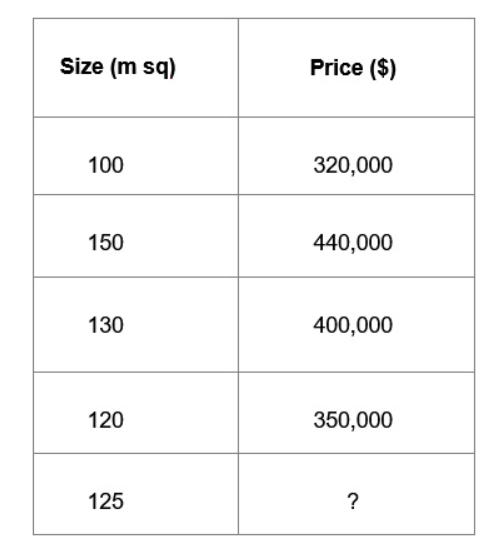

Lab 1: Fundamentals of Machine Learning and Deep Learning
==========================================================

Our world is rich with natural language data. Over the past several
decades, the way we communicate with one another has shifted to the
digital realm and, as such, this data can be used to build models that
can improve our online experience. From returning relevant results
within a search engine, to autocompleting the next word you type in an
email, the benefits of being able to extract insights from natural
language is clear to see.

While the way we, as humans, understand language differs notably from
the way a model or *artificial intelligence* may understand it, by
shedding light on machine learning and what it is used for, we can begin
to understand just how these deep learning models *understand* language
and what fundamentally happens when a model learns from data.

Throughout this book, we will explore this application of artificial
intelligence and deep learning to natural language. Through the use of
PyTorch, we will learn, step by step, how to build models that allow us
to perform sentiment analysis, text classification, and sequence
translation, which will lead to us building a basic chatbot. By covering
the theory behind each of these models, as well as demonstrating how to
implement them practically, we will demystify the field of **natural
language processing** (**NLP**) and provide you with enough background
for you to start building your own models.

In our first chapter, we will explore some of the basic concepts of
machine learning. We will then take this a step further by examining the
fundamentals of deep learning, neural networks, and some of the
advantages that deep learning methods afford over basic machine learning
techniques. Finally, we will take a more detailed look at deep learning,
specifically with regard to NLP-specific tasks and how we can use deep
learning models to gain insights from natural language. Specifically,
we\'ll cover the following topics:

-   Overview of machine learning
-   Introduction to neural networks
-   NLP for machine learning

Overview of machine learning
============================

Fundamentally, machine learning is the algorithmic
process used to identify patterns and extract trends from data. By
training specific machine learning algorithms on data, a machine
learning model may learn insights that aren\'t immediately obvious to
the human eye. A medical imaging model may learn to detect cancer from
images of the human body, while a sentiment analysis model may learn
that a book review containing the words *good*, *excellent*, and
*entertaining* is more likely to be a positive review than one
containing the words *bad*, *terrible*, and *boring*.

Broadly speaking, machine learning algorithms fall into two main
categories: supervised learning and unsupervised learning.

Supervised learning
-------------------

**Supervised learning** covers any task where we
wish to use an input to predict an output. Let\'s
say we wish to train a model to predict house prices. We know that
larger houses tend to sell for more money, but we don\'t know the exact
relationship between price and size. A machine learning model can learn
this relationship by looking at the data:

Here, we have been given the sizes of four houses
that recently sold, as well as the prices they
sold for. Given the data on these four houses, can we use this
information to make a prediction about a new house on the market? A
simple machine learning model known as a **regression** can estimate the
relationship between these two factors:

Given this historic data, we can use this data to
estimate a relationship between **size** (X) and
**price** (Y). Now that we have an estimation of the relationship
between size and price, if we are given a new house where we just know
its size, we can use this to predict its price using the learned
function:

Therefore, all supervised learning tasks aim to
learn some function of the model inputs to predict
an output, given many examples of how input relates to output:

*Given many (X, y), learn:*

*F (X) = y*

The input to your number can consist of any number of features. Our
simple house price model consisted of just a single feature (**size**),
but we may wish to add more features to give an even better prediction
(for example, number of bedrooms, size of the garden, and so on). So,
more specifically, our supervised model learns a function in order to
map a number of inputs to an output. This is given by the following
equation:

Given many *(\[X0, X1, X2,...,Xn\], y),* learn:

*f(X0, X1, X2,...,Xn) = y*

In the preceding example, the function that we learn is as follows:

Models can consist of millions, even billions,
of input features (though you may find that you
run into hardware limitations when the feature space becomes too large).
The types of inputs to a model may vary as well, with models being able
to learn from images:

As we shall explore in more detail later, they can
also learn from text:

*I loved this film* -\> Positive

*This movie was terrible* -\> Negative

*The best film I saw this year* -\> ?

Unsupervised learning
---------------------

**Unsupervised learning** differs from supervised
learning in that unsupervised learning doesn\'t
use pairs of inputs and outputs (*X, y*) to learn. Instead, we only
provide input data and the model will learn something about the
structure or representation of the input data. One of the most common
methods of unsupervised learning is **clustering**. 

For example, we take a dataset of readings of temperatures and rainfall
measures from a set of four different countries but have no labels about
where these readings were taken. We can use a clustering algorithm to
identify the distinct clusters (countries) that exist within the data:

Clustering also has uses within the realm of NLP.
If we are given a dataset of emails and want to determine how many
different languages are being spoken within these
emails, a form of clustering could help us identify this. If English
words appear frequently with other English words within the same email
and Spanish words appear frequently with other Spanish words, we would
use clustering to determine how many distinct clusters of words our
dataset has and, thus, the number of languages.

How do models learn?
--------------------

While other models may use different loss functions, regressions
generally use mean squared error. Now, we can calculate a measure of
loss across our entire dataset, but we still need
a way of algorithmically arriving at the lowest
possible loss. This process is known as **gradient descent**.

### Gradient descent

### Overfitting and underfitting

Consider the following example. Here, we\'re fitting a function using
our house price model to not only the size of the house (*X*), but the
second and third order polynomials too *(X2, X3)*. Here, we can see that
our new model fits our data points perfectly. However, this does not
necessarily result in a good model:

We now have a house of size **110 sq m** to
predict the price of. Using our intuition, as this house is larger than
the **100 sq m** house, we would expect this house to be more expensive
at around **\$340,000**. Using our fitted polynomial model, we can see
that the predicted price is actually lower than the smaller house at
around **\$320,000**. Our model fits the data we have trained it on
well, but it does not generalize well to a new, unseen datapoint. This
is known as **overfitting**. Because of
overfitting, it is important not to evaluate a model\'s performance on
the data it was trained on, so we need to generate a separate set of
data to evaluate our data on.

### Train versus test

Normally, when training models, we separate our data into two parts: a
training set of data and a smaller test set of
data. We train the model using the training set of data and evaluate it
on the test set of data. This is done in order to measure the model\'s
performance on an unseen set of data. As mentioned previously, for a
model to be a good predictor, it must generalize well to a new set of
data that the model hasn\'t seen before, and this is precisely what
evaluating on a testing set of data measures. 

### Evaluating models

While we seek to minimize loss in our models, this
alone does not give us much information about how good our model is at
actually making predictions. Consider an anti-spam model that predicts
whether a received email is spam or not and automatically sends spam
emails to a junk folder. One simple measure of evaluating
performance is **accuracy**:

To calculate accuracy, we simply take the number of emails that were
predicted correctly as spam/non-spam and divide this by the total number
of predictions we made. If we correctly predicted 990 emails out of
1,000, we would have an accuracy of 99%. However, a high accuracy does
not necessarily mean our model is good:

Here, we can see that although our model predicted
990 emails as not spam correctly (known as true
negatives), it also predicted 10 emails that were spam
as not spam (known as false negatives). Our model
just assumes that all emails are not spam, which is not a good anti-spam
filter at all! Instead of just using accuracy, we
should also evaluate our model using **precision
and recall**. In this scenario, the fact that our model would have a
recall of zero (meaning no positive results were returned) would be an
immediate red flag:

Neural networks
===============

However, as we add more features to our model, when to use a
transformation of the original feature becomes a case of trial and
error. Using **neural networks**, we are able to fit a much more complex
function, *y = f(X)*, to our data, without the need to engineer or
transform our existing features. 

Structure of neural networks
----------------------------

Since each node within the fully connected layer takes all values of *X*
as input, the neural network is able to learn interaction features
between the input features. Multiple fully connected
layers can be chained together to learn even more
complex features. In this book, we will see that all of the neural
networks we build will use this concept; chaining together multiple
layers of different varieties in order to construct even more complex
models. However, there is one additional key element to cover before we
can fully understand neural networks: activation functions.

Activation functions
--------------------

While chaining various weights together allows us
to learn more complex parameters, ultimately, our final prediction will
still be a combination of the linear products of weights and
features. If we wish our neural networks to learn a truly complex,
non-linear function, then we must introduce an element of nonlinearity
into our model. This is done through the use of **activation
functions**:

We apply an activation function to each node
within our fully connected layer. What this means is that each node in
the fully connected layer takes a sum of features and weights as input,
applies a nonlinear function to the resulting value, and outputs the
transformed result. While there are many different
activation functions, the most frequently used in recent times is
**ReLU**, or the **Rectified Linear Unit**:

How do neural networks learn?
-----------------------------

The act of learning from our data using neural networks is slightly more
complicated than when we learned using basic regressions. While we still
use gradient descent as before, the actual loss function we need to
differentiate becomes significantly more complex. In a one-layered
neural network with no activation functions, we can easily
calculate the derivative of the loss function as
it is easy to see how the loss function changes as we vary each
parameter. However, in a multi-layered neural network with activation
functions, this is more complex.

We must first perform a **forward-pass**, which is
where, using the model\'s current state, we
compute the predicted value of *y* and evaluate this against the true
value of *y* in order to obtain a measure of loss. Using this loss, we
move backward through the network, calculating the gradient at each
parameter within the network. This allows us to know which direction to
update our parameter in so that we can move closer
toward the point where loss is minimized. This is known as
**backpropagation**. We can calculate the derivative of the loss
function with respect to each parameter using the
**chain rule**:

1.  Perform a forward pass using your data, calculating the total loss
    of the network.
2.  Using backpropagation, calculate the gradients of each parameter
    with respect to loss at each node in the network.
3.  Update the values of these parameters, moving toward the direction
    where loss is minimized.
4.  Repeat until convergence.

Overfitting in neural networks
------------------------------

We saw that, in the case of our regressions, it
was possible to add so many features that it was possible to overfit the
network. This gets to a point where the model fits the training data
perfectly but does not generalize well to an unseen test set of data.
This is a common problem in neural networks as the increased complexity
of the models means that it is often possible to fit a function to the
training set of data that doesn\'t necessarily generalize. The following
is a plot of the total loss on the training and
test sets of data after each forward and backward pass of the dataset
(known as an epoch):

Here, we can see that as we continue to train the
network, the training loss gets smaller over time as we move closer to
the point where the total loss is minimized. While this generalizes well
to the test set of data up to a point, after a while, the total loss on
the test set of data begins to increase as our function overfits to the
data in the training set. One solution to this is
**early stopping**. Because we want our model to make good predictions
on data it hasn\'t seen before, we can stop training our model at the
point where test loss is minimized. A fully trained NLP model may be
able to easily classify sentences it has seen before, but the measure of
a model that has truly learned something is its ability to make
predictions on unseen data.

Neural networks
===============

Structure of neural networks
----------------------------

parameters.

Since each node within the fully connected layer takes all values of *X*
as input, the neural network is able to learn interaction features
between the input features. Multiple fully connected
layers can be chained together to learn even more
complex features. In this book, we will see that all of the neural
networks we build will use this concept; chaining together multiple
layers of different varieties in order to construct even more complex
models. However, there is one additional key element to cover before we
can fully understand neural networks: activation functions.

Activation functions
--------------------

While chaining various weights together allows us
to learn more complex parameters, ultimately, our final prediction will
still be a combination of the linear products of weights and
features. If we wish our neural networks to learn a truly complex,
non-linear function, then we must introduce an element of nonlinearity
into our model. This is done through the use of **activation
functions**:

We apply an activation function to each node
within our fully connected layer. What this means is that each node in
the fully connected layer takes a sum of features and weights as input,
applies a nonlinear function to the resulting value, and outputs the
transformed result. While there are many different
activation functions, the most frequently used in recent times is
**ReLU**, or the **Rectified Linear Unit**:

How do neural networks learn?
-----------------------------

The act of learning from our data using neural networks is slightly more
complicated than when we learned using basic regressions. While we still
use gradient descent as before, the actual loss function we need to
differentiate becomes significantly more complex. In a one-layered
neural network with no activation functions, we can easily
calculate the derivative of the loss function as
it is easy to see how the loss function changes as we vary each
parameter. However, in a multi-layered neural network with activation
functions, this is more complex.

We must first perform a **forward-pass**, which is
where, using the model\'s current state, we
compute the predicted value of *y* and evaluate this against the true
value of *y* in order to obtain a measure of loss. Using this loss, we
move backward through the network, calculating the gradient at each
parameter within the network. This allows us to know which direction to
update our parameter in so that we can move closer
toward the point where loss is minimized. This is known as
**backpropagation**. We can calculate the derivative of the loss
function with respect to each parameter using the
**chain rule**:

1.  Perform a forward pass using your data, calculating the total loss
    of the network.
2.  Using backpropagation, calculate the gradients of each parameter
    with respect to loss at each node in the network.
3.  Update the values of these parameters, moving toward the direction
    where loss is minimized.
4.  Repeat until convergence.

Overfitting in neural networks
------------------------------

We saw that, in the case of our regressions, it
was possible to add so many features that it was possible to overfit the
network. This gets to a point where the model fits the training data
perfectly but does not generalize well to an unseen test set of data.
This is a common problem in neural networks as the increased complexity
of the models means that it is often possible to fit a function to the
training set of data that doesn\'t necessarily generalize. The following
is a plot of the total loss on the training and
test sets of data after each forward and backward pass of the dataset
(known as an epoch):

Here, we can see that as we continue to train the
network, the training loss gets smaller over time as we move closer to
the point where the total loss is minimized. While this generalizes well
to the test set of data up to a point, after a while, the total loss on
the test set of data begins to increase as our function overfits to the
data in the training set. One solution to this is
**early stopping**. Because we want our model to make good predictions
on data it hasn\'t seen before, we can stop training our model at the
point where test loss is minimized. A fully trained NLP model may be
able to easily classify sentences it has seen before, but the measure of
a model that has truly learned something is its ability to make
predictions on unseen data.

NLP for machine learning
========================

Unlike humans, computers do not understand text --
at least not in the same way that we do. In order to create machine
learning models that are able to learn from data, we must first learn to
represent natural language in a way that
computers are able to process.

When we discussed machine learning fundamentals, you may have noticed
that loss functions all deal with numerical data so as to be able to
minimize loss. Because of this, we wish to represent our text in a
numerical format that can form the basis of our input into a neural
network. Here, we will cover a couple of basic ways of numerically
representing our data. 

Bag-of-words
------------

The first and most simple way of
representing text is by using a **bag-of-words**
representation. This method simply counts the words in a given sentence
or document and counts all the words. These counts are then transformed
into a vector where each element of the vector is
the count of the times each word in the **corpus** appears within the
sentence. The corpus is simply all the
words that appear across all the
sentences/documents being analyzed. Take the following two sentences:

*The cat sat on the mat*

*The dog sat on the cat*

We can represent each of these sentences as a count of words:

Sequential representation
-------------------------

We will see later in this book that more complex neural network models,
including RNNs and LSTMs, do not just take a
single vector as input, but can take a whole sequence of vectors in the
form of a matrix. Because of this, in order to better capture the order
of words and thus the meaning of any sentence, we are able to represent
this in the form of a sequence of one-hot encoded vectors:

#### Summary

In this lab, we introduced the fundamentals of machine learning and
neural networks, as well as a brief overview of transforming text for
use within these models. In the next lab, we will provide a brief
overview of PyTorch and how it can be used to construct some of these
models.