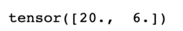
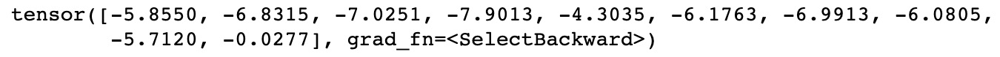

*Lab 2*: Getting Started with PyTorch 1.x for NLP
==========================================================================


**PyTorch** is a Python-based machine learning library. It consists of
two main features: its ability to efficiently perform tensor operations
with hardware acceleration (using GPUs) and its ability to build deep
neural networks. PyTorch also uses dynamic computational graphs instead
of static ones, which sets it apart from similar libraries such as
TensorFlow. By demonstrating how language can be represented using
tensors and how neural networks can be used to learn from NLP, we will
show that both these features are particularly useful for natural
language processing.

In this chapter, we will show you how to get PyTorch up and running on
your computer, as well as demonstrate some of its key functionalities.
We will then compare PyTorch to some other deep learning frameworks,
before exploring some of the NLP functionality of PyTorch, such as its
ability to perform tensor operations, and finally demonstrate how to
build a simple neural network. In summary, this chapter will cover the
following topics:

-   Installing PyTorch
-   Comparing PyTorch to other deep learning frameworks
-   NLP functionality of PyTorch


Installing and using PyTorch 1.x
================================


Like most Python packages, PyTorch is very simple to install. There are
two main ways of doing so. The first is to simply
install it using `pip` in the command
line. Simply type the following command:

```
pip install torch torchvision
```


While this installation method is quick, it is recommended to install
using Anaconda instead, as this includes all the required dependencies
and binaries for PyTorch to run. Furthermore, Anaconda will be required
later to enable training models on a GPU using CUDA. PyTorch can be
installed through Anaconda by entering the following in the command
line:

```
conda install torch torchvision -c pytorch
```


To check that PyTorch is working correctly, we can open a Jupyter
Notebook and run a few simple commands:

1.  To define a Tensor in PyTorch, we can do the following:

    ```
    import torch
    x = torch.tensor([1.,2.])
    print(x)
    ```
    

    This results in the following output:

    ``

    Figure 2.1 -- Tensor output

    This shows that tensors within PyTorch are saved as their own data
    type (not dissimilar to how arrays are saved within NumPy).

2.  We can perform basic operations such as
    multiplication using standard Python
    operators:

    ```
    x = torch.tensor([1., 2.])
    y = torch.tensor([3., 4.])
    print(x * y)
    ```
    

    This results in the following output:

    
    
    

    Figure 2.2 -- Tensor multiplication output

3.  We can also select individual elements from a tensor, as follows:

    ```
    x = torch.tensor([[1., 2.],[5., 3.],[0., 4.]])
    print(x[0][1])
    ```
    

    This results in the following output:


Figure 2.3 -- Tensor selection output

However, note that unlike a NumPy array, selecting an
individual element from a tensor object
returns another tensor. In order to return an
individual value from a tensor, you can use the `.item()`
function:

```
print(x[0][1].item())
```


This results in the following output:


Figure 2.4 -- Output of the .item() function


Tensors
-------

Before we continue, it is important that you are fully aware of the
properties of a tensor. Tensors have a property
known as an **order**, which essentially
determines the dimensionality of a tensor. An order one tensor is a
tensor with a single dimension, which is equivalent to a vector or list
of numbers. An order 2 tensor is a tensor with two dimensions,
equivalent to a matrix, whereas a tensor of order 3 consists of three
dimensions. There is no limit to the maximum order a tensor can have
within PyTorch:


Figure 2.5 -- Tensor matrix

You can check the size of any tensor by typing the
following:

```
x.shape
```


This results in the following output:


Figure 2.6 -- Tensor shape output

This shows that this is a 3x2 tensor (order 2).


Enabling PyTorch acceleration using CUDA
========================================


One of the main benefits of PyTorch is its ability to enable
acceleration through the use of a **graphics processing unit**
(**GPU**). Deep learning is a computational task that is easily
parallelizable, meaning that the calculations can be broken down into
smaller tasks and calculated across many smaller
processors. This means that instead of needing to
execute the task on a single CPU, it is more efficient to perform the
calculation on a GPU.

GPUs were originally created to efficiently render graphics, but since
deep learning has grown in popularity, GPUs have
been frequently used for their ability to perform multiple calculations
simultaneously. While a traditional CPU may consist of around four or
eight cores, a GPU consists of hundreds of smaller cores. Because
calculations can be executed across all these cores simultaneously, GPUs
can rapidly reduce the time taken to perform deep learning tasks.

Consider a single pass within a neural network. We may take a small
batch of data, pass it through our network to obtain our loss, and then
backpropagate, adjusting our parameters according to the gradients. If
we have many batches of data to do this over, on a traditional CPU, we
must wait until batch 1 has completed before we can compute this for
batch 2:


Figure 2.7 -- One pass in a neural network

However, on a GPU, we can perform all these steps simultaneously,
meaning there is no requirement for batch 1 to
finish before batch 2 can be started. We can calculate the parameter
updates for all batches simultaneously and then
perform all the parameter updates in one go (as the results are
independent of one another). The parallel approach can vastly speed up
the machine learning process:


Figure 2.8 -- Parallel approach to perform passes

**Compute Unified Device Architecture** (**CUDA**) is the
technology specific to Nvidia GPUs that enables
hardware acceleration on PyTorch. In order to enable CUDA, we
must first make sure the graphics card on our
system is CUDA-compatible. A list of
can be
found here: <https://developer.nvidia.com/cuda-gpus>. If you have a
CUDA-compatible GPU, then CUDA can be installed from
this link:
<https://developer.nvidia.com/cuda-downloads>. We will activate it using
the following steps:

1.  Firstly, in order to actually enable CUDA support on PyTorch, you
    will have to build PyTorch from source. Details about how this can
    be done can be found here:
    https://github.com/pytorch/pytorch\#from-source.

2.  Then, to actually CUDA within our PyTorch code, we must type the
    following into our Python code:

    ```
    cuda = torch.device('cuda') 
    ```
    

    This sets our default CUDA device\'s name to `'cuda'`.

3.  We can then execute operations on this device by manually specifying
    the device argument in any tensor operations:

    ```
    x = torch.tensor([5., 3.], device=cuda)
    ```
    

    Alternatively, we can do this by calling the `cuda`
    method:

    ```
    y = torch.tensor([4., 2.]).cuda()
    ```
    

4.  We can then run a simple operation to
    ensure this is working correctly:

    ```
    x*y
    ```
    

    This results in the following output:




Figure 2.9 -- Tensor multiplication output using CUDA

The changes in speed will not be noticeable at this stage as we are just
creating a tensor, but when we begin training models at scale later, we
will see the speed benefits of parallelizing our computations using
CUDA. By training our models in parallel, we will be able to reduce the
time this takes by a considerable amount.


Comparing PyTorch to other deep learning frameworks
===================================================


PyTorch is one of the main frameworks used in deep learning today. There
are other widely used frameworks available too,
such as TensorFlow, Theano, and Caffe. While these
are very similar in many ways, there are some key differences in how
they operate. These include the following:

-   How the models are computed
-   The way in which the computational graphs are compiled
-   The ability to create dynamic computational graphs with variable
    layers
-   Differences in syntax 

Arguably, the main difference between PyTorch and other frameworks is in
the way that the models themselves are computed. PyTorch uses an
automatic differentiation method called
**autograd**, which allows computational graphs to be defined and
executed dynamically. This is in contrast to other frameworks such as
TensorFlow, which is a static framework. In these static frameworks,
computational graphs must be defined and compiled before finally being
executed. While using pre-compiled models may lead to efficient
implementations in production, they do not offer the same level of
flexibility in research and explorational projects.

Frameworks such as PyTorch do not need to pre-compile computational
graphs before the model can be trained. The dynamic computational graphs
used by PyTorch mean that graphs are compiled as they are executed,
which allows graphs to be defined on the go. The dynamic approach to
model construction is particularly useful in the field of NLP. Let\'s
consider two sentences that we wish to perform
sentiment analysis on:


Figure 2.10 -- Model construction in PyTorch

We can represent each of these sentences as a sequence of individual
word vectors, which would then form our input to our neural network.
However, as we can see, each of our inputs is of a
different size. Within a
fixed computation graph, these varying input sizes
could be a problem, but for frameworks like PyTorch, models are able to
adjust dynamically to account for the variation in input structure. This
is one reason why PyTorch is often preferred for NLP-related deep
learning.

Another major difference between PyTorch and other deep learning
frameworks is syntax. PyTorch is often preferred by developers with
experience in Python as it is considered to be very Pythonic in nature.
PyTorch integrates well with other aspects of the Python ecosystem and
it is very easy to learn if you have prior knowledge of Python. We will
demonstrate PyTorch syntax now by coding up our own neural network from
scratch.


Building a simple neural network in PyTorch
===========================================


We will now walk through building a neural network from scratch in
PyTorch. Here, we have a small `.csv` file containing several
examples of images from the MNIST dataset. The MNIST dataset
consists of a collection of hand-drawn digits
between 0 and 9 that we want to attempt to classify. The following is an
example from the MNIST dataset, consisting of a hand-drawn digit 1:


Figure 2.11 -- Sample image from the MNIST dataset

These images are 28x28 in size: 784 pixels in total. Our dataset in
`train.csv` consists of 1,000 of these images, with each
consisting of 784 pixel values, as well as the correct classification of
the digit (in this case, 1).


Loading the data
----------------

We will begin by loading the data, as follows:

1.  First, we need to load our training dataset,
    as follows:

    ```
    train = pd.read_csv("train.csv")
    train_labels = train['label'].values
    train = train.drop("label",axis=1).values.reshape(len(train),1,28,28)
    ```
    

    Notice that we reshaped our input to (`1,` `1,`
    `28,` `28`), which is a tensor of 1,000 images,
    each consisting of 28x28 pixels.

2.  Next, we convert our training data and training labels into PyTorch
    tensors so they can be fed into the neural network:
    ```
    X = torch.Tensor(train.astype(float))
    y = torch.Tensor(train_labels).long()
    ```
    

Note the data types of these two tensors. A float tensor comprises
32-bit floating-point numbers, while a long tensor consists of 64-bit
integers. Our `X` features must be floats in order for PyTorch
to be able to compute gradients, while our labels must be integers
within this classification model (as we\'re trying to predict values of
1, 2, 3, and so on), so a prediction of 1.5 wouldn\'t make sense.


Building the classifier
-----------------------

Next, we can start to construct our actual neural
network classifier:

```
class MNISTClassifier(nn.Module):
    def __init__(self):
        super().__init__()
        self.fc1 = nn.Linear(784, 392)
        self.fc2 = nn.Linear(392, 196)
        self.fc3 = nn.Linear(196, 98)
        self.fc4 = nn.Linear(98, 10)
```


We build our classifier as if we were building a normal class in Python,
inheriting from `nn.Module` in PyTorch. Within our
`init` method, we define each of the layers of our neural
network. Here, we define fully connected linear layers of varying sizes.

Our first layer takes **784** inputs as this is the size of each of our
images to classify (28x28). We then see that the output of one layer
must have the same value as the input of the next one, which means our
first fully connected layer outputs **392** units and our second layer
takes **392** units as input. This is repeated for
each layer, with them having half the number of units each time until we
reach our final fully connected layer, which outputs **10** units. This
is the length of our classification layer.

Our network now looks something like this:


Figure 2.12 -- Our neural network

Here, we can see that our final layer outputs **10** units. This is
because we wish to predict whether each image is a digit between 0 and
9, which is 10 different possible classifications in total. Our output
is a vector of length **10** and contains predictions for each of the 10
possible values of the image. When making a final
classification, we take the digit classification that has the highest
value as the model\'s final prediction. For example, for a given
prediction, our model might predict the image is type 1 with a
probability of 10%, type 2 with a probability of 10%, and type 3 with a
probability of 80%. We would, therefore, take type 3 as the prediction
as it was predicted with the highest probability.


Implementing dropout
--------------------

Within the `init` method of our
`MNISTClassifier` class, we also define a dropout method in
order to help regularize the network:

```
self.dropout = nn.Dropout(p=0.2)
```


Dropout is a way of regularizing our neural networks to prevent
overfitting. On each training epoch, for each node in a layer that has
dropout applied, there is a probability (here, defined as *p* = 20%)
that each node within the layer will not be used in
training/backpropagation. This means that when training, our network
becomes robust toward overfitting since each node
will not be used in every iteration of the training process. This
prevents our network from becoming too reliant on predictions from
specific nodes within our network.


Defining the forward pass
-------------------------

Next, we define the forward pass within our
classifier:

```
    def forward(self, x):
        x = x.view(x.shape[0], -1)
        x = self.dropout(F.relu(self.fc1(x)))
        x = self.dropout(F.relu(self.fc2(x)))
        x = self.dropout(F.relu(self.fc3(x)))
        x = F.log_softmax(self.fc4(x), dim=1)
```


The `forward()` method within our classifier is where we apply
our activation functions and define where dropout is applied within our
network. Our `forward` method defines the path our input will
take through the network. It first takes our input, `x,` and
reshapes it for use within the network, transforming it into a
one-dimensional vector. We then pass it through our first fully
connected layer and wrap it in a `ReLU` activation function to
make it non-linear. We also wrap it in our dropout, as defined in our
`init` method. We repeat this process for all the other layers
in the network.

For our final prediction layer, we wrap it in a log `softmax`
layer. We will use this to easily calculate our
loss function, as we will see next.


Setting the model parameters
----------------------------

Next, we define our model parameters:

```
model = MNISTClassifier()
loss_function = nn.NLLLoss()
opt = optim.Adam(model.parameters(), lr=0.001)
```


We initialize an instance of our `MNISTClassifier` class as a
model. We also define our loss as a **Negative Log
Likelihood Loss**:

Loss(y) = -log(y)

Let\'s assume our image is of a number 7. If we predict class 7 with
probability 1, our loss will be *-log(1) = 0*, but if we only predict
class 7 with probability 0.7, our loss will be *-log(0.7) = 0.3*. This
means that our loss approaches infinity the further away from the
correct prediction we are:


Figure 2.13 -- Representation of loss for our network

This is then summed over all the correct classes in our dataset to
compute the total loss. Note that we defined a log
softmax when building the classifier as this
already applies a softmax function (restricting the predicted output to
be between 0 and 1) and takes the log. This means that *log(y)* is
already calculated, so all we need to do to compute the total loss on
the network is calculate the negative sum of the outputs.

We will also define our optimizer as an Adam optimizer. An optimizer
controls the **learning rate** within our model. The learning rate
of a model defines how big the parameter updates
are during each epoch of training. The larger the size of the learning
rate, the larger the size of the parameter updates during gradient
descent. An optimizer dynamically controls this learning rate so that
when a model is initialized, the parameter updates are large. However,
as the model learns and moves closer to the point where loss is
minimized, the optimizer controls the learning rate, so the parameter
updates become smaller and the local minimum can be located more
precisely.


Training our network
--------------------

Finally, we can actually start training our network:

1.  First, create a loop that runs once for each epoch of our training.
    Here, we will run our training loop for 50
    epochs. We first take our input tensor of images and our output
    tensor of labels and transform them into PyTorch variables. A
    `variable` is a PyTorch object that contains a
    `backward()` method that we can use to perform
    backpropagation through our network:
    ```
    for epoch in range(50): 
        images = Variable(X)
        labels = Variable(y)
    ```
    
2.  Next, we call `zero_grad()` on our optimizer to set our
    calculated gradients to zero. Within PyTorch, gradients are
    calculated cumulatively on each backpropagation. While this is
    useful in some models, such as when training RNNs, for our example,
    we wish to calculate the gradients from scratch after each epoch, so
    we make sure to reset the gradients to zero after each pass:
    ```
    opt.zero_grad()
    ```
    
3.  Next, we use our model\'s current state to make predictions on our
    dataset. This is effectively our forward pass as we then use these
    predictions to calculate our loss:
    ```
    outputs = model(images)
    ```
    
4.  Using the outputs and the true labels of our dataset, we calculate
    the total loss of our model using the defined loss function, which
    in this case is the negative log likelihood. On calculating this
    loss, we can then make a `backward()` call to
    backpropagate our loss through the network. We then use
    `step()` using our optimizer in
    order to update our model parameters accordingly:
    ```
    loss = loss_function(outputs, labels)
    loss.backward()
    opt.step()
    ```
    
5.  Finally, after each epoch is complete, we print the total loss. We
    can observe this to make sure our model is learning:
    ```
    print ('Epoch [%d/%d] Loss: %.4f' %(epoch+1, 50,         loss.data.item()))
    ```
    

In general, we would expect the loss to decrease after every epoch. Our
output will look something like this:


Figure 2.14 -- Training epochs


Making predictions
------------------

Now that our model has been trained, we can use this to make predictions
on unseen data. We begin by reading in our test
set of data (which was not used to train our model):

```
test = pd.read_csv("test.csv")
test_labels = test['label'].values
test = test.drop("label",axis=1).values.reshape(len(test),                  1,28,28)
X_test = torch.Tensor(test.astype(float))
y_test = torch.Tensor(test_labels).long()
```


Here, we perform the same steps we performed when we loaded our training
set of data: we reshape our test data and transform it into PyTorch
tensors. Next, to predict using our trained model, we simply run the
following command:

```
preds = model(X_test)
```


In the same way that we calculated our outputs on the forward pass of
our training data in our model, we now pass our test data through the
model and obtain predictions. We can view the predictions for one of the
images like so:

```
print(preds[0])
```


This results in the following output:




Figure 2.15 -- Prediction outputs

Here, we can see that our prediction is a vector of length 10, with a
prediction for each of the possible classes (digits between 0 and 9).
The one with the highest predicted value is the one our model chooses as
its prediction. In this case, it is the 10[th]{.superscript} unit of our
vector, which equates to the digit 9. Note that
since we used log softmax earlier, our predictions are logs and not raw
probabilities. To convert these back into probabilities, we can just
transform them using *x*.

We can now construct a summary DataFrame containing our true test data
labels, as well as the labels our model predicted:

```
_, predictionlabel = torch.max(preds.data, 1)
predictionlabel = predictionlabel.tolist()
predictionlabel = pd.Series(predictionlabel)
test_labels = pd.Series(test_labels)
pred_table = pd.concat([predictionlabel, test_labels], axis=1)
pred_table.columns =['Predicted Value', 'True Value']
display(pred_table.head())
```


This results in the following output:


Figure 2.16 -- Prediction table

Note how the `torch.max()` function automatically selects the
prediction with the highest value. We can see here that, based
on a small selection of our data, our model
appears to be making some good predictions!


Evaluating our model
--------------------

Now that we have some predictions from our model, we can use these
predictions to evaluate how good our model is. One
rudimentary way of evaluating model performance is
**accuracy**, as discussed in the previous chapter. Here, we simply
calculate our correct predictions (where the predicted image label is
equal to the actual image label) as a percentage of the total number of
predictions our model made:

```
preds = len(predictionlabel)
correct = len([1 for x,y in zip(predictionlabel, test_labels)               if x==y])
print((correct/preds)*100)
```


This results in the following output:


Figure 2.17 -- Accuracy score

Congratulations! Your first neural network was able to correctly
identify almost 90% of unseen digit images. As we progress, we will see
that there are more sophisticated models that may
lead to improved performance. However, for now, we have demonstrated
that creating a simple deep neural network is very simple using PyTorch.
This can be coded up in just a few lines and leads to performance above
and beyond what is possible with basic machine learning models such as
regression.


NLP for PyTorch
===============


Now that we have learned how to build neural networks, we will see how
it is possible to build models for NLP using
PyTorch. In this example, we will create a basic bag-of-words classifier
in order to classify the language of a given sentence.


Setting up the classifier
-------------------------

For this example, we\'ll take a selection of sentences in Spanish and
English:

1.  First, we split each sentence into a list of
    words and take the language of each sentence as a label. We take a
    section of sentences to train our model on and keep a small section
    to one side as our test set. We do this so that we can evaluate the
    performance of our model after it has been trained:

    ```
    ("This is my favourite chapter".lower().split(),\
     "English"),
    ("Estoy en la biblioteca".lower().split(), "Spanish")
    ```
    

    Note that we also transform each word into lowercase, which stops
    words being double counted in our bag-of-words. If we have the word
    `book` and the word `Book`, we want these to be
    counted as the same word, so we transform these into lowercase.

2.  Next, we build our word index, which is simply a dictionary of all
    the words in our corpus, and then create a
    unique index value for each word. This can be easily done with a
    short `for` loop:

    ```
    word_dict = {}
    i = 0
    for words, language in training_data + test_data:
        for word in words:
            if word not in word_dict:
                word_dict[word] = i
                i += 1
    print(word_dict)
    ```
    

    This results in the following output:

    
    
    

    Figure 2.18 -- Setting up the classifier

    Note that here, we looped through all our training data and test
    data. If we just created our word index on training data, when it
    came to evaluating our test set, we would have new words that were
    not seen in the original training, so we wouldn\'t be able to create
    a true bag-of-words representation for these words.

3.  Now, we build our classifier in a similar fashion to how we built
    our neural network in the previous section; that is, by building a
    new class that inherits from `nn.Module`.

    Here, we define our classifier so that it consists of a single
    linear layer with log softmax activation functions approximating a
    logistic regression. We could easily extend this to
    operate as a neural network by adding extra
    linear layers here, but a single layer of parameters will serve our
    purpose. Pay close attention to the input and output sizes of our
    linear layer:

    ```
    corpus_size = len(word_dict)
    languages = 2
    label_index = {"Spanish": 0, "English": 1}
    class BagofWordsClassifier(nn.Module):  
        def __init__(self, languages, corpus_size):
            super(BagofWordsClassifier, self).__init__()
            self.linear = nn.Linear(corpus_size, languages)
        def forward(self, bow_vec):
            return F.log_softmax(self.linear(bow_vec), dim=1)
    ```
    

    The input is of length `corpus_size`, which is just the
    total count of unique words in our corpus. This is because each
    input to our model will be a bag-of-words representation, consisting
    of the counts of words in each sentence, with a count of 0 if a
    given word does not appear in our sentence. Our output is of size 2,
    which is our number of languages to predict. Our final predictions
    will consist of a probability that our sentence is English versus
    the probability that our sentence is Spanish, with our final
    prediction being the one with the highest probability.

4.  Next, we define some utility functions. We first define
    `make_bow_vector`, which takes the sentence and transforms
    it into a bag-of-words representation. We first create a vector
    consisting of all zeros. We then loop through them and for each
    word in the sentence, we increment the count
    of that index within the bag-of-words vector by one. We finally
    reshape this vector using `with .view()` for entry into
    our classifier:
    ```
    def make_bow_vector(sentence, word_index):
        word_vec = torch.zeros(corpus_size)
        for word in sentence:
            word_vec[word_dict[word]] += 1
        return word_vec.view(1, -1)
    ```
    

5.  Similarly, we define `make_target`, which simply takes the
    label of the sentence (Spanish or English) and returns its relevant
    index (`0` or `1`):
    ```
    def make_target(label, label_index):
        return torch.LongTensor([label_index[label]])
    ```
    

6.  We can now create an instance of our model, ready for training. We
    also define our loss function as Negative Log Likelihood as we are
    using a log softmax function, and then define our optimizer in order
    to use standard **stochastic** **gradient** **descent** (**SGD**):
    ```
    model = BagofWordsClassifier(languages, corpus_size)
    loss_function = nn.NLLLoss()
    optimizer = optim.SGD(model.parameters(), lr=0.1)
    ```
    

Now, we are ready to train our model.


Training the classifier
-----------------------

First, we set up a loop consisting of the number
of epochs we wish our model to run for. In this instance, we will select
100 epochs.

Within this loop, we first zero our gradients (as otherwise, PyTorch
calculates gradients cumulatively) and then for each sentence/label
pair, we transform each into a bag-of-words vector and target,
respectively. We then calculate the predicted output of this particular
sentence pair by making a forward pass of our data through the current
state of our model.

Using this prediction, we then take our predicted and actual labels and
call our defined `loss_function` on the two to obtain a
measure of loss for this sentence. By calling `backward()`, we
then backpropagate this loss through our model and by calling
`step()` on our optimizer, we update our model parameters.
Finally, we print our loss after every 10 training steps:

```
for epoch in range(100):
    for sentence, label in training_data:
        model.zero_grad()
        bow_vec = make_bow_vector(sentence, word_dict)
        target = make_target(label, label_index)
        log_probs = model(bow_vec)
        loss = loss_function(log_probs, target)
        loss.backward()
        optimizer.step()
        
    if epoch % 10 == 0:
        print('Epoch: ',str(epoch+1),', Loss: ' +                         str(loss.item()))
```


This results in the following output:


Figure 2.19 -- Training loss

Here, we can see that our loss is decreasing over
time as our model learns. Although our training set in this example is
very small, we can still demonstrate that our model has learned
something useful, as follows:

1.  We evaluate our model on a couple of sentences from our test data
    that our model was not trained on. Here, we first set
    `torch.no_grad()`, which deactivates the
    `autograd` engine as there is no longer any need to
    calculate gradients as we are no longer training our model. Next, we
    take our test sentence and transform it into a bag-of-words vector
    and feed it into our model to obtain predictions.

2.  We then simply print the sentence, the true label of the sentence,
    and then the predicted probabilities. Note that we transform the
    predicted values from log probabilities back into probabilities. We
    obtain two probabilities for each prediction, but if
    we refer back to the label index, we can see
    that the first probability (index 0) corresponds to Spanish, whereas
    the other one corresponds to English:

    ```
    def make_predictions(data):
        with torch.no_grad():
            sentence = data[0]
            label = data[1]
            bow_vec = make_bow_vector(sentence, word_dict)
            log_probs = model(bow_vec)
            print(sentence)
            print(label + ':')
            print(np.exp(log_probs))
            
    make_predictions(test_data[0])
    make_predictions(test_data[1])
    ```
    

    This results in the following output:

    
    
    

    Figure 2.20 -- Predicted output

    Here, we can see that for both our predictions, our model predicts
    the correct answer, but why is this? What exactly has our model
    learned? We can see that our first test sentence contains the word
    `estoy`, which was previously seen in a Spanish sentence
    within our training set. Similarly, we can see that the word
    `book` was seen within our training set in an English
    sentence. Since our model consists of a single
    layer, the parameters on each of our nodes are easy to interpret.

3.  Here, we define a function that takes a word as input and returns
    the weights on each of the parameters within the layer. For a given
    word, we get the index of this word from our dictionary and then
    select these parameters from the same index within the model. Note
    that our model returns two parameters as we are making two
    predictions; that is, the model\'s contribution to the Spanish
    prediction and the model\'s contribution to the English prediction:

    ```
    def return_params(word): 
        index = word_dict[word]
        for p in model.parameters():
            dims = len(p.size())
            if dims == 2:
                print(word + ':')
                print('Spanish Parameter = ' +                    str(p[0][index].item()))
                print('English Parameter = ' +                    str(p[1][index].item()))
                print('\n')
                
    return_params('estoy')
    return_params('book')
    ```
    

    This results in the following output:


Figure 2.21 -- Predicted output for the updated function

Here, we can see that for the word
`estoy`, this parameter is positive for the Spanish prediction
and negative for the English one. This means that for each count of the
word \"`estoy`\" in our sentence, the sentence becomes more
likely to be a Spanish sentence. Similarly, for the word
`book`, we can see that this contributes positively to the
prediction that the sentence is English.

We can show that our model has only learned based on what it has been
trained on. If we try to predict a word the model hasn\'t been trained
on, we can see it is unable to make an accurate decision. In
this case, our model thinks that the English word
\"`not"` is Spanish:

```
new_sentence = (["not"],"English")
make_predictions(new_sentence)
```


This results in the following output:


Summary
=======


In this chapter, we introduced PyTorch and some of its key features.
Hopefully, you now have a better understanding of how PyTorch differs
from other deep learning frameworks and how it can be used to build
basic neural networks. While these simple examples are just the tip of
the iceberg, we have illustrated that PyTorch is an immensely powerful
tool for NLP analysis and learning.

In future chapters, we will demonstrate how the unique properties of
PyTorch can be utilized to build highly sophisticated models for solving
very complex machine learning tasks.
