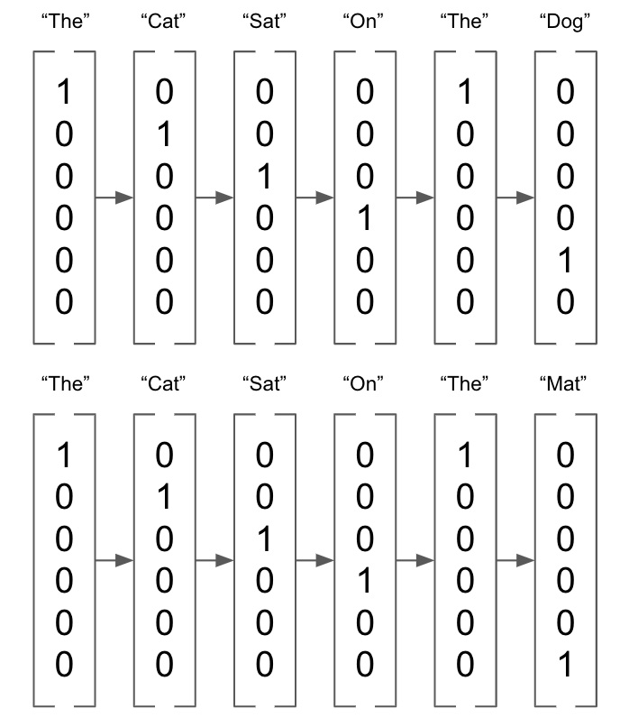
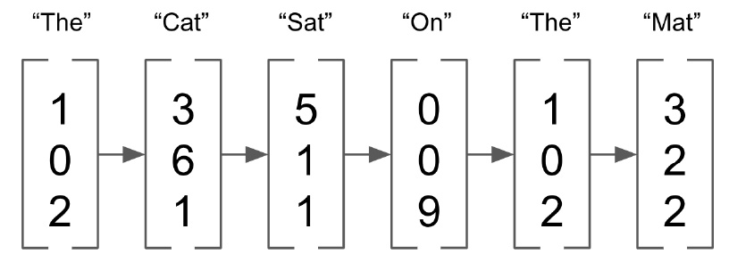
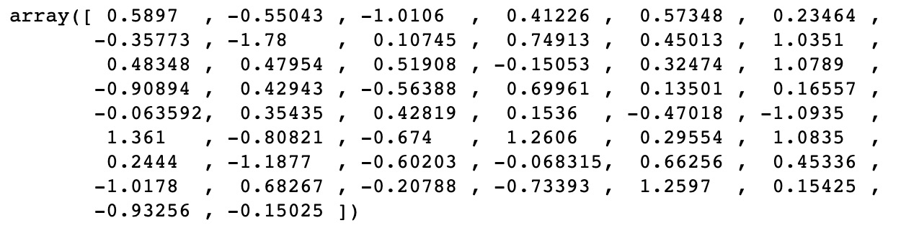
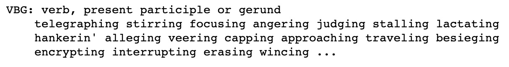
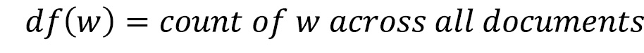
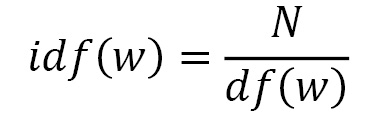
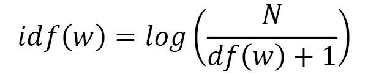
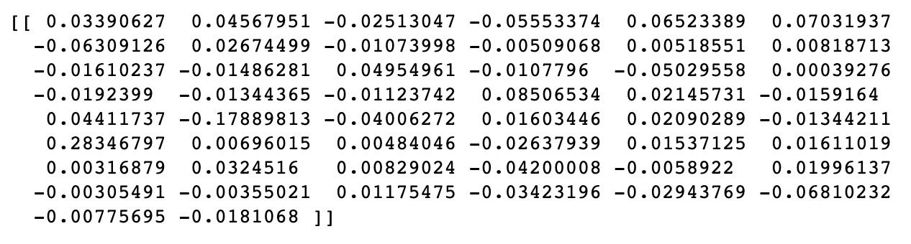

*Lab 3*: NLP and Text Embeddings
=========================================================


There are many different ways of representing text in deep learning.
While we have covered basic **bag-of-words** (**BoW**) representations,
unsurprisingly, there is a far more sophisticated way of representing
text data known as embeddings. While a BoW vector acts only as a count
of words within a sentence, embeddings help to numerically define the
actual meaning of certain words.

In this chapter, we will explore text embeddings and learn how to create
embeddings using a continuous BoW model. We will then move on to discuss
n-grams and how they can be used within models. We will also cover
various ways in which tagging, chunking, and tokenization can be used to
split up NLP into its various constituent parts. Finally, we will look
at TF-IDF language models and how they can be useful in weighting our
models toward infrequently occurring words.

The following topics will be covered in the chapter:

-   Word embeddings
-   Exploring CBOW
-   Exploring n-grams
-   Tokenization
-   Tagging and chunking for parts of speech
-   TF-IDF


Technical requirements
======================


GLoVe vectors can be downloaded from
<https://nlp.stanford.edu/projects/glove/> . It is recommended to use
the `glove.6B.50d.txt` file as it is much smaller than the
other files and will be much faster to process. NLTK will be required
for later parts of this chapter. All the code for this chapter can be
found at
<https://github.com/PacktPublishing/Hands-On-Natural-Language-Processing-with-PyTorch-1.x>.


Embeddings for NLP
==================


Words do not have a natural way of representing
their meaning. In images, we already have
representations in rich vectors (containing the values of each pixel
within the image), so it would clearly be beneficial to have a similarly
rich vector representation of words. When parts of
language are represented in a high-dimensional vector format, they are
known as **embeddings**. Through analysis of a corpus of words, and by
determining which words appear frequently together, we can obtain an
*n*-length vector for each word, which better represents the semantic
relationship of each word to all other words. We saw previously that we
can easily represent words as one-hot encoded vectors:




Figure 3.1 -- One-hot encoded vectors

On the other hand, embeddings are vectors of
length *n* (in the following example, *n* = 3) that can take any value:




Figure 3.2 -- Vectors with n=3

These embeddings represent the word\'s vector in *n*-dimensional space
(where *n* is the length of the embedding vectors), and words with
similar vectors within this space are considered to be more similar in
meaning. While these embeddings can be of any size, they are generally
of much lower dimensionality than the BoW representation. The BOW
representation requires vectors that are of the length of the entire
corpus, which, when looking at a whole language, could become very large
very quickly. Although embeddings are of a high enough dimensionality to
represent the individual words, they are generally not much larger than
a few hundred dimensions. Furthermore, the BOW vectors are generally
very sparse, consisting mostly of zeros, whereas embeddings are rich in
data and every dimension contributes to the overall representation of
the word. The lower dimensionality and the fact that they are not sparse
makes performing deep learning on embeddings much more efficient than
performing it on BOW representations.


GLoVe
-----

We can download a set of pre-calculated word
embeddings to demonstrate how they work. For this, we will use **Global
Vectors for Word Representation** (**GLoVe**) embeddings, which can be
downloaded from here: <https://nlp.stanford.edu/projects/glove/> . These
embeddings are calculated on a very large corpus
of NLP data and are trained on a word
co-occurrence matrix. This is based on the notion that words that appear
together are more likely to have similar meaning. For instance, the word
*sun* is likely to appear more frequently with the word *hot* as opposed
to the word *cold*, so it is more likely that *sun* and *hot* are
considered more similar.

We can validate that this is true by examining the individual GLoVe
vectors:

1.  We first create a simple function to load our GLoVe vectors from a
    text file. This just builds a dictionary where the index is each
    word in the corpus and the values are the embedding vector:
    ```
    def loadGlove(path):
        file = open(path,'r')
        model = {}
        for l in file:
            line = l.split()
            word = line[0]
            value = np.array([float(val) for val in                           line[1:]])
            model[word] = value
        return model
    glove = loadGlove('glove.6B.50d.txt')
    ```
    

2.  This means we can access a single vector by
    just calling it from the dictionary:

    ```
    glove['python']
    ```
    

    This results in the following output:

    
    
    

    Figure 3.3 -- Vector output

    We can see that this returns a 50-dimensional vector embedding for
    the word Python. We will now introduce the
    concept of **cosine similarity** to compare how similar two vectors
    are. Vectors will have a similarity of 1 if the angle in the
    *n*-dimensional space between them is 0 degrees. Values with high
    cosine similarity can be considered similar, even if they are not
    equal. This can be calculated using the following formula, where A
    and B are the two embedding vectors being compared:

    
    
    

3.  We can calculate this easily in Python using the
    `cosine_similarity()` function from `Sklearn`.
    We can see that `cat` and `dog` have similar
    vectors as they are both animals:

    ```
    cosine_similarity(glove['cat'].reshape(1, -1), glove['dog'].reshape(1, -1))
    ```
    

    This results in the following output:

    
    
    

    Figure 3.4 -- Cosine similarity output for cat and dog

4.  However, `cat` and `piano` are quite dissimilar
    as they are two seemingly unrelated items:

    ```
    cosine_similarity(glove['cat'].reshape(1, -1), glove['piano'].reshape(1, -1))
    ```
    

    This results in the following output:


Figure 3.5 -- Cosine similarity output for cat and piano


Embedding operations
--------------------

Since embeddings are vectors, we can perform operations on them. For
example, let\'s say we take the embeddings for the following sorts and
we calculate the following:

*Queen-Woman+Man*

With this, we can approximate the embedding for
*king*. This essentially replaces the *Woman* vector component from
*Queen* with the *Man* vector to arrive at this approximation. We can
graphically illustrate this as follows:


Figure 3.6 -- Graphical representation of the example

Note that in this example, we illustrate this graphically in two
dimensions. In the case of our embeddings, this is happening in a
50-dimensional space. While this is not exact, we can verify that our
calculated vector is indeed similar to the GLoVe vector for **King**:

```
predicted_king_embedding = glove['queen'] - glove['woman'] + glove['man']
cosine_similarity(predicted_king_embedding.reshape(1, -1), glove['king'].reshape(1, -1))
```


This results in the following output:


Figure 3.7 -- Output for the GLoVe vector

While GLoVe embeddings are very useful pre-calculated embeddings, it is
actually possible for us to calculate our own
embeddings. This may be useful when we are analyzing a particularly
unique corpus. For example, the language used on Twitter may differ from
the language used on Wikipedia, so embeddings trained on one may not be
useful for the other. We will now demonstrate how we can calculate our
own embeddings using a continuous bag-of-words.


Exploring CBOW
==============


The **continuous** **bag-of-words (CBOW)** model
forms part of Word2Vec -- a model created by Google in order to obtain
vector representations of words. By running these models over a very
large corpus, we are able to obtain detailed representations of words
that represent their semantic and contextual similarity to one another.
The Word2Vec model consists of two main components:

-   **CBOW**: This model attempts to predict the
    target word in a document, given the surrounding words.
-   **Skip-gram**: This is the opposite of CBOW;
    this model attempts to predict the surrounding words, given the
    target word.

Since these models perform similar tasks, we will focus on just one for
now, specifically CBOW. This model aims to predict
a word (the **target word**), given the other words around it (known as
the **context** words). One way of accounting for context words could
beusing the
word directly before the target word in the sentence to predict the
target word, whereas more complex models could use several words before
and after the target word. Consider the following sentence:

*PyTorch is a deep learning framework*

Let\'s say we want to predict the word *deep*, given the context words:

*PyTorch is a {target\_word} learning framework*

We could look at this in a number of ways:


Figure 3.8 -- Table of context and representations

For our CBOW model, we will use a window of length 2, which means for
our model\'s (*X, y*) input/output pairs, we use *(\[n-2, n-1, n+1, n+2,
n\])*, where *n* is our target word being predicted.

Using these as our model inputs, we will train a
model that includes an embedding layer. This embedding layer
automatically forms an *n*-dimensional representation of the words in
our corpus. However, to begin with, this layer is initialized with
random weights. These parameters are what will be learned using our
model so that after our model has finished training, this embedding
layer can be used can be used to encode our corpus in an embedded vector
representation.


CBOW architecture
-----------------

We will now design the architecture of our model
in order to learn our embeddings. Here, our model takes an input of four
words (two before our target word and two after) and trains it against
an output (our target word). The following representation is an
illustration of how this might look:


Figure 3.9 -- CBOW architecture

Our input words are first fed through an embedding
layer, represented as a tensor of size (n,l), where n is the specified
length of our embeddings and l is the number of words in our corpus.
This is because every word within the corpus has its own unique tensor
representation.

Using our combined (summed) embeddings from our four context words, this
is then fed into a fully connected layer in order to learn the final
classification of our target word against our embedded representation of
our context words. Note that our predicted/target word is encoded as a
vector that\'s the length of our corpus. This is because our model
effectively predicts the probability of each word in the corpus to be
the target word, and the final classification is the one with the
highest probability. We then obtain a loss, backpropagate this through
our network, and update the parameters on the fully
connected layer, as well as the embeddings
themselves.

The reason this methodology works is because our learned embeddings
represent semantic similarity. Let\'s say we train our model on the
following:

*X = \[\"is\", \"a\", \"learning\", \"framework\"\]; y = \"deep\"*

What our model is essentially learning is that the combined embedding
representation of our target words is semantically similar to our target
word. If we repeat this over a large enough corpus of words, we will
find that our word embeddings begin to resemble our previously seen
GLoVe embeddings, where semantically similar words appear to one another
within the embedding space.


Building CBOW
-------------

We will now run through building a CBOW model from
scratch, thereby demonstrating how our embedding vectors can be learned:

1.  We first define some text and perform some basic text cleaning,
    removing basic punctuation and converting it all into lowercase:
    ```
    text = text.replace(',','').replace('.','').lower().                            split()
    ```
    

2.  We start by defining our corpus and its length:
    ```
    corpus = set(text)
    corpus_length = len(corpus)
    ```
    

3.  Note that we use a set instead of a list as we are only concerned
    with the unique words within our text. We then build our corpus
    index and our inverse corpus index. Our corpus
    index will allow us to obtain the index of a word given the word
    itself, which will be useful when encoding our words for entry into
    our network. Our inverse corpus index allows us to obtain a word,
    given the index value, which will be used to convert our predictions
    back into words:
    ```
    word_dict = {}
    inverse_word_dict = {}
    for i, word in enumerate(corpus):
        word_dict[word] = i
        inverse_word_dict[i] = word
    ```
    

4.  Next, we encode our data. We loop through our corpus and for each
    target word, we capture the context words (the two words before and
    the two words after). We append this with the target word itself to
    our dataset. Note how we begin this process from the third word in
    our corpus (index = `2`) and stop it two steps before the
    end of the corpus. This is because the two words at the beginning
    won\'t have two words before them and, similarly, the two words at
    the end won\'t have two words after them:

    ```
    data = []
    for i in range(2, len(text) - 2):
        sentence = [text[i-2], text[i-1],
                    text[i+1], text[i+2]]
        target = text[i]
        data.append((sentence, target))
        
    print(data[3])
    ```
    

    This results in the following output:


    Figure 3.10 -- Encoding the data

5.  We then define the length of our embeddings.
    While this can technically be any number you wish, there are some
    tradeoffs to consider. While higher-dimensional embeddings can lead
    to a more detailed representation of the words, the feature space
    also becomes sparser, which means high-dimensional embeddings are
    only appropriate for large corpuses. Furthermore, larger embeddings
    mean more parameters to learn, so increasing the embedding size can
    increase training time significantly. We are only training on a very
    small dataset, so we have opted to use embeddings of size
    `20`:

    ```
    embedding_length = 20
    ```
    

    Next, we define our `CBOW` model in PyTorch. We define our
    embeddings layer so that it takes a vector of corpus length in and
    outputs a single embedding. We define our linear layer as a fully
    connected layer that takes an embedding in and outputs
    a vector of `64`. We define our
    final layer as a classification layer that is the same length as our
    text corpus.

6.  We define our forward pass by obtaining and summing the embeddings
    for all input context words. This then passes through the fully
    connected layer with ReLU activation functions and finally into the
    classification layer, which predicts which word in the corpus
    corresponds to the summed embeddings of the context words the most:
    ```
    class CBOW(torch.nn.Module):
        def __init__(self, corpus_length, embedding_dim):
            super(CBOW, self).__init__()
            
            self.embeddings = nn.Embedding(corpus_length,                             embedding_dim)
            self.linear1 = nn.Linear(embedding_dim, 64)
            self.linear2 = nn.Linear(64, corpus_length)
            
            self.activation_function1 = nn.ReLU()
            self.activation_function2 = nn.LogSoftmax                                        (dim = -1)
        def forward(self, inputs):
            embeds = sum(self.embeddings(inputs)).view(1,-1)
            out = self.linear1(embeds)
            out = self.activation_function1(out)
            out = self.linear2(out)
            out = self.activation_function2(out)
            return out
    ```
    

7.  We can also define a `get_word_embedding()` function,
    which will allow us to extract embeddings for
    a given word after our model has been trained:
    ```
    def get_word_emdedding(self, word):
    word = torch.LongTensor([word_dict[word]])
    return self.embeddings(word).view(1,-1)
    ```
    

8.  Now, we are ready to train our model. We first create an instance of
    our model and define the loss function and optimizer:
    ```
    model = CBOW(corpus_length, embedding_length)
    loss_function = nn.NLLLoss()
    optimizer = torch.optim.SGD(model.parameters(), lr=0.01)
    ```
    

9.  We then create a helper function that takes our input context words,
    gets the word indexes for each of these, and transforms them into a
    tensor of length 4, which forms the input to
    our neural network:

    ```
    def make_sentence_vector(sentence, word_dict):
        idxs = [word_dict[w] for w in sentence]
        return torch.tensor(idxs, dtype=torch.long)
    print(make_sentence_vector(['stormy','nights','when','the'], word_dict))
    ```
    

    This results in the following output:

    

    

    Figure 3.11 -- Tensor value

10. Now, we train our network. We loop through 100 epochs and for each
    pass, we loop through all our context words, that is, target word
    pairs. For each of these pairs, we load the context sentence using
    `make_sentence_vector()` and use our current model state
    to obtain predictions. We evaluate these predictions against our
    actual target in order to obtain our loss. We backpropagate to
    calculate the gradients and step through our optimizer to update the
    weights. Finally, we sum all our losses for the epoch and print this
    out. Here, we can see that our loss is decreasing, showing that our
    model is learning:

    ```
    for epoch in range(100):
        epoch_loss = 0
        for sentence, target in data:
            model.zero_grad()
            sentence_vector = make_sentence_vector                               (sentence, word_dict)  
            log_probs = model(sentence_vector)
            loss = loss_function(log_probs, torch.tensor(
            [word_dict[target]], dtype=torch.long))
            loss.backward()
            optimizer.step()
            epoch_loss += loss.data
        print('Epoch: '+str(epoch)+', Loss: ' + str(epoch_loss.item()))
    ```
    

    This results in the following output:

    
    
    

    Figure 3.12 -- Training our network

    Now that our model has been trained, we can make predictions. We
    define a couple of functions to allow us to do so.
    `get_predicted_result()` returns the predicted word from
    the array of predictions, while our `predict_sentence()`
    function makes a prediction based on the context words.

11. We split our sentences into individual words
    and transform them into an input vector. We then create our
    prediction array by feeding this into our model and get our final
    predicted word by using the `get_predicted_result()`
    function. We also print the two words before and after the predicted
    target word for context. We can run a couple of predictions to
    validate our model is working correctly:

    ```
    def get_predicted_result(input, inverse_word_dict):
        index = np.argmax(input)
        return inverse_word_dict[index]
    def predict_sentence(sentence):
        sentence_split = sentence.replace('.','').lower().                              split()
        sentence_vector = make_sentence_vector(sentence_                      split, word_dict)
        prediction_array = model(sentence_vector).data.                             numpy()
        print('Preceding Words: {}\n'.format(sentence_           split[:2]))
        print('Predicted Word: {}\n'.format(get_predicted_            result(prediction_array[0], inverse_            word_dict)))
        print('Following Words: {}\n'.format(sentence_           split[2:]))
    predict_sentence('to see leap and')
    ```
    


    This results in the following output:


    

    Figure 3.13 -- Predicted values

12. Now that we have a trained model, we are able to use the
    `get_word_embedding()` function in
    order to return the 20 dimensions word embedding for any word in our
    corpus. If we needed our embeddings for another NLP task, we could
    actually extract the weights from the whole embedding layer and use
    this in our new model:

    ```
    print(model.get_word_emdedding('leap'))
    ```
    

    This results in the following output:


Figure 3.14 -- Tensor value after editing the model

Here, we have demonstrated how to train a CBOW model for creating word
embeddings. In reality, to create reliable embeddings for a corpus, we
would require a very large dataset to be able to truly capture the
semantic relationship between all the words. Because of this, it may be
preferable to use pre-trained embeddings such as GLoVe, which have been
trained on a very large corpus of data, for your
models, but there may be cases where it would be preferable to train a
brand new set of embeddings from scratch; for example, when analyzing a
corpus of data that doesn\'t resemble normal NLP (for example, Twitter
data where users may speak in short abbreviations and not use full
sentences).


Exploring n-grams
=================


In our CBOW model, we successfully showed that the
meaning of the words is related to the context of the words around it.
It is not only our context words that influence the meaning of words in
a sentence, but the order of those words as well. Consider the following
sentences:

*The cat sat on the dog*

*The dog sat on the cat*

If you were to transform these two sentences into a bag-of-words
representation, we would see that they are identical. However, by
reading the sentences, we know they have completely different meanings
(in fact, they are the complete opposite!). This clearly demonstrates
that the meaning of a sentence is not just the words it contains, but
the order in which they occur. One simple way of attempting to capture
the order of words within a sentence is by using n-grams.

If we perform a count on our sentences, but instead of counting
individual words, we now count the distinct two-word pairings that
occur within the sentences, this
is known as using **bi-grams**:


Figure 3.15 -- Tabular representation of bi-grams

We can represent this as follows:

*The cat sat on the dog -\> \[1,1,1,0,1,1\]*

*The dog sat on the cat -\> \[1,1,0,1,1,1\]*

These pairs of words attempt to capture the order the words appear in
within a sentence, not just their frequency. Our first sentence contains
the bi-gram *cat sat*, while the other one contains *dog sat*. These
bigrams clearly help add much more context to our sentence than just
using raw word counts.

We are not limited to pairs of words. We can also look at distinct word
triplets, known as **trigrams**, or indeed any
distinct number of words. We can use n-grams as
inputs into our deep learning models instead of just a singular word,
but when using n-gram models, it is worth noting that your feature space
can become very large very quickly and may make machine learning very
slow. If a dictionary contains all the words in the English language, a
dictionary containing all distinct pairs of words would be several
orders of magnitude larger!


N-gram language modeling
------------------------

One thing that n-grams help us do is understand
how natural language is formed. If we think of a language as being
represented by parts of smaller word pairs (bigrams) instead of single
words, we can begin to model language as a probabilistic model where the
probability that a word appears in a sentence depends on the words that
appeared before it.

In a **unigram** model, we assume that all the
words have a finite probability of appearing based on the distribution
of the words in a corpus or document. Let\'s take a document consisting
of one sentence:

*My name is my name*

Based on this sentence, we can generate a distribution of words whereby
each word has a given probability of occurring based on its frequency
within the document:


Figure 3.16 -- Tabular representation of a unigram

We could then draw words randomly from this distribution in order to
generate new sentences:

*Name is Name my my*

But as we can see, this sentence doesn\'t make any sense, illustrating
the problems of using a unigram model. Because the probability of each
word occurring is independent of all the other words in
the sentence, there is no consideration given to
the order or context of the words appearing. This is where n-gram models
are useful.

We will now consider using a **bigram** language
model. This calculation takes the probability of a word occurring, given
the word that appears before it:


This means that the probability of a word occurring, given the previous
word, is the probability of the word n-gram occurring divided by the
probability of the previous word occurring. Let\'s say we are trying to
predict the next word in the following sentence:

*My favourite language is \_\_\_*

Along with this, we\'re given the following n-gram and word
probabilities:


Figure 3.17 -- Tabular representation of the probabilities

With this, we could calculate the probability of Python occurring, given
the probability of the previous word *is* occurring is only 20%, whereas
the probability of *English* occurring is only 10%. We could expand this
model further to use a trigram or any n-gram representation of words
as we deem appropriate. We have demonstrated that
n-gram language modeling can be used to introduce further information
about word\'s relationships to one another into our models, rather than
naively assuming that words are independently distributed.


Tokenization
============


Next, we will learn about tokenization for NLP, a
way of pre-processing text for entry into our models. Tokenization
splits our sentences up into smaller parts. This could involve splitting
a sentence up into its individual words or splitting a whole document up
into individual sentences. This is an essential pre-processing step for
NLP that can be done fairly simply in Python:

1.  We first take a basic sentence and split this
    up into individual words using the **word
    tokenizer** in NLTK:

    ```
    text = 'This is a single sentence.'
    tokens = word_tokenize(text)
    print(tokens)
    ```
    

    This results in the following output:

    


    Figure 3.18 -- Splitting the sentence

2.  Note how a period (`.`) is considered
    a token as it is a part of natural language.
    Depending on what we want to do with the text, we may wish to keep
    or dispose of the punctuation:

    ```
    no_punctuation = [word.lower() for word in tokens if word.isalpha()]
    print(no_punctuation)
    ```
    

    This results in the following output:

    

    

    Figure 3.19 -- Removing the punctuation

3.  We can also tokenize documents into individual
    sentences using the **sentence**
    **tokenizer**:

    ```
    text = "This is the first sentence. This is the second sentence. A document contains many sentences."
    print(sent_tokenize(text))
    ```
    

    This results in the following output:

    

    

    Figure 3.20 -- Splitting multiple sentences into single sentences

4.  Alternatively, we can combine the two to split into individual
    sentences of words:

    ```
    print([word_tokenize(sentence) for sentence in sent_tokenize(text)])
    ```
    

    This results in the following output:

    
    
    

    Figure 3.21 -- Splitting multiple sentences into words

5.  One other optional step in the process of
    tokenization, which is the removal of stopwords. Stopwords are very
    common words that do not contribute to the overall meaning of a
    sentence. These include words such as *a*, `I`, and
    `or`. We can print a complete list from NLTK using the
    following code:

    ```
    stop_words = stopwords.words('english')
    print(stop_words[:20])
    ```
    

    This results in the following output:

    
    
    

    Figure 3.22 -- Displaying stopwords

6.  We can easily remove these stopwords from our
    words using basic list comprehension:

    ```
    text = 'This is a single sentence.'
    tokens = [token for token in word_tokenize(text) if token not in stop_words]
    print(tokens)
    ```
    

    This results in the following output:


Figure 3.23 -- Removing stopwords

While some NLP tasks (such as predicting the next word in the sentence)
require stopwords, others (such as judging the sentiment of a film
review) do not as the stopwords do not contribute much toward the
overall meaning of the document. Removing stopwords may be preferable in
these circumstances as the frequency of these common words means they
can increase our feature space unnecessarily, which will increase the
time it takes for our models to train.


Tagging and chunking for parts of speech
========================================


So far, we have covered several approaches for
representing words and sentences, including
bag-of-words, embeddings, and n-grams. However, these representations
fail to capture the structure of any given sentence. Within natural
language, different words can have different functions within a
sentence. Consider the following:

*The big dog is sleeping on the bed*

We can \"tag\" the various words of this text, depending on the function
of each word in the sentence. So, the preceding sentence becomes as
follows:

*The -\> big -\> dog -\> is -\> sleeping -\> on -\> the -\> bed*

*Determiner -\> Adjective -\> Noun -\> Verb -\> Verb -\> Preposition -\>
Determiner-\> Noun*

These **parts of speech** include, but are not limited to, the
following:


Figure 3.24 -- Parts of speech

These different parts of speech can be used to
better understand the structure of sentences. For
example, adjectives often precede nouns in English. We can use these
parts of speech and their relationships to one another in our models.
For example, if we are predicting the next word in the sentence and the
context word is an adjective, we know the probability of the next word
being a noun is high.


Tagging
-------

Part of speech **tagging** is the act of assigning
these part of speech tags to the various words
within the sentence. Fortunately, NTLK has a
built-in tagging functionality, so there is no need for us to train our
own classifier to be able to do so:

```
sentence = "The big dog is sleeping on the bed"
token = nltk.word_tokenize(sentence)
nltk.pos_tag(token)
```


This results in the following output:


Figure 3.25 -- Classifying parts of speech

Here, we simply tokenize our text and call the
`pos_tag()` function to tag each of the words in the sentence.
This returns a tag for each of the words in the
sentence. We can decode the meaning of this tag by calling
`upenn_tagset()` on the code. In this case, we can see that
\"`VBG`\" corresponds to a verb:

```
nltk.help.upenn_tagset("VBG")
```


This results in the following output:




Figure 3.26 -- Explanation of VBG

Using pre-trained part of speech taggers is beneficial because they
don\'t just act as a dictionary that looks up the individual words in
the sentence; they also use the context of the word within the sentence
to allocate its meaning. Consider the following sentences:

*He drinks the water*

*I will buy us some drinks*

The word *drinks* within these sentences
represents two different parts of speech. In the
first sentence, *drinks* refers to the verb; the present tense of the
verb *to drink.* In the second sentence, *drinks* refers to the noun;
the plural of a singular *drink*. Our pre-trained tagger is able to
determine the context of these individual words and perform accurate
part of speech tagging.


Chunking
--------

**Chunking** expands upon our initial parts of
speech tagging and aims to structure our sentences in small chunks,
where each of these chunks represent a small part
of speech.

We may wish to split our text up into
**entities**, where each entity is a separate object or thing. For
example, *the red book* refers not to three separate entities, but to a
single entity described by three words. We can easily implement chunking
using NLTK again. We must first define a grammar pattern to match using
regular expressions. The pattern in question looks
for **noun phrases** (**NP**), where a noun phrase
is defined as a **determiner** (**DT**), followed by an **optional
adjective** (**JJ**), followed by a **noun** (**NN**):

```
expression = ('NP: {<DT>?<JJ>*<NN>}')
```


Using the `RegexpParser()` function, we can match occurrences
of this expression and tag them as noun phrases. We are then able to
print the resulting tree, showing the tagged phrases. In
our example sentence, we can see that *the big
dog* and *the bed* are tagged as two separate noun phrases. We are able
to match any chunk of text that we define using
the regular expression as we see fit:

```
tagged = nltk.pos_tag(token)
REchunkParser = nltk.RegexpParser(expression)
tree = REchunkParser.parse(tagged)
print(tree)
```


This results in the following output:


Figure 3.27 -- Tree representation


TF-IDF
======


**TF-IDF** is yet another technique we can learn
about to better represent natural language. It is often used in text
mining and information retrieval to match documents based on search
terms, but can also be used in combination with embeddings to better
represent sentences in embedding form. Let\'s take the following phrase:

*This is a small giraffe*

Let\'s say we want a single embedding to represent the meaning of this
sentence. One thing we could do is simply average the individual
embeddings of each of the five words in this sentence:


Figure 3.28 -- Word embeddings

However, this methodology assigns equal weight to
all the words in the sentence. Do you think that all the words
contribute equally to the meaning of the sentence? **This** and **a**
are very common words in the English language, but **giraffe** is very
rarely seen. Therefore, we might want to assign more weight to the rarer
words. This methodology is known as **Term Frequency -- Inverse Document
Frequency** (**TD-IDF**). We will now demonstrate how we can calculate
TF-IDF weightings for our documents.


Calculating TF-IDF
------------------

As the name suggests, TF-IDF consists of two
separate parts: term frequency and inverse
document frequency. Term frequency is a document-specific measure
counting the frequency of a given word within the document being
analyzed:


Note that we divide this measure by the total number of words in the
document as a longer document is more likely to contain any given word.
If a word appears many times in a document, it will receive a higher
term frequency. However, this is the opposite of what we wish our TF-IDF
weighting to do as we want to give a higher weight to occurrences of
rare words within our document. This is where IDF comes into play.

Document frequency measures the number of documents
within the entire corpus of documents where the
word is being analyzed, and inverse document frequency calculates the
ratio of the total documents to the document frequency:







If we have a corpus of 100 documents and our word appears five times
across them, we will have an inverse document frequency of 20. This
means that a higher weight is given to words with lower occurrences
across all documents. Now, consider a corpus of 100,000 documents. If a
word appears just once, it will have an IDF of 100,000, whereas a word
occurring twice would have an IDF of 50,000. These very large and
volatile IDFs aren\'t ideal for our calculations, so we must first
normalize them with logs. Note how we add 1 within our calculations to
prevent division by 0 if we calculate TF-IDF for a word that doesn\'t
appear in our corpus:




This makes our final TF-IDF equation look as follows:


We can now demonstrate how to implement this in
Python and apply TF-IDF weightings to our embeddings.


Implementing TF-IDF
-------------------

Here, we will implement TF-IDF on a dataset using the Emma corpus from
NLTK datasets. This dataset consists of a
selection of sentences from the book *Emma* by Jane Austen, and we wish
to calculate an embedded vector representation for each of these
sentences:

1.  We start by importing our dataset and looping through each of the
    sentences, removing any punctuation and non-alphanumeric characters
    (such as astericks). We choose to leave stopwords in our dataset to
    demonstrate how TF-IDF accounts for these as these words appear in
    many documents and so have a very low IDF. We create a list of
    parsed sentences and a set of the distinct words in our corpus:
    ```
    emma = nltk.corpus.gutenberg.sents('austen-emma.txt')
    emma_sentences = []
    emma_word_set = []
    for sentence in emma:
        emma_sentences.append([word.lower() for word in          sentence if word.isalpha()])
        for word in sentence:
            if word.isalpha():
                emma_word_set.append(word.lower())
    emma_word_set = set(emma_word_set)
    ```
    

2.  Next, we create a function that will return
    our Term Frequencies for a given word in a given document. We take
    the length of the document to give us the number of words and count
    the occurrences of this word in the document before returning the
    ratio. Here, we can see that the word `ago` appears in the
    sentence once and that the sentence is 41 words long, giving us a
    Term Frequency of 0.024:

    ```
    def TermFreq(document, word):
        doc_length = len(document)
        occurances = len([w for w in document if w == word])
        return occurances / doc_length
    TermFreq(emma_sentences[5], 'ago')
    ```
    

    This results in the following output:

    
    
    

    Figure 3.29 -- TF-IDF score

3.  Next, we calculate our Document Frequency. In order to do this
    efficiently, we first need to pre-compute a Document Frequency
    dictionary. This loops through all the data and counts the
    number of documents each word in our corpus
    appears in. We pre-compute this so we that do not have to perform
    this loop every time we wish to calculate Document Frequency for a
    given word:
    ```
    def build_DF_dict():
        output = {}
        for word in emma_word_set:
            output[word] = 0
            for doc in emma_sentences:
                if word in doc:
                    output[word] += 1
        return output
            
    df_dict = build_DF_dict()
    df_dict['ago']
    ```
    

4.  Here, we can see that the word `ago` appears within our
    document 32 times. Using this dictionary, we can very easily
    calculate our Inverse Document Frequency by dividing the total
    number of documents by our Document Frequency and taking the
    logarithm of this value. Note how we add one to the Document
    Frequency to avoid a divide by zero error when the word doesn\'t
    appear in the corpus:
    ```
    def InverseDocumentFrequency(word):
        N = len(emma_sentences)
        try:
            df = df_dict[word] + 1
        except:
            df = 1
        return np.log(N/df)
    InverseDocumentFrequency('ago')
    ```
    

5.  Finally, we simply combine the Term Frequency
    and Inverse Document Frequency to get the TF-IDF weighting for each
    word/document pair:

    ```
    def TFIDF(doc, word):
        tf = TF(doc, word)
        idf = InverseDocumentFrequency(word)
        return tf*idf
    print('ago - ' + str(TFIDF(emma_sentences[5],'ago')))
    print('indistinct - ' + str(TFIDF(emma_sentences[5],'indistinct')))
    ```
    

    This results in the following output:


Figure 3.30 -- TF-IDF score for ago and indistinct

Here, we can see that although the words
`ago` and `indistinct` appear only once in the given
document, `indistinct` occurs less frequently throughout the
whole corpus, meaning it receives a higher TF-IDF weighting.


Calculating TF-IDF weighted embeddings
--------------------------------------

Next, we can show how these TF-IDF weightings can
be applied to embeddings:

1.  We first load our pre-computed GLoVe embeddings to provide the
    initial embedding representation of words in our corpus:
    ```
    def loadGlove(path):
        file = open(path,'r')
        model = {}
        for l in file:
            line = l.split()
            word = line[0]
            value = np.array([float(val) for val in                           line[1:]])
            model[word] = value
        return model
    glove = loadGlove('glove.6B.50d.txt')
    ```
    

2.  We then calculate an unweighted mean average of all the individual
    embeddings in our document to get a vector representation of the
    sentence as a whole. We simply loop through
    all the words in our document, extract the embedding from the GLoVe
    dictionary, and calculate the average over all these vectors:

    ```
    embeddings = []
    for word in emma_sentences[5]:
        embeddings.append(glove[word])
    mean_embedding = np.mean(embeddings, axis = 0).reshape      (1, -1)
    print(mean_embedding)
    ```
    

    This results in the following output:

    
    
    

    Figure 3.31 -- Mean embedding

3.  We repeat this process to calculate our TF-IDF weighted document
    vector, but this time, we multiply our vectors
    by their TF-IDF weighting before we average them:

    ```
    embeddings = []
    for word in emma_sentences[5]:
        tfidf = TFIDF(emma_sentences[5], word)
        embeddings.append(glove[word]* tfidf) 
        
    tfidf_weighted_embedding = np.mean(embeddings, axis =                               0).reshape(1, -1)
    print(tfidf_weighted_embedding)
    ```
    

    This results in the following output:

    
    
    

    Figure 3.32 -- TF-IDF embedding

4.  We can then compare the TF-IDF weighted embedding with our average
    embedding to see how similar they are. We can
    do this using cosine similarity, as follows:

    ```
    cosine_similarity(mean_embedding, tfidf_weighted_embedding)
    ```
    

    This results in the following output:


Figure 3.33 -- Cosine similarity between TF-IDF and average embedding

Here, we can see that our two different representations are very
similar. Therefore, while using TF-IDF may not dramatically change our
representation of a given sentence or document, it may weigh it in favor
of words of interest, thus providing a more useful representation.


Summary
=======


In this chapter, we have taken a deeper dive into word embeddings and
their applications. We have demonstrated how they can be trained using a
continuous bag-of-words model and how we can incorporate n-gram language
modeling to better understand the relationship between words in a
sentence. We then looked at splitting documents into individual tokens
for easy processing and how to use tagging and chunking to identify
parts of speech. Finally, we showed how TF-IDF weightings can be used to
better represent documents in embedding form.

In the next chapter, we will see how to use NLP for text preprocessing,
stemming, and lemmatization.

