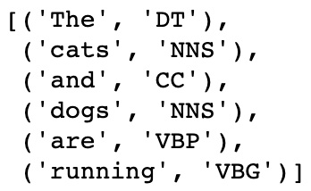

*Lab 4*: Text Preprocessing, Stemming, and Lemmatization
=========================================================


In this lab, we will cover the following topics:

-   Text preprocessing
-   Stemming
-   Lemmatization
-   Uses of stemming and lemmatization


Technical requirements
======================

For the text preprocessing in this lab, we will mostly use inbuilt
Python functions, but we will also use the external
`BeautifulSoup` package. For stemming and lemmatization, we
will use the NLTK Python package.


Removing HTML
-------------

When scraping text from online sources, you may find that your text
contains HTML markup and other non-textual
artifacts. We do not generally want to include these in our NLP inputs
for our models, so these should be removed by default. For example, in
HTML, the `<b>` tag indicates that the text following it
should be in bold font. However, this does not contain any textual
information about the content of the sentence, so we should remove this.
Fortunately, in Python, there is a package called
`BeautifulSoup` that allows us to remove all HTML in a few
lines:

```
input_text = "<b> This text is in bold</br>, <i> This text is in italics </i>"
output_text =  BeautifulSoup(input_text, "html.parser").get_text()
print('Input: ' + input_text)
print('Output: ' + output_text)
```


This returns the following output:


The preceding screenshot shows that the HTML has been successfully
removed. This could be useful in any situations where HTML code may be
present within raw text data, such as when scraping a web page for
data.


Converting text into lowercase
------------------------------

It is standard practice when preprocessing text to convert everything
into lowercase. This is because any two words that
are the same should be considered semantically identical, regardless of
whether they are capitalized or not. \'`Cat`\',
\'`cat`\', and \'`CAT`\' are all the same words but
just have different elements capitalized. Our models will generally
consider these three words as separate entities as they are not
identical. Therefore, it is standard practice to convert all words into
lowercase so that these words are all semantically and structurally
identical. This can be done very easily within Python using the
following lines of code:

```
input_text = ['Cat','cat','CAT']
output_text =  [x.lower() for x in input_text]
print('Input: ' + str(input_text))
print('Output: ' + str(output_text))
```


This returns the following output:


Removing punctuation
--------------------


*The panda eats shoots and leaves*

*The panda eats, shoots, and leaves*

The addition of a comma transforms the sentence describing a
panda\'s eating habits into a sentence describing an armed robbery of a
restaurant by a panda! Nevertheless, it is still important to be able to
remove punctuation from sentences for the sake of consistency. We can do
this in Python by using the `re` library, to match any
punctuation using a regular expression, and the `sub()`
method, to replace any matched punctuation with an empty character:

```
input_text = "This ,sentence.'' contains-£ no:: punctuation?"
output_text = re.sub(r'[^\w\s]', '', input_text)
print('Input: ' + input_text)
print('Output: ' + output_text)
```


This returns the following output:


This shows that the punctuation has been removed from the input
sentence.

There may be instances where we may not wish to directly remove
punctuation. A good example would be the use of
the ampersand (`&`), which in almost every instance is used
interchangeably with the word \"`and`\". Therefore, rather
than completely removing the ampersand, we may instead opt to replace it
directly with the word \"`and`\". We can easily implement this
in Python using the` .replace()` function:

```
input_text = "Cats & dogs"
output_text = input_text.replace("&", "and")
print('Input: ' + input_text)
print('Output: ' + output_text)
```


This returns the following output:


It is also worth considering specific circumstances where punctuation
may be essential for the representation of a
sentence. One crucial example is email addresses. Removing the
`@` from email addresses doesn\'t make the address any more
readable:

`name@gmail.com`

Removing the punctuation returns this:

namegmailcom

So, in instances like this, it may be preferable to remove the whole
item altogether, according to the requirements and purpose of your NLP
model.


Replacing numbers
-----------------

Similarly, with numbers, we also want to standardize our outputs.
Numbers can be written as digits (9, 8, 7) or as actual words (nine,
eight, seven). It may be worth transforming these
all into a single, standardized representation so that 1 and one are not
treated as separate entities. We can do this in Python using the
following methodology:

```
def to_digit(digit):
    i = inflect.engine()
    if digit.isdigit():
        output = i.number_to_words(digit)
    else:
        output = digit
    return output
input_text = ["1","two","3"]
output_text = [to_digit(x) for x in input_text]
print('Input: ' + str(input_text))
print('Output: ' + str(output_text))
```


This returns the following output:


This shows that we have successfully converted our digits into text.

However, in a similar fashion to processing email
addresses, processing phone numbers may not require the same
representation as regular numbers. This is illustrated in the following
example:

```
input_text = ["0800118118"]
output_text = [to_digit(x) for x in input_text]
print('Input: ' + str(input_text))
print('Output: ' + str(output_text))
```


This returns the following output:


Clearly, the input in the preceding example is a
phone number, so the full text representation is not necessarily fit for
purpose. In instances like this, it may be preferable to drop any long
numbers from our input text.


Stemming
--------

The **Porter Stemmer** is an algorithm with a
large number of logical rules that can be used to return the stem of a
word. We will first show how to implement a Porter Stemmer in Python
using NLTK before moving on and discussing the algorithm in more detail:

1.  First, we create an instance of the Porter Stemmer:
    ```
    porter = PorterStemmer()
    ```
    

2.  We then simply call this instance of the stemmer on individual words
    and print the results. Here, we can see an example of the stems
    returned by the Porter Stemmer:

    ```
    word_list = ["see","saw","cat", "cats", "stem", "stemming","lemma","lemmatization","known","knowing","time", "timing","football", "footballers"]
    for word in word_list:
        print(word + ' -> ' + porter.stem(word))
    ```
    

    This results in the following output:

    

    


3.  We can also apply stemming to an entire
    sentence, first by tokenizing the sentence and then by stemming each
    term individually:
    ```
    def SentenceStemmer(sentence):
        tokens=word_tokenize(sentence)
        stems=[porter.stem(word) for word in tokens]
        return " ".join(stems)
    SentenceStemmer('The cats and dogs are running')
    ```
    

This returns the following output:


We can examine some of the rules the Porter
Stemmer applies in more detail to understand exactly how the
transformation into the stem occurs. While the actual Porter algorithm
has many detailed steps, here, we will simplify some of the rules for
ease of understanding:


While it is not essential to understand every rule within the Porter
Stemmer, it is key that we understand its limitations. While the Porter
Stemmer has been shown to work well across a corpus, there will always
be words that it cannot reduce to their true stems correctly. Since the
rule set of the Porter Stemmer relies on the conventions of English word
structure, there will always be words that do not fall within the
conventional word structure and are not correctly transformed by these
rules. Fortunately, some of these limitations can be overcome through
the use of lemmatization.


Lemmatization
-------------


We will first create an instance of our lemmatizer and call it on a
selection of words:

```
wordnet_lemmatizer = WordNetLemmatizer()
print(wordnet_lemmatizer.lemmatize('horses'))
print(wordnet_lemmatizer.lemmatize('wolves'))
print(wordnet_lemmatizer.lemmatize('mice'))
print(wordnet_lemmatizer.lemmatize('cacti'))
```


This results in the following output:


Here, we can already begin to see the advantages of using lemmatization
over stemming. Since the WordNet Lemmatizer is built on a database of
all the words in the English language, it knows that `mice` is
the plural version of `mouse`. We would not have been able to
reach this same root using stemming. Although lemmatization works better
in the majority of cases, because it relies on a built-in index of
words, it is not able to generalize to new or made-up words:

```
print(wordnet_lemmatizer.lemmatize('madeupwords'))
print(porter.stem('madeupwords'))
```


This results in the following output:


Here, we can see that, in this instance, our stemmer is able to
generalize better to previously unseen words. Therefore, using a
lemmatizer may be a problem if we\'re lemmatizing
sources where language doesn\'t necessarily match
up with *real* English language, such as social media sites where people
may frequently abbreviate language.

If we call our lemmatizer on two verbs, we will see that this doesn\'t
reduce them to their expected common lemma:

```
print(wordnet_lemmatizer.lemmatize('run'))
print(wordnet_lemmatizer.lemmatize('ran'))
```


This results in the following output:


This is because our lemmatizer relies on the context of words to be able
to return the lemmas. Recall from our POS analysis that we can easily
return the context of a word in a sentence and determine whether a given
word is a noun, verb, or adjective. For now, let\'s manually specify
that our words are verbs. We can see that this now correctly returns the
lemma:

```
print(wordnet_lemmatizer.lemmatize('ran', pos='v'))
print(wordnet_lemmatizer.lemmatize('run', pos='v'))
```


This results in the following output:


This means that in order to return the correct
lemmatization of any given sentence, we must first perform POS tagging
to obtain the context of the words in the sentence, then pass this
through the lemmatizer to obtain the lemmas of each of the words in the
sentence. We first create a function that will return our POS tagging
for each word in the sentence:

```
sentence = 'The cats and dogs are running'
def return_word_pos_tuples(sentence):
    return nltk.pos_tag(nltk.word_tokenize(sentence))
return_word_pos_tuples(sentence)
```


This results in the following output:





Note how this returns the NLTK POS tags for each of the words in the
sentence. Our WordNet lemmatizer requires a slightly different input for
POS. This means that we first create a function
that maps the NLTK POS tags to the required WordNet POS tags:

```
def get_pos_wordnet(pos_tag):
    pos_dict = {"N": wordnet.NOUN,
                "V": wordnet.VERB,
                "J": wordnet.ADJ,
                "R": wordnet.ADV}
    return pos_dict.get(pos_tag[0].upper(), wordnet.NOUN)
get_pos_wordnet('VBG')
```


This results in the following output:


Finally, we combine these functions into one final function that will
perform lemmatization on the whole sentence:

```
def lemmatize_with_pos(sentence):
    new_sentence = []
    tuples = return_word_pos_tuples(sentence)
    for tup in tuples:
        pos = get_pos_wordnet(tup[1])
        lemma = wordnet_lemmatizer.lemmatize(tup[0], pos=pos)
        new_sentence.append(lemma)
    return new_sentence
lemmatize_with_pos(sentence)
```


This results in the following output:


#### Summary

In this lab, we have covered both stemming and lemmatization in
detail by exploring the functionality of both methods, their use cases,
and how they can be implemented. Now that we have covered all of the
fundamentals of deep learning and NLP preprocessing, we are ready to
start training our own deep learning models from scratch.

In the next lab, we will explore the fundamentals of NLP and
demonstrate how to build the most widely used models within the field of
deep NLP: recurrent neural networks.
