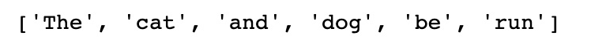

*Chapter 4*: Text Preprocessing, Stemming, and Lemmatization
=================================================================================


Textual data can be gathered from a number of different sources and
takes many different forms. Text can be tidy and readable or raw and
messy and can also come in many different styles and formats. Being able
to preprocess this data so that it can be converted into a standard
format before it reaches our NLP models is what we\'ll be looking at in
this chapter.

Stemming and lemmatization, similar to tokenization, are other forms of
NLP preprocessing. However, unlike tokenization, which reduces a
document into individual words, stemming and lemmatization are attempts
to reduce these words further to their lexical roots. For example,
almost any verb in English has many different variations, depending on
tense:

*He jumped*

*He is jumping*

*He jumps*

While all these words are different, they all relate to the same root
word -- **jump**. Stemming and lemmatization are both techniques we can
use to reduce word variations to their common roots.

In this chapter, we will explain how to perform preprocessing on textual
data, as well as explore both stemming and lemmatization and show how
these can be implemented in Python.

In this chapter, we will cover the following topics:

-   Text preprocessing
-   Stemming
-   Lemmatization
-   Uses of stemming and lemmatization


Technical requirements
======================


For the text preprocessing in this chapter, we will mostly use inbuilt
Python functions, but we will also use the external
`BeautifulSoup` package. For stemming and lemmatization, we
will use the NLTK Python package. All the code in this chapter can be
found at
<https://github.com/PacktPublishing/Hands-On-Natural-Language-Processing-with-PyTorch-1.x/tree/master/Chapter4>.


Text preprocessing
==================


Textual data can come in a variety of formats and styles. Text may be in
a structured, readable format or in a more raw,
unstructured format. Our text may contain punctuation and symbols that
we don\'t wish to include in our models or may contain HTML and other
non-textual formatting. This is of particular concern when scraping text
from online sources. In order to prepare our text so that it can be
input into any NLP models, we must perform preprocessing. This will
clean our data so that it is in a standard format. In this section, we
will illustrate some of these preprocessing steps in more
detail.


Removing HTML
-------------

When scraping text from online sources, you may find that your text
contains HTML markup and other non-textual
artifacts. We do not generally want to include these in our NLP inputs
for our models, so these should be removed by default. For example, in
HTML, the `<b>` tag indicates that the text following it
should be in bold font. However, this does not contain any textual
information about the content of the sentence, so we should remove this.
Fortunately, in Python, there is a package called
`BeautifulSoup` that allows us to remove all HTML in a few
lines:

```
input_text = "<b> This text is in bold</br>, <i> This text is in italics </i>"
output_text =  BeautifulSoup(input_text, "html.parser").get_text()
print('Input: ' + input_text)
print('Output: ' + output_text)
```


This returns the following output:


Figure 4.1 -- Removing HTML

The preceding screenshot shows that the HTML has been successfully
removed. This could be useful in any situations where HTML code may be
present within raw text data, such as when scraping a web page for
data.


Converting text into lowercase
------------------------------

It is standard practice when preprocessing text to convert everything
into lowercase. This is because any two words that
are the same should be considered semantically identical, regardless of
whether they are capitalized or not. \'`Cat`\',
\'`cat`\', and \'`CAT`\' are all the same words but
just have different elements capitalized. Our models will generally
consider these three words as separate entities as they are not
identical. Therefore, it is standard practice to convert all words into
lowercase so that these words are all semantically and structurally
identical. This can be done very easily within Python using the
following lines of code:

```
input_text = ['Cat','cat','CAT']
output_text =  [x.lower() for x in input_text]
print('Input: ' + str(input_text))
print('Output: ' + str(output_text))
```


This returns the following output:


Figure 4.2 -- Converting input into lowercase

This shows that the inputs have all been transformed into identical
lowercase representations. There are a few examples where capitalization
may actually provide additional semantic information. For example, *May*
(the month) and *may* (meaning *might*) are semantically different and
*May* (the month) will always be capitalized. However, instances like
this are very rare and it is much more efficient to convert everything
into lowercase than trying to account for these rare examples.

It is worth noting that capitalization may be
useful in some tasks such as part of speech tagging, where a capital
letter may indicate the word\'s role in the sentence, and named entity
recognition, where a capital letter may indicate that a word is a proper
noun rather than the non-proper noun alternative; for example, *Turkey*
(the country) and *turkey* (the bird).


Removing punctuation
--------------------

Sometimes, depending on the type of model being constructed, we may wish
to remove punctuation from our input text. This is
particularly useful in models where we are aggregating word counts, such
as in a bag-of-words representation. The presence of a full stop or a
comma within the sentence doesn\'t add any useful information about the
semantic content of the sentence. However, more complicated models that
take into account the position of punctuation within the sentence may
actually use the position of the punctuation to infer a different
meaning. A classic example is as follows:

*The panda eats shoots and leaves*

*The panda eats, shoots, and leaves*

Here, the addition of a comma transforms the sentence describing a
panda\'s eating habits into a sentence describing an armed robbery of a
restaurant by a panda! Nevertheless, it is still important to be able to
remove punctuation from sentences for the sake of consistency. We can do
this in Python by using the `re` library, to match any
punctuation using a regular expression, and the `sub()`
method, to replace any matched punctuation with an empty character:

```
input_text = "This ,sentence.'' contains-£ no:: punctuation?"
output_text = re.sub(r'[^\w\s]', '', input_text)
print('Input: ' + input_text)
print('Output: ' + output_text)
```


This returns the following output:


Figure 4.3 -- Removing punctuation from input

This shows that the punctuation has been removed from the input
sentence.

There may be instances where we may not wish to directly remove
punctuation. A good example would be the use of
the ampersand (`&`), which in almost every instance is used
interchangeably with the word \"`and`\". Therefore, rather
than completely removing the ampersand, we may instead opt to replace it
directly with the word \"`and`\". We can easily implement this
in Python using the` .replace()` function:

```
input_text = "Cats & dogs"
output_text = input_text.replace("&", "and")
print('Input: ' + input_text)
print('Output: ' + output_text)
```


This returns the following output:


Figure 4.4 -- Removing and replacing punctuation

It is also worth considering specific circumstances where punctuation
may be essential for the representation of a
sentence. One crucial example is email addresses. Removing the
`@` from email addresses doesn\'t make the address any more
readable:

`name@gmail.com`

Removing the punctuation returns this:

namegmailcom

So, in instances like this, it may be preferable to remove the whole
item altogether, according to the requirements and purpose of your NLP
model.


Replacing numbers
-----------------

Similarly, with numbers, we also want to standardize our outputs.
Numbers can be written as digits (9, 8, 7) or as actual words (nine,
eight, seven). It may be worth transforming these
all into a single, standardized representation so that 1 and one are not
treated as separate entities. We can do this in Python using the
following methodology:

```
def to_digit(digit):
    i = inflect.engine()
    if digit.isdigit():
        output = i.number_to_words(digit)
    else:
        output = digit
    return output
input_text = ["1","two","3"]
output_text = [to_digit(x) for x in input_text]
print('Input: ' + str(input_text))
print('Output: ' + str(output_text))
```


This returns the following output:


Figure 4.5 -- Replacing numbers with text

This shows that we have successfully converted our digits into text.

However, in a similar fashion to processing email
addresses, processing phone numbers may not require the same
representation as regular numbers. This is illustrated in the following
example:

```
input_text = ["0800118118"]
output_text = [to_digit(x) for x in input_text]
print('Input: ' + str(input_text))
print('Output: ' + str(output_text))
```


This returns the following output:


Figure 4.6 -- Converting a phone number into text

Clearly, the input in the preceding example is a
phone number, so the full text representation is not necessarily fit for
purpose. In instances like this, it may be preferable to drop any long
numbers from our input text.


Stemming and lemmatization
==========================


In language, **inflection** is how different grammatical categories such
as tense, mood, or gender can be expressed by modifying a common root
word. This often involves changing the prefix or
suffix of a word but can also involve modifying
the entire word. For example, we can make
modifications to a verb to change its tense:

*Run -\> Runs (Add \"s\" suffix to make it present tense)*

*Run -\> Ran (Modify middle letter to \"a\" to make it past tense)*

But in some cases, the whole word changes:

*To be -\> Is (Present tense)*

*To be -\> Was (Past tense)*

*To be -\> Will be (Future tense -- addition of modal)*

There can be lexical variations on nouns too:

*Cat -\> Cats (Plural)*

*Cat -\> Cat\'s (Possessive)*

*Cat -\> Cats\' (Plural possessive)*

All these words relate back to the root word cat. We can calculate the
root of all the words in the sentence to reduce the whole sentence to
its lexical roots:

*\"His cats\' fur are different colors\" -\> \"He cat fur be different
color\"*

Stemming and lemmatization is the process by which we arrive at these
root words. **Stemming** is an algorithmic process in which the ends of
words are cut off to arrive at a common root, whereas lemmatization uses
a true vocabulary and structural analysis of the word itself to arrive
at the true roots, or **lemmas**, of the word. We will cover both of
these methodologies in detail in the following
sections.


Stemming
--------

**Stemming** is the algorithmic process by which
we trim the ends off words in order to arrive at their lexical roots, or
**stems**. To do this, we can use different **stemmers** that each
follow a particular algorithm in order to return
the stem of a word. In English, one of the most common stemmers is the
Porter Stemmer.

The **Porter Stemmer** is an algorithm with a
large number of logical rules that can be used to return the stem of a
word. We will first show how to implement a Porter Stemmer in Python
using NLTK before moving on and discussing the algorithm in more detail:

1.  First, we create an instance of the Porter Stemmer:
    ```
    porter = PorterStemmer()
    ```
    

2.  We then simply call this instance of the stemmer on individual words
    and print the results. Here, we can see an example of the stems
    returned by the Porter Stemmer:

    ```
    word_list = ["see","saw","cat", "cats", "stem", "stemming","lemma","lemmatization","known","knowing","time", "timing","football", "footballers"]
    for word in word_list:
        print(word + ' -> ' + porter.stem(word))
    ```
    

    This results in the following output:

    
    
    

    Figure 4.7 -- Returning the stems of words

3.  We can also apply stemming to an entire
    sentence, first by tokenizing the sentence and then by stemming each
    term individually:
    ```
    def SentenceStemmer(sentence):
        tokens=word_tokenize(sentence)
        stems=[porter.stem(word) for word in tokens]
        return " ".join(stems)
    SentenceStemmer('The cats and dogs are running')
    ```
    

This returns the following output:


Figure 4.8 -- Applying stemming to a sentence

Here, we can see how different words are stemmed using the Porter
Stemmer. Some words, such as `stemming` and
`timing`, reduce to their expected stems of `stem`
and `time`. However, some words, such as `saw`,
don\'t reduce to their logical stem (`see`). This illustrates
the limitations of the Porter Stemmer. Since stemming applies a series
of logical rules to the word, it is very difficult to define a set of
rules that will correctly stem all words. This is especially true in the
cases of words in English where the word changes completely, depending
on the tense (is/was/be). This is because there are no generic rules
that can be applied to these words to transform them all into the same
root stem.

We can examine some of the rules the Porter
Stemmer applies in more detail to understand exactly how the
transformation into the stem occurs. While the actual Porter algorithm
has many detailed steps, here, we will simplify some of the rules for
ease of understanding:


Figure 4.9 -- Rules of the Porter Stemmer algorithm

While it is not essential to understand every rule within the Porter
Stemmer, it is key that we understand its limitations. While the Porter
Stemmer has been shown to work well across a corpus, there will always
be words that it cannot reduce to their true stems correctly. Since the
rule set of the Porter Stemmer relies on the conventions of English word
structure, there will always be words that do not fall within the
conventional word structure and are not correctly transformed by these
rules. Fortunately, some of these limitations can be overcome through
the use of lemmatization.


Lemmatization
-------------

**Lemmatization** differs from stemming in that it reduces words to
their **lemma** instead of their stem. While the stem of a word is
processed and reduced to a string, a word\'s lemma is its
true lexical root. So, while the stem of the word
`ran` will just be *ran*, its lemma is the true lexical root
of the word, which would be `run`.

The lemmatization process uses both inbuilt pre-computed lemmas and
associated words, as well as the context of the word within the sentence
to determine the correct lemma for a given word. In this
example, we will look at using the **WordNet**
**Lemmatizer** within NLTK. WordNet is a large database of English words
and their lexical relationships to one another. It contains one of the
most robust and comprehensive mappings of the English language,
specifically with regard to words\' relationships to their lemmas.

We will first create an instance of our lemmatizer and call it on a
selection of words:

```
wordnet_lemmatizer = WordNetLemmatizer()
print(wordnet_lemmatizer.lemmatize('horses'))
print(wordnet_lemmatizer.lemmatize('wolves'))
print(wordnet_lemmatizer.lemmatize('mice'))
print(wordnet_lemmatizer.lemmatize('cacti'))
```


This results in the following output:


Figure 4.10 -- Lemmatization output

Here, we can already begin to see the advantages of using lemmatization
over stemming. Since the WordNet Lemmatizer is built on a database of
all the words in the English language, it knows that `mice` is
the plural version of `mouse`. We would not have been able to
reach this same root using stemming. Although lemmatization works better
in the majority of cases, because it relies on a built-in index of
words, it is not able to generalize to new or made-up words:

```
print(wordnet_lemmatizer.lemmatize('madeupwords'))
print(porter.stem('madeupwords'))
```


This results in the following output:


Figure 4.11 -- Lemmatization output for made-up words

Here, we can see that, in this instance, our stemmer is able to
generalize better to previously unseen words. Therefore, using a
lemmatizer may be a problem if we\'re lemmatizing
sources where language doesn\'t necessarily match
up with *real* English language, such as social media sites where people
may frequently abbreviate language.

If we call our lemmatizer on two verbs, we will see that this doesn\'t
reduce them to their expected common lemma:

```
print(wordnet_lemmatizer.lemmatize('run'))
print(wordnet_lemmatizer.lemmatize('ran'))
```


This results in the following output:


Figure 4.12 -- Running lemmatization on verbs

This is because our lemmatizer relies on the context of words to be able
to return the lemmas. Recall from our POS analysis that we can easily
return the context of a word in a sentence and determine whether a given
word is a noun, verb, or adjective. For now, let\'s manually specify
that our words are verbs. We can see that this now correctly returns the
lemma:

```
print(wordnet_lemmatizer.lemmatize('ran', pos='v'))
print(wordnet_lemmatizer.lemmatize('run', pos='v'))
```


This results in the following output:


Figure 4.13 -- Implementing POS in the function

This means that in order to return the correct
lemmatization of any given sentence, we must first perform POS tagging
to obtain the context of the words in the sentence, then pass this
through the lemmatizer to obtain the lemmas of each of the words in the
sentence. We first create a function that will return our POS tagging
for each word in the sentence:

```
sentence = 'The cats and dogs are running'
def return_word_pos_tuples(sentence):
    return nltk.pos_tag(nltk.word_tokenize(sentence))
return_word_pos_tuples(sentence)
```


This results in the following output:


Figure 4.14 -- Output of POS tagging on a sentence

Note how this returns the NLTK POS tags for each of the words in the
sentence. Our WordNet lemmatizer requires a slightly different input for
POS. This means that we first create a function
that maps the NLTK POS tags to the required WordNet POS tags:

```
def get_pos_wordnet(pos_tag):
    pos_dict = {"N": wordnet.NOUN,
                "V": wordnet.VERB,
                "J": wordnet.ADJ,
                "R": wordnet.ADV}
    return pos_dict.get(pos_tag[0].upper(), wordnet.NOUN)
get_pos_wordnet('VBG')
```


This results in the following output:


Figure 4.15 -- Mapping NTLK POS tags to WordNet POS tags

Finally, we combine these functions into one final function that will
perform lemmatization on the whole sentence:

```
def lemmatize_with_pos(sentence):
    new_sentence = []
    tuples = return_word_pos_tuples(sentence)
    for tup in tuples:
        pos = get_pos_wordnet(tup[1])
        lemma = wordnet_lemmatizer.lemmatize(tup[0], pos=pos)
        new_sentence.append(lemma)
    return new_sentence
lemmatize_with_pos(sentence)
```


This results in the following output:




Figure 4.16 -- Output of the finalized lemmatization function

Here, we can see that, in general, lemmas generally provide a better
representation of a word\'s true root compared to stems, with some
notable exceptions. When we might decide to use
stemming and lemmatization depends on the requirements of the task at
hand, some of which we will explore now.


Uses of stemming and lemmatization
==================================


Stemming and lemmatization are both a form of NLP
that can be used to extract information from text. This
is known as **text mining**. Text mining tasks
come in a variety of categories, including text
clustering, categorization, summarizing documents, and sentiment
analysis. Stemming and lemmatization can be used in conjunction with
deep learning to solve some of these tasks, as we will see later in this
book.

By performing preprocessing using stemming and lemmatization, coupled
with the removal of stop words, we can better reduce our sentences to
understand their core meaning. By removing words that do not
significantly contribute to the meaning of the sentence
and by reducing words to their roots or lemmas, we
can efficiently analyze sentences within our deep learning frameworks.
If we are able to reduce a 10-word sentence to
five words consisting of multiple core lemmas rather than multiple
variations of similar words, this means much less data that we need to
feed through our neural networks. If we use bag-of-words
representations, our corpus will be significantly smaller as multiple
words all reduce down to the same lemmas, whereas if we calculate
embedding representations, the dimensionality required to capture the
true representations of our words will be smaller for a reduced corpus
of words.


Differences in lemmatization and stemming
-----------------------------------------

Now that we have seen both lemmatization and stemming in action, the
question still remains as to under which
circumstances we should use both of these techniques. We saw that both
techniques attempt to reduce each word to its root. In stemming, this
may just be a reduced form of the target room,
whereas in lemmatization, it reduces to a true English language word
root.

Because lemmatization requires cross-referencing the target word within
the WordNet corpus, as well as performing part-of-speech analysis to
determine the form of the lemma, this may take a significant amount of
processing time if a large number of words have to be lemmatized. This
is in contrast to stemming, which uses a detailed but relatively fast
algorithm to stem words. Ultimately, as with many problems in computing,
it is a question of trading off speed versus detail. When choosing which
of these methods to incorporate in our deep learning pipeline, the
trade-off may be between speed and accuracy. If time is of the essence,
then stemming may be the way to go. On the other hand, if you need your
model to be as detailed and as accurate as possible, then lemmatization
will likely result in the superior model.


Summary
=======


In this chapter, we have covered both stemming and lemmatization in
detail by exploring the functionality of both methods, their use cases,
and how they can be implemented. Now that we have covered all of the
fundamentals of deep learning and NLP preprocessing, we are ready to
start training our own deep learning models from scratch.

In the next chapter, we will explore the fundamentals of NLP and
demonstrate how to build the most widely used models within the field of
deep NLP: recurrent neural networks.
