*Lab 5*: Recurrent Neural Networks and Sentiment Analysis
==================================================================================


This chapter covers the following topics:

-   Building RNNs
-   Working with LSTMs
-   Building a sentiment analyzer using LSTM


Building RNNs
=============


Our recurrent layer looks something like the following, where *h* is the
hidden state and *x* is our input at various time steps in our sequence.
For each iteration, we update our hidden state at each time step, *x*:


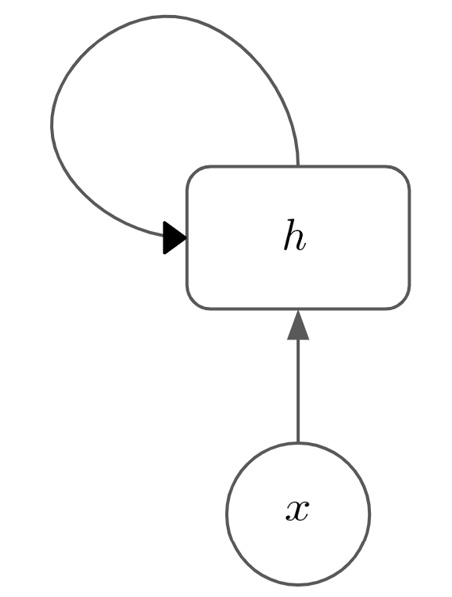


Alternatively, we can expand this out to the whole
sequence of time steps, which looks like this:


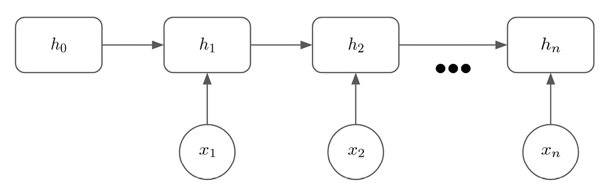


We also apply a *tanh* activation function to the resulting product,
keeping the values of the hidden state between -1 and 1. The equation
for calculating any hidden state, *h*[t], becomes the
following:


Using RNNs for sentiment analysis
---------------------------------

In the context of sentiment analysis, our model is
trained on a sentiment analysis dataset of reviews that consists of a
number of reviews in text and a label of 0 or 1,
depending on whether the review is negative or positive. This means that
our model becomes a classification task (where the two classes are
negative/positive). Our sentence is passed through a layer of learned
word embeddings to form a representation of the sentence comprising
several vectors (one for each word). These vectors are then fed
sequentially into our RNN layer and the final hidden state is passed
through another fully connected layer. Our model\'s output is a single
value between 0 and 1, depending on whether our model predicts a
negative or positive sentiment from the sentence.
This means our complete classification model looks like this:


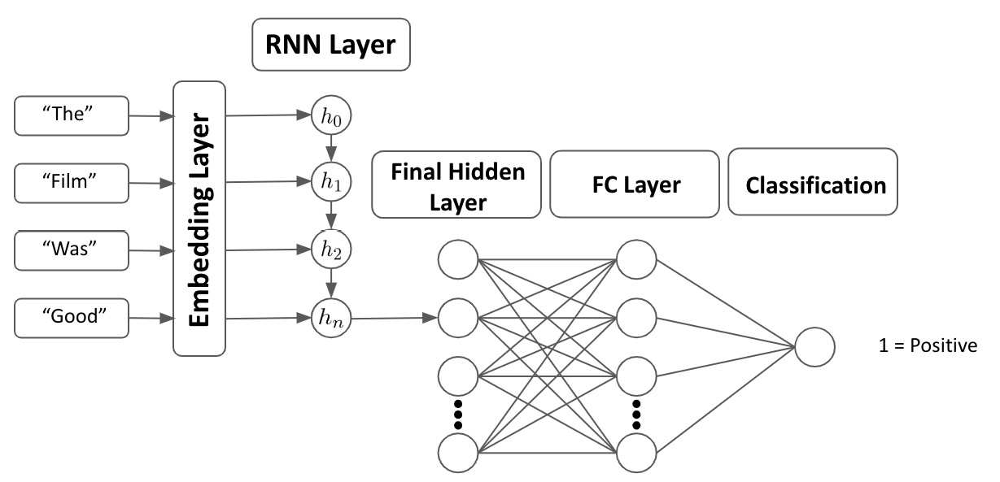


Now, we will highlight one of the issues with
RNNs---exploding and shrinking gradients---and how we can remedy this
using gradient clipping.


Exploding and shrinking gradients
---------------------------------

One issue that we are often faced with within RNNs is that of
**exploding or shrinking gradients**. We can think of
the recursive layer as a very deep network. When
calculating the gradients, we do so at every iteration of the hidden
state. If the gradient of the loss relative to the weights at any given
position becomes very big, this will have a multiplicative effect as it
feeds forward through all the iterations of the recurrent layer. This
can cause gradients to explode as they get very large very quickly. If
we have large gradients, this can cause instability in our network. On
the other hand, if the gradients within our hidden state are very small,
this will again have a multiplicative effect and the gradients will be
close to 0. This means that the gradients can become too small to
accurately update our parameters via gradient descent, meaning our model
fails to learn.

One technique we can use to prevent our gradients
from exploding is to use **gradient clipping**. This technique limits
our gradients to prevent them from becoming too
large. We simply choose a hyperparameter, *C*, and can calculate our
clipped gradient, as follows:


The following graph shows the relationship between the two variables:


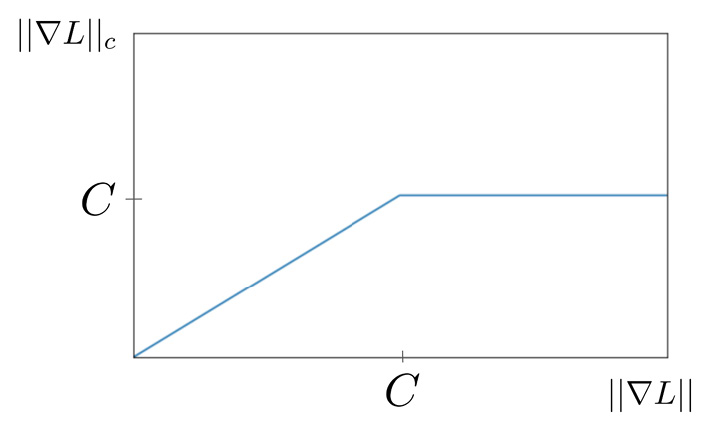


Working with LSTMs
------------------

LSTMs are more advanced versions of RNNs and
contain two extra properties an **update gate** and a **forget gate**.
These two 
easier for the network to learn long-term dependencies.

LSTMs are very similar in structure to RNNs. While there is a hidden
state that is carried over between steps within the LSTM, the inner
workings of the LSTM cell itself are different from that of the RNN:

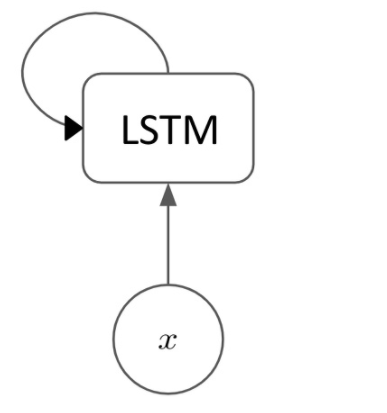


LSTM cells
----------

While an RNN cell just takes the previous hidden
state and the new input step and calculates the next hidden state using
some learned parameters, the inner workings of an LSTM cell are
significantly more complicated:


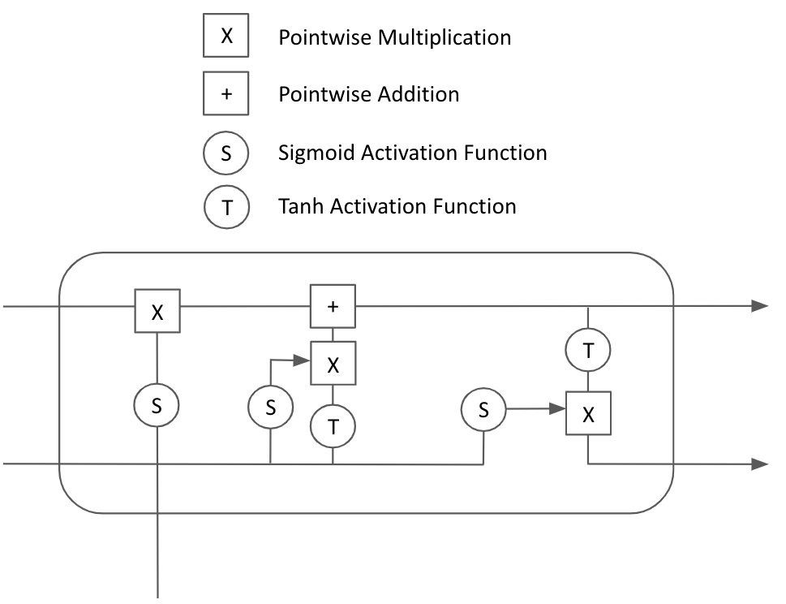


While this looks significantly more daunting than the RNN, we will
explain each component of the LSTM cell in turn.
We will first look at the **forget gate** (indicated by
the bold rectangle):


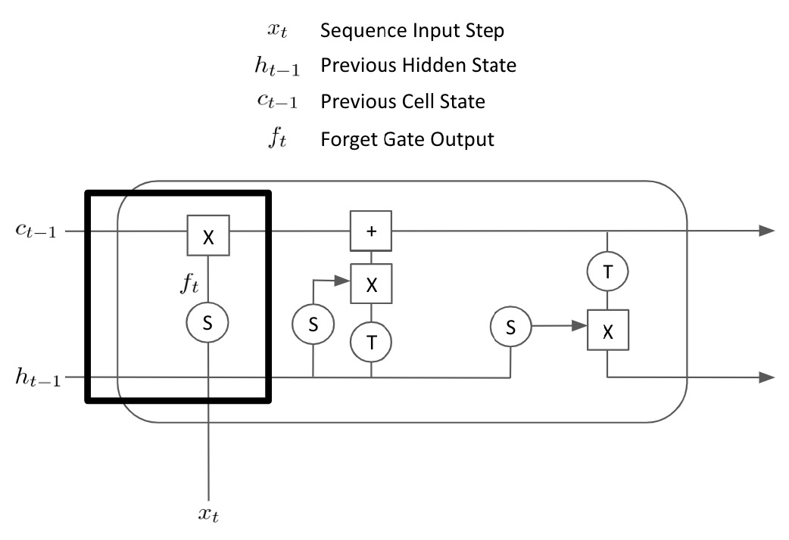


Next, we will look at the **input gate**:


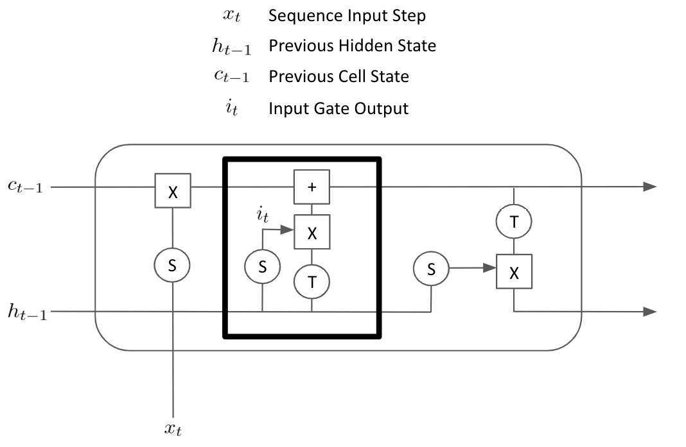


Finally, we have the last element of the LSTM
cell---the **output gate**:


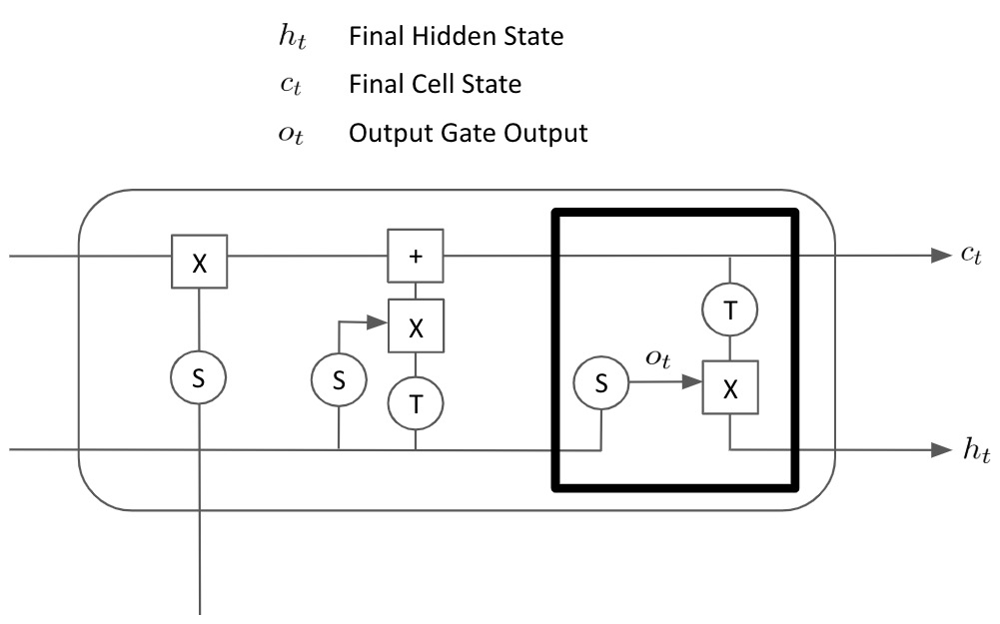


Bidirectional LSTMs
-------------------

Bidirectional LSTMs process sequences in regular order and reverse order
simultaneously, maintaining two hidden states.
We\'ll call the forward hidden state *f*[t] and use
*r*[t] for the reverse hidden state:

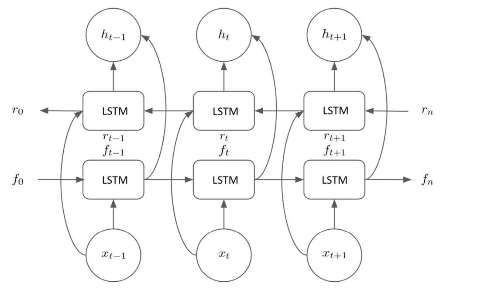


Building a sentiment analyzer using LSTMs
=========================================


We will now look at how to build our own simple
LSTM to categorize sentences based on their sentiment. We will train our
model on a dataset of 3,000 reviews that have been categorized as
positive or negative. These reviews come from
three different sources film reviews, product reviews, and location
reviews in order to ensure that our sentiment analyzer is robust. The
dataset is balanced so that it consists of 1,500 positive reviews and
1,500 negative reviews. We will start by importing our dataset and
examining it:

```
with open("sentiment labelled sentences/sentiment.txt") as f:
    reviews = f.read()
    
data = pd.DataFrame([review.split('\t') for review in                      reviews.split('\n')])
data.columns = ['Review','Sentiment']
data = data.sample(frac=1)
```


This returns the following output:

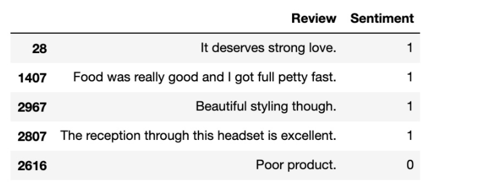


Preprocessing the data
----------------------

First, we create a function to tokenize our data,
splitting each review into a list of individual preprocessed words. We
loop through our dataset and for each review, we remove any punctuation,
convert letters into lowercase, and remove any trailing whitespace. We
then use the NLTK tokenizer to create individual tokens from this
preprocessed text:

```
def split_words_reviews(data):
    text = list(data['Review'].values)
    clean_text = []
    for t in text:
        clean_text.append(t.translate(str.maketrans('', '',                   punctuation)).lower().rstrip())
    tokenized = [word_tokenize(x) for x in clean_text]
    all_text = []
    for tokens in tokenized:
        for t in tokens:
            all_text.append(t)
    return tokenized, set(all_text)
reviews, vocab = split_words_reviews(data)
reviews[0]
```


This results in the following output:

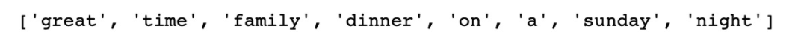


We return the reviews themselves, as well as a set of all words within
all the reviews (that is, the vocabulary/corpus), which we will use to
create our vocab dictionaries.

In order to fully prepare our sentences for entry into a neural network,
we must convert our words into numbers. In order to do this, we create a
couple of dictionaries, which will allow us to convert data from word
into index and from index into word. To do this, we simply loop through
our corpus and assign an index to each unique word:

```
def create_dictionaries(words):
    word_to_int_dict = {w:i+1 for i, w in enumerate(words)}
    int_to_word_dict = {i:w for w, i in word_to_int_dict.                            items()}
    return word_to_int_dict, int_to_word_dict
word_to_int_dict, int_to_word_dict = create_dictionaries(vocab)
int_to_word_dict
```


This gives the following output:

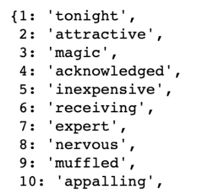


Our neural network will take input of a fixed length; however, if we
explore our reviews, we will see that our reviews
are all of different lengths. In order to ensure that all of our inputs
are of the same length, we will *pad* our input sentences. This
essentially means that we add empty tokens to shorter sentences so that
all the sentences are of the same length. We must first decide on the
length of the padding we wish to implement. We first calculate the
maximum length of a sentence in our input reviews, as well as the
average length:

```
print(np.max([len(x) for x in reviews]))
print(np.mean([len(x) for x in reviews]))
```


This gives the following:

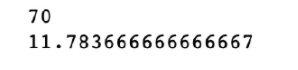


We can see that the longest sentence is `70` words long and
the average sentence length has a length of `11.78`. To
capture all the information from all our sentences, we want to pad all
of our sentences so that they have a length of 70. However, using longer
sentences means longer sequences, which causes our LSTM layer to become
deeper. This means model training takes longer as we have to
backpropagate our gradients through more layers, but it also means that
a large percentage of our inputs would just be sparse
and full of empty tokens, which makes learning
from our data much less efficient. This is illustrated by the fact that
our maximum sentence length is much larger than our average sentence
length. In order to capture the majority of our sentence information
without unnecessarily padding our inputs and making them too sparse, we
opt to use an input size of `50`. You may wish to experiment
with using different input sizes between `20` and
`70` to see how this affects your model performance.

We will create a function that allows us to pad our sentences so that
they are all the same size. For reviews shorter than the sequence
length, we pad them with empty tokens. For reviews longer than the
sequence length, we simply drop any tokens over the maximum sequence
length:

```
def pad_text(tokenized_reviews, seq_length):
    
    reviews = []
    
    for review in tokenized_reviews:
        if len(review) >= seq_length:
            reviews.append(review[:seq_length])
        else:
            reviews.append(['']*(seq_length-len(review)) +                    review)
        
    return np.array(reviews)
padded_sentences = pad_text(reviews, seq_length = 50)
padded_sentences[0]
```


Our padded sentence looks like this:


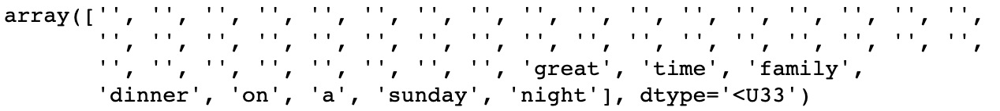


We must make one further adjustment to allow the use of empty tokens
within our model. Currently, our vocabulary
dictionaries do not know how to convert empty tokens into integers to
use within our network. Because of this, we manually add these to our
dictionaries with index `0`, which means empty tokens will be
given a value of `0` when fed into our model:

```
int_to_word_dict[0] = ''
word_to_int_dict[''] = 0
```


We are now very nearly ready to begin training our model. We perform one
final step of preprocessing and encode all of our padded sentences as
numeric sequences for feeding into our neural network. This means that
the previous padded sentence now looks like this:

```
encoded_sentences = np.array([[word_to_int_dict[word] for word in review] for review in padded_sentences])
encoded_sentences[0]
```


Our encoded sentence is represented as follows:

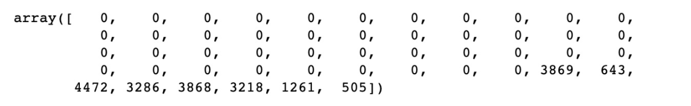


Now that we have all our input sequences encoded as numerical vectors,
we are ready to begin designing our model architecture.


Model architecture
------------------

Our model will consist of several main parts.
Besides the input and output layers that are common to many neural
networks, we will first require an **embedding layer**. This is so that
our model learns the vector representations of
the words it is being trained on. We could opt to
use precomputed embeddings (such as GLoVe), but for demonstrative
purposes, we will train our own embedding layer. Our input sequences are
fed through the input layer and come out as sequences of vectors.

These vector sequences are then fed into our
**LSTM layer**. As explained in detail earlier in this lab, the LSTM
layer learns sequentially from our sequence of embeddings and outputs a
single vector output representing the final hidden state of the LSTM
layer. This final hidden state is finally passed
through a further **hidden layer** before the final output node predicts
a value between 0 and 1, indicating whether the input sequence was a
positive or negative review. This means that our model architecture
looks something like this:


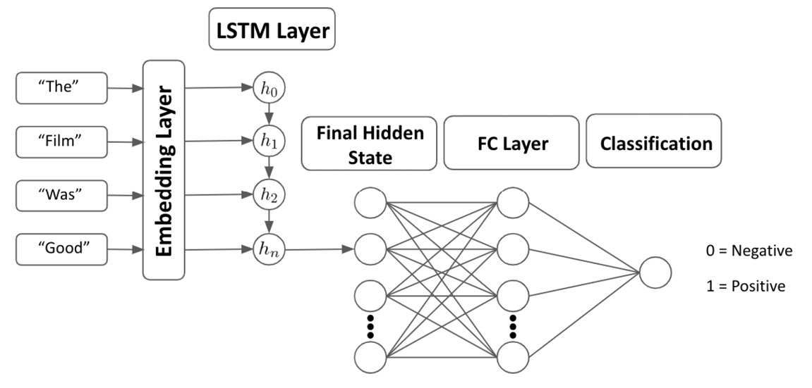


We will now demonstrate how to code this model
from scratch using PyTorch. We create a class called
`SentimentLSTM`, which inherits from the `nn.Module`
class. We define our `init` parameters as the size
of our vocab, the number of LSTM layers
our model will have, and the size of our model\'s
hidden state:

```
class SentimentLSTM(nn.Module):
    
    def __init__(self, n_vocab, n_embed, n_hidden, n_output,    n_layers, drop_p = 0.8):
        super().__init__()
        
        self.n_vocab = n_vocab  
        self.n_layers = n_layers 
        self.n_hidden = n_hidden 
```


We then define each of the layers of our network. Firstly, we define our
embedding layer, which will have the length of the
number of words in our vocabulary and the size of the embedding vectors
as a `n_embed` hyperparameter to be specified. Our LSTM layer
is defined using the output vector size from the embedding layer, the
length of the model\'s hidden state, and the
number of layers that our LSTM layer will have. We also add an argument
to specify that our LSTM can be trained on batches
of data and an argument to allow us to implement network regularization
via dropout. We define a further dropout layer with probability,
`drop_p` (a hyperparameter to be specified on model creation),
as well as our definitions of our final fully connected layer and
output/prediction node (with a sigmoid activation function):

```
       self.embedding = nn.Embedding(n_vocab, n_embed)
        self.lstm = nn.LSTM(n_embed, n_hidden, n_layers,                        batch_first = True, dropout = drop_p)
        self.dropout = nn.Dropout(drop_p)
        self.fc = nn.Linear(n_hidden, n_output)
        self.sigmoid = nn.Sigmoid()
```


Next, we need to define our forward pass within our model class. Within
this forward pass, we just chain together the output of one layer to
become the input into our next layer. Here, we can see that our
embedding layer takes `input_words` as input and outputs the
embedded words. Then, our LSTM layer takes embedded words as input and
outputs `lstm_out`. The only nuance here is that we use
`view()` to reshape our tensors from the LSTM output to be the
correct size for input into our fully connected layer. The same also
applies for reshaping the output of our hidden layer to match that of
our output node. Note that our output will return a prediction for
`class = 0` and `class = 1`, so we slice the output
to only return a prediction for `class = 1`---that is, the
probability that our sentence is positive:

```
 def forward (self, input_words):
                          
        embedded_words = self.embedding(input_words)
        lstm_out, h = self.lstm(embedded_words) 
        lstm_out = self.dropout(lstm_out)
        lstm_out = lstm_out.contiguous().view(-1,                             self.n_hidden)
        fc_out = self.fc(lstm_out)                  
        sigmoid_out = self.sigmoid(fc_out)              
        sigmoid_out = sigmoid_out.view(batch_size, -1)  
        
        sigmoid_last = sigmoid_out[:, -1]
        
        return sigmoid_last, h
```


We also define a function called `init_hidden()`, which
initializes our hidden layer with the dimensions
of our batch size. This allows our model to train
and predict on many sentences at once, rather than just training on one
sentence at a time, if we so wish. Note that we
define `device` as `"cpu"` here to run it on our
local processor. However, it is also possible to set this to a
CUDA-enabled GPU in order to train it on a GPU if you have one:

```
    def init_hidden (self, batch_size):
        
        device = "cpu"
        weights = next(self.parameters()).data
        h = (weights.new(self.n_layers, batch_size,\
                 self.n_hidden).zero_().to(device),\
             weights.new(self.n_layers, batch_size,\
                 self.n_hidden).zero_().to(device))
        
        return h
```


We then initialize our model by creating a new instance of the
`SentimentLSTM` class. We pass the size of our vocab, the size
of our embeddings, the size of our hidden state, as well as the output
size, and the number of layers in our LSTM:

```
n_vocab = len(word_to_int_dict)
n_embed = 50
n_hidden = 100
n_output = 1
n_layers = 2
net = SentimentLSTM(n_vocab, n_embed, n_hidden, n_output, n_layers)
```


Now that we 
model architecture fully, it\'s time to begin training our model.


Training the model
------------------

To train our model, we must first define our
datasets. We will train our model using a training set of data, evaluate
our trained model at each step on a validation set, and then finally,
measure our model\'s final performance using an unseen test set of data.
The reason we use a test set that is separate from our validation
training is that we may wish to fine-tune our model hyperparameters
based on the loss against the validation set. If we do this, we may end
up picking the hyperparameters that are only optimal in performance for
that particular validation set of data. We evaluate a final time against
an unseen test set to make sure our model generalizes well to data it
hasn\'t seen before at any part of the training loop.

We have already defined our model inputs (*x*) as
`encoded_sentences`, but we must also define our model output
(*y*). We do this simply, as follows:

```
labels = np.array([int(x) for x in data['Sentiment'].values])
```


Next, we define our training and validation ratios. In this case, we
will train our model on 80% of the data, validate on a further 10% of
the data, and finally, test on the remaining 10% of the data:

```
train_ratio = 0.8
valid_ratio = (1 - train_ratio)/2
```


We then use these ratios to slice our data and
transform them into tensors and then tensor datasets:

```
total = len(encoded_sentences)
train_cutoff = int(total * train_ratio)
valid_cutoff = int(total * (1 - valid_ratio))
train_x, train_y = torch.Tensor(encoded_sentences[:train_cutoff]).long(), torch.Tensor(labels[:train_cutoff]).long()
valid_x, valid_y = torch.Tensor(encoded_sentences[train_cutoff : valid_cutoff]).long(), torch.Tensor(labels[train_cutoff : valid_cutoff]).long()
test_x, test_y = torch.Tensor(encoded_sentences[valid_cutoff:]).long(), torch.Tensor(labels[valid_cutoff:])
train_data = TensorDataset(train_x, train_y)
valid_data = TensorDataset(valid_x, valid_y)
test_data = TensorDataset(test_x, test_y)
```


Then, we use these datasets to create PyTorch `DataLoader`
objects. `DataLoader` allows us to batch process our datasets
with the `batch_size` parameter, allowing different batch
sizes to be easily passed to our model. In this instance, we will keep
it simple and set `batch_size = 1`, which means our model will
be trained on individual sentences, rather than using larger batches of
data. We also opt to randomly shuffle our `DataLoader` objects
so that data is passed through our neural network in random order,
rather than the same order each epoch, potentially removing any biased
results from the training order:

```
batch_size = 1
train_loader = DataLoader(train_data, batch_size = batch_size,                          shuffle = True)
valid_loader = DataLoader(valid_data, batch_size = batch_size,                          shuffle = True)
test_loader = DataLoader(test_data, batch_size = batch_size,                         shuffle = True)
```


Now that we have defined our `DataLoader` object for each of
our three datasets, we define our training loop. We first define a
number of hyperparameters, which will be used
within our training loop. Most importantly, we
define our loss function as binary cross entropy (as we are dealing with
predicting a single binary class) and we define our optimizer to be
`Adam` with a learning rate of `0.001`. We also
define our model to run for a short number of epochs (to save time) and
set `clip = 5` to define our gradient clipping:

```
print_every = 2400
step = 0
n_epochs = 3
clip = 5  
criterion = nn.BCELoss()
optimizer = optim.Adam(net.parameters(), lr = 0.001)
```


The main body of our training loop looks like this:

```
for epoch in range(n_epochs):
    h = net.init_hidden(batch_size)
    
    for inputs, labels in train_loader:
        step += 1  
        net.zero_grad()
        output, h = net(inputs)
        loss = criterion(output.squeeze(), labels.float())
        loss.backward()
        nn.utils.clip_grad_norm(net.parameters(), clip)
        optimizer.step()
```


Here, we just train our model for a number of epochs, and for every
epoch, we first initialize our hidden layer using the batch size
parameter. In this instance, we set `batch_size = 1` as we are
just training our model one sentence at a time.
For each batch of input sentences and labels within our train loader, we
first zero our gradients (to stop them accumulating) and calculate our
model outputs using the forward pass of our data using the model\'s
current state. Using this output, we then calculate our loss using the
predicted output from the model and the correct labels. We then perform
a backward pass of this loss through our network to calculate the
gradients at each stage. Next, we use the `grad_clip_norm()`
function to clip our gradients as this will stop our gradients from
exploding, as mentioned earlier in this lab. We defined
`clip = 5`, meaning the maximum gradient at any given node is
`5`. Finally, we update our weights using the gradients
calculated on our backward pass by calling `optimizer.step()`.

If we run this loop by itself, we will train our model. However, we want
to evaluate our model performance after every epoch in order to
determine its performance on a validation set of data. We do this as
follows:

```
if (step % print_every) == 0:            
            net.eval()
            valid_losses = []
            for v_inputs, v_labels in valid_loader:
                       
                v_output, v_h = net(v_inputs)
                v_loss = criterion(v_output.squeeze(),                                    v_labels.float())
                valid_losses.append(v_loss.item())
            print("Epoch: {}/{}".format((epoch+1), n_epochs),
                  "Step: {}".format(step),
                  "Training Loss: {:.4f}".format(loss.item()),
                  "Validation Loss: {:.4f}".format(np.                                     mean(valid_losses)))
            net.train()
```


This means that at the end of each epoch, our model calls
`net.eval()` to freeze the weights of our model and performs a
forward pass using our data as before. Note that dropout is also not
applied when we are in evaluation mode. However, this time, instead of
using the training data loader, we use the validation loader. By doing
this, we can calculate the total loss of the model\'s current state over
our validation set of data. Finally, we print our results and call
`net.train()` to unfreeze our model\'s weights so that we can
train again on the next epoch. Our output looks
something like this:


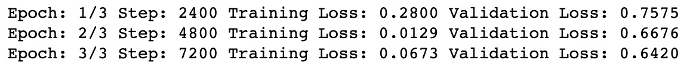


Finally, we can save our model for future use:

```
torch.save(net.state_dict(), 'model.pkl')
```


After training our model for three epochs, we notice two main things.
We\'ll start with the good news first---our model is learning something!
Not only has our training loss fallen, but we can also see that our loss
on the validation set has fallen after each epoch. This means that our
model is better at predicting sentiment on an unseen set of data after
just three epochs! The bad news, however, is that our model is massively
overfitting. Our training loss is much lower than that of our validation
loss, showing that while our model has learned how to predict the
training set of data very well, this doesn\'t generalize as well to an
unseen set of data. This was expected to happen as we are
using a very small set of training data (just
2,400 training sentences). As we are training a whole embedding layer,
it is possible that many of the words occur just once in the training
set and never in the validation set and vice versa, making it
practically impossible for the model to generalize all the different
variety of words within our corpus. In practice, we would hope to train
our model on a much larger dataset to allow our model to learn how to
generalize much better. We have also trained this model over a very
short time period and have not performed hyperparameter tuning to
determine the best possible iteration of our model. Feel free to try
changing some of the parameters within the model (such as the training
time, hidden state size, embedding size, and so on) in order to improve
the performance of the model.

Although our model overfitted, it has still learned something. We now
wish to evaluate our model on a final test set of data. We perform one
final pass on the data using the test loader we defined earlier. Within
this pass, we loop through all of our test data and make predictions
using our final model:

```
net.eval()
test_losses = []
num_correct = 0
for inputs, labels in test_loader:
    test_output, test_h = net(inputs)
    loss = criterion(test_output, labels)
    test_losses.append(loss.item())
    
    preds = torch.round(test_output.squeeze())
    correct_tensor = preds.eq(labels.float().view_as(preds))
    correct = np.squeeze(correct_tensor.numpy())
    num_correct += np.sum(correct)
    
print("Test Loss: {:.4f}".format(np.mean(test_losses)))
print("Test Accuracy: {:.2f}".format(num_correct/len(test_loader.dataset)))    
```


Our performance on our test set of data is as follows:


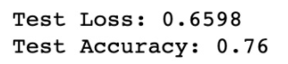


We then compare our model predictions with our true labels to get
`correct_tensor`, which is a vector that evaluates whether
each of our model\'s predictions was correct. We then sum this vector
and divide it by its length to get our model\'s total accuracy. Here, we
get an accuracy of 76%. While our model is certainly far from perfect,
given our very small training set and limited training time, this is not
bad at all! This just serves to illustrate how
useful LSTMs can be when it comes to learning from NLP data. Next, we
will show how we can use our model to make predictions from new data.


Using our model to make predictions
-----------------------------------

Now that we have a trained model, it should be
possible to repeat our preprocessing steps on a new sentence, pass this
into our model, and get a prediction of it\'s sentiment. We first create
a function to preprocess our input sentence to predict:

```
def preprocess_review(review):
    review = review.translate(str.maketrans('', '',                    punctuation)).lower().rstrip()
    tokenized = word_tokenize(review)
    if len(tokenized) >= 50:
        review = tokenized[:50]
    else:
        review= ['0']*(50-len(tokenized)) + tokenized
    
    final = []
    
    for token in review:
        try:
            final.append(word_to_int_dict[token])
            
        except:
            final.append(word_to_int_dict[''])
        
    return final
```


We remove punctuation and trailing whitespace, convert letters into
lowercase, and tokenize our input sentence as before. We pad our
sentence to a sequence with a length of `50` and then convert
our tokens into numeric values using our
precomputed dictionary. Note that our input may contain new words that
our network hasn\'t seen before. In this case, our function treats these
as empty tokens.

Next, we create our actual `predict()` function. We preprocess
our input review, convert it into a tensor, and pass this into a data
loader. We then loop through this data loader (even though it only
contains one sentence) and pass our review through our network to obtain
a prediction. Finally, we evaluate our prediction and print whether it
is a positive or negative review:

```
def predict(review):
    net.eval()
    words = np.array([preprocess_review(review)])
    padded_words = torch.from_numpy(words)
    pred_loader = DataLoader(padded_words, batch_size = 1,                             shuffle = True)
    for x in pred_loader:
        output = net(x)[0].item()
    
    msg = "This is a positive review." if output >= 0.5 else           "This is a negative review."
    print(msg)
    print('Prediction = ' + str(output))
```


Finally, we just call `predict()` on our review to make a
prediction:

```
predict("The film was good")
```


This results in the following output:

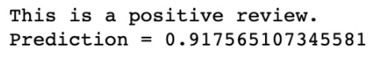


We also try using `predict()` on the negative value:

```
predict("It was not good")
```


This results in the following output:

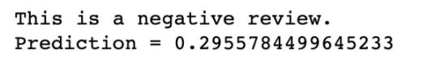


Flask Application
------------------

#### Creating an API using Flask -- file structure

Creating an API is fairly simple using Flask as
Flask contains a default template required to make
an API:

First, in the command line, create a new folder
for your flask API and navigate to it:

```
mkdir flaskAPI
cd flaskAPI
```


Then, create a virtual environment within the folder. This will be the
Python environment that your API will use:

```
python3 -m venv vir_env
```


Within your environment, install all the packages that you will need
using `pip`. This includes all the packages that you use
within your model program, such as NLTK, `pandas`, NumPy, and
PyTorch, as well as the packages you will need to run the API, such as
Flask and Gunicorn:

```
pip install nltk pandas numpy torch flask gunicorn
```


We then create a list of requirements that our API will use. We can do this by typing the
following:

```
pip freeze > requirements.txt
```


One adjustment we need to make is to replace the `torch` line
within the `requirements.txt` file with the following:

```
https://download.pytorch.org/whl/cpu/torch-1.3.1%2Bcpu-cp37-cp37m-linux_x86_64.whl
```


This is a link to the wheel file of the version of PyTorch that only
contains the CPU implementation. Finally, we create three more files within our folder, as well
as a final directory for our models:

```
touch app.py
touch Procfile
touch wsgi.py
mkdir models
```


Now, we have created all the files we will need
for our Flash API and we are ready to start making
adjustments to our file.


Creating an API using Flask -- API file
---------------------------------------

Within our `app.py` file, we can begin
building our API:

1.  We first carry out all of our imports and
    create a `predict` route. This allows us to call our API
    with the `predict` argument in order to run a
    `predict()` method within our API:
    ```
    import flask
    from flask import Flask, jsonify, request
    import json
    import pandas as pd
    from string import punctuation
    import numpy as np
    import torch
    from nltk.tokenize import word_tokenize
    from torch.utils.data import TensorDataset, DataLoader
    from torch import nn
    from torch import optim
    app = Flask(__name__)
    @app.route('/predict', methods=['GET'])
    ```
    

2.  Next, we define our `predict()` method within our
    `app.py` file. This is largely a rehash of our model file,
    so to avoid repetition of code, it is advised that you look at the
    completed `app.py` file within the GitHub repository
    linked in the *Technical requirements* section of this chapter. You
    will see that there are a few additional
    lines. Firstly, within our `preprocess_review()` function,
    we will see the following lines:

    ```
    with open('models/word_to_int_dict.json') as handle:
    word_to_int_dict = json.load(handle)
    ```
    

    This takes the `word_to_int` dictionary we computed within
    our main model notebook and loads it into our
    model. This is so that our word indexing is consistent with our
    trained model. We then use this dictionary to convert our input text
    into an encoded sequence. Be sure to take the
    `word_to_int_dict.json` file from the original notebook
    output and place it within the `models` directory.

3.  Similarly, we must also load the weights from our trained model. We
    first define our `SentimentLSTM` class and the load our
    weights using `torch.load`. We will use the
    `.pkl` file from our original notebook, so be sure to
    place this in the `models` directory as well:
    ```
    model = SentimentLSTM(5401, 50, 100, 1, 2)
    model.load_state_dict(torch.load("models/model_nlp.pkl"))
    ```
    

4.  We must also define the input and outputs of our API. We want our
    model to take the input from our API and pass this to our
    `preprocess_review()` function. We do this using
    `request.get_json()`:
    ```
    request_json = request.get_json()
    i = request_json['input']
    words = np.array([preprocess_review(review=i)])
    ```
    

5.  To define our output, we return a JSON response consisting of the
    output from our model and a response code,
    `200`, which is what is returned by our predict function:
    ```
    output = model(x)[0].item()
    response = json.dumps({'response': output})
        return response, 200
    ```
    

6.  With the main body of our app complete, there
    are just two more additional things we must add in order to make our
    API run. We must first add the following to our `wsgi.py`
    file:
    ```
    from app import app as application
    if __name__ == "__main__":
        application.run()
    ```
    

7.  Finally, add the following to our Procfile:
    ```
    web: gunicorn app:app --preload
    ```
    

That\'s all that\'s required for the app to run. We can test that our
API runs by first starting the API locally using the following command:

```
gunicorn --bind 0.0.0.0:8080 wsgi:application -w 1
```


Once the API is running locally, we can make a request to the API by
passing it a sentence to predict the outcome:

```
curl -X GET http://0.0.0.0:8080/predict -H "Content-Type: application/json" -d '{"input":"the film was good"}'
```


Your application will now return a prediction from the model.
Congratulations, you have now learned how to train an LSTM model from
scratch and make predictions using it!


#### Summary

In this lab, we discussed the fundamentals of RNNs and one of their
main variations, LSTM. We then demonstrated how you can build your own
RNN from scratch. While
RNNs are often used for deep learning on NLP tasks, they are by no means
the only neural network architecture suitable for this task.

In the next lab, we will look at convolutional neural networks and
show how they can be used for NLP learning tasks.
