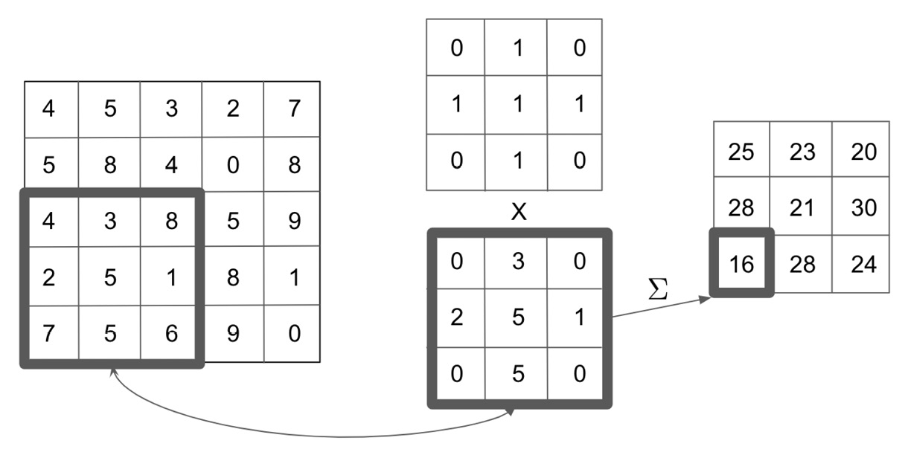
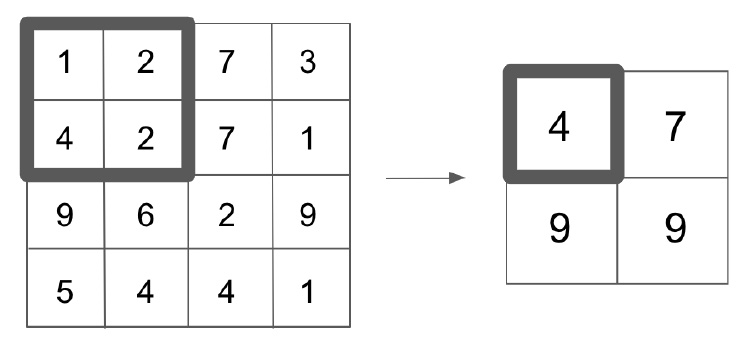

*Lab 6*: Convolutional Neural Networks for Text Classification
=======================================================================================


In the previous chapter, we showed how RNNs can be used to provide
sentiment classifications for text. However, RNNs are not the only
neural network architecture that can be used for NLP classification
tasks. **Convolutional neural networks** (**CNNs**) are another such
architecture.

RNNs rely on sequential modeling, maintain a hidden state, and then step
sequentially through the text word by word, updating the state at each
iteration. CNNs do not rely on the sequential element of language, but
instead try and learn from the text by perceiving each word in the
sentence individually and learning its relationship to the words
surrounding it within the sentence.

While CNNs are more commonly used for classifying images for the reasons
mentioned here, they have been shown to be effective at classifying text
as well. While we do perceive text as a sequence, we also know that the
meaning of individual words in the sentence depends on their context and
the words they appear next to. Although CNNs and RNNs learn from text in
different ways, they have both shown to be effective in text
classification, and which one to use in any given situation depends on
the nature of the task.

In this chapter, we will explore the basic theory behind CNNs, as well
as construct a CNN from scratch that will be used to classify text. We
will cover the following topics:

-   Exploring CNNs
-   Building a CNN for text classification

Let\'s get started!


Exploring CNNs
==============


The basis for CNNs comes from the field of
computer vision but can conceptually be extended to work on NLP as well.
The way the human brain processes and understands images is not on a
pixel-by-pixel basis, but as a holistic map of an image and how each
part of the image relates to the other parts.

A good analogy of CNNs would be how the human mind processes a picture
versus how it processes a sentence. Consider the sentence, *This is a
sentence about a cat*. When you read that sentence you read the first
word, followed by the second word and so forth. Now, consider a picture
of a cat. It would be foolish to assimilate the information within the
picture by looking at the first pixel, followed by the second pixel.
Instead, when we look at something, we perceive the whole image at once,
rather than as a sequence.

For example, if we take a black and white representation of an image (in
this case, the digit 1), we can see that we can transform this into a
vector representation, where the color of each pixel is denoted by a 0
or a 1:


Figure 6.1 -- Vector representation of an image

However, if we think about this in machine learning terms and treat this
vector as features of our model, does the fact that any single pixel is
black or white make it more or less likely that the picture is of a
given digit? Does a white pixel in the top-right corner make the picture
more likely to be a four or a seven? Imagine if we were trying to detect
something more complex, such as whether a picture is of a dog or a cat.
Does a brown pixel in the middle of the screen
make the photo more likely to be a cat or a dog?
Intuitively, we see that individual pixel values do not mean a lot when
it comes to image classification. However, what we are interested in is
the pixel\'s relationships to one another.

In our case of digit representation, we know that a long vertical line
is very likely to be a one and that any photo with a closed loop in it
is more likely to be a zero, six, eight, or nine. By identifying and
learning from patterns within our images, rather than just looking at
individual pixels, we can better understand and identify these images.
This is exactly what CNNs aim to achieve.


Convolutions
------------

The basic concept behind CNNs is that of
convolutions. A **convolution** is essentially a sliding window function
that\'s applied to a matrix in order to capture
information from the surrounding pixels. In the
following diagram, we can see an example of convolution in action:




Figure 6.2 -- Convolution in action

On the left, we have the image that we are
processing, while at the top, we have the convolution kernel we wish to
apply. For every 3x3 block within our image, we multiply this by our
kernel to give us our convolution matrix at the
bottom. We then sum (or average) the convolved matrix to get our single
output value for this 3x3 block within our initial image. Note that
within our 5x5 initial images, there are nine possible 3x3 blocks we can
overlay onto this. As we apply this convolution process for every 3x3
block within our initial image, we are left with a final processed
convolution that is 3x3.

In a large image (or a complex sentence, in the case of NLP), we will
also need to implement pooling layers. In our preceding example,
applying a 3x3 convolution to a 5x5 image results in a 3x3 output.
However, if we applied a 3x3 convolution to a 100x100 pixel image, this
would only reduce the output to 98x98. This hasn\'t reduced the
dimensionality of the image enough to perform deep learning effectively
(as we would have to learn 98x98 parameters per convolutional layer).
Therefore, we apply a pooling layer to further reduce the dimensionality
of the layer.

A pooling layer applies a function (typically, a max function) to the
output of the convolutional layer in order to reduce its dimensionality.
This function is applied over a sliding window, similar to how
our convolutions are performed, except now our
convolutions do not overlap. Let\'s assume our convolutional layer has
an output of 4x4 and we apply a 2x2 max pooling function to our output.
This means that for every smaller 2x2 grid within our layer, we apply a
max function and keep the resulting output. We can
see this in the following diagram:




Figure 6.3 -- Pooling layers

These pooling layers have been shown to effectively reduce the
dimensionality of our data, while still retaining much of the essential
information from the convolutional layer.

This combination of convolutions and pooling layers is essentially how
CNNs learn from images. We can see that by applying many of these
convolutional processes (also known as
**convolutional layers**), we are able to capture information about any
given pixel\'s relationship to its neighboring pixels. Within CNNs, the
parameters we aim to learn are the values of the convolution kernel
itself. This means that our model effectively learns how it should
convolve across an image in order to be able to extract the necessary
information required to make a classification.

There are two main advantages to using
convolutions in this context. Firstly, we are able to compose a series
of low-level features into a higher-level feature; that is, a 3x3 patch
on our initial image is composed into a single
value. This effectively acts as a form of feature reduction and allows
us to only extract the relevant information from our image. The other
advantage that using convolutions has is that it makes our model
location invariant. In our digit detector example, we do not
care if the number occurs on the right-hand side
of the image or the left-hand side; we just want to be able to detect
it. As our convolutions will detect specific patterns within our image
(that is, edges), this makes our model location invariant as the same
features will theoretically be picked up by the convolutions, no matter
where they occur within the image.

While these principles are useful for understanding how convolutions
work in image data, they can also be applied to NLP data. We\'ll look at
this in the next section.


Convolutions for NLP
--------------------

As we have seen many times in this book, we can represent individual
words numerically as vectors, and represent whole
sentences and documents as a sequence of vectors.
When we represent our sentence as a sequence of
vectors, we can represent this as a matrix. If we have a matrix
representation of a given sentence, we notice immediately that this is
similar to the image we convolved over within our image convolutions.
Therefore, we can apply convolutions to NLP in a similar fashion to
images, provided we can represent our text as a matrix.

Let\'s first consider the basis for using this methodology. When we
looked at n-grams previously, we saw that the context of a word in a
sentence depends on the words preceding it and the words coming after
it. Therefore, if we can convolve over a sentence in a way that allows
us to capture the relation of one word to the words around it, we can
theoretically detect patterns in language and use this to better
classify our sentences.

It is also worth noting that our method of convolution is slightly
different to our convolution on images. In our image matrix, we wish to
capture the context of a single pixel relative to those surrounding it,
whereas in a sentence, we wish to capture the context of a whole word
vector, relative to the other vectors around it. Therefore, in NLP, we
want to perform our convolutions across whole word vectors, rather than
within word vectors. This is demonstrated in the
following diagram.

We first represent our sentence as individual word
vectors:


Figure 6.4 -- Word vectors

We then apply a (2 x *n*) convolution over the matrix (where *n* is the
length of our word vectors; in this instance, *n* = 5). We can convolve
four different times using a (2 x *n*) filter, which reduces down into
four outputs. You will notice that this is similar to a bi-gram model,
where there are four possible bi-grams within a five-word sentence:


Figure 6.5 -- Convolving word vectors into bi-grams

Similarly, we can do this for any number of n-grams; for example, *n*=3:


Figure 6.6 -- Convolving word vectors into n-grams

One of the benefits of convolutional models such
as this is there is no limit to the number of
n-grams we can convolve over. We are also able to convolve over multiple
different n-grams simultaneously. So, to capture both bi-grams and
trigrams, we could set our model up like so:


Figure 6.7 -- Convolving word vectors into bi-grams and trigrams

Although CNNs for NLP have advantages such as those described in the
preceding sections, they do have their drawbacks.

In CNNs for images, the assumption that a given
pixel is likely related to those surrounding it is a reasonable one.
When applied to NLP, while this assumption is partially correct, words
can be semantically related, even if they are not
in direct proximity to one another. A word at the start of a sentence
can pertain to the word at the end of a sentence.

While our RNN models may be able to detect this relationship through
longer-term memory dependencies, our CNNs may struggle as CNNs only
capture the context of the words surrounding the target word.

That being said, CNNs for NLP have been proven to perform very well in
some tasks, even though our language assumptions do not necessarily
hold. Arguably, the main advantages of using CNNs for NLP are speed and
efficiency. Convolutions can be easily implemented on GPUs, allowing for
fast parallelized computation and training.

The way that relationships between words are captured is also much more
efficient. In a true n-gram model, the model must learn individual
representations for every single n-gram, whereas in our CNN models, we
just learn the convolutional kernels, which will automatically extract
the relationships between given word vectors.

Now that we have defined how our CNN will learn
from our data, we can begin to code up a model
from scratch.


Building a CNN for text classification
======================================


Now that we know the basics of CNNs, we can begin to
build one from scratch. In the previous chapter,
we built a model for sentiment prediction, where
sentiment was a binary classifier; `1`
for positive and `0` for negative. However, in this example,
we will aim to build a CNN for **multi-class text classification**. In a
multi-class problem, a particular example can only be classified as one
of several classes. If an example can be classified as many different
classes, then this is multi-label classification. Since our model is
multi-class, this means that our model will aim at predicting which one
of several classes our input sentence is classified as. While this
problem is considerably more difficult than our binary classification
task (as our sentence can now belong to one of many, rather than one of
two classes), we will show that CNNs can deliver good performance on
this task. We will first begin by defining our data.


Defining a multi-class classification dataset
---------------------------------------------

In the previous chapter, we looked at a selection
of reviews and learned a binary classification
based on whether the review was positive or negative. For this task, we
will look at data from the TREC
(<https://trec.nist.gov/data/qa.html>) dataset, which is a common
dataset used to evaluate the performance of a model\'s
text-classification tasks. The dataset consists of a selection of
questions, each of which falls into one of six broad semantic categories
that our trained model will learn to classify. These six categories are
as follows:


Figure 6.8 -- Semantic categories in the TREC dataset

This means that unlike our previous classification
class, where our model output was a single prediction between
`0` and `1`, our multi-class prediction model now
returns a probability for each of the six possible
classes. We assume that the prediction that\'s made is for the class
with the highest prediction:


Figure 6.9 -- Prediction values

In this way, our model will now be able to perform classification tasks
over several classes and we are no longer restricted to the 0 or 1
binary classification we looked at previously. Models with multiple
classes may suffer in terms of predictions as
there are more different classes to differentiate between.

In a binary classification model, assuming we had a balanced dataset, we
would expect our model to have an accuracy of 50% if it were just to
perform random guesses, whereas a multi-class
model with five different classes would only have
a baseline accuracy of 20%. This means that just because a multiclass
model has an accuracy much lower than 100%, this does not mean the model
itself is inherently bad at making predictions. This is particularly
true when it comes to training models that predict from hundreds of
different classes. In these cases, a model with just 50% accuracy would
be considered to be performing very well.

Now that we have defined our multi-class classification problem, we need
to load our data in order to train a model.


Creating iterators to load the data
-----------------------------------

In our LSTM model in the previous chapter, we
simply used a `.csv` file containing all the data we used to
train our model. We then manually converted this data into input tensors
and fed them one by one into our network in order to train it. While
this methodology is perfectly acceptable, it is not the most efficient
one.

In our CNN model, we will instead look at creating data iterators from
our data. These iterator objects allow us to easily generate small
batches of data from our input data, thus allowing us to train our model
using mini batches, rather than feeding our input data one by one into
the network. This means that the gradients within our network are
calculated across a whole batch of data and that parameter adjustments
happen after each batch rather than after each individual row of data is
passed through the network.

For our data, we will take our dataset from the TorchText package. This
has the advantage of not only containing a number of datasets for model
training, but it also allows us to easily tokenize and vectorize our
sentences using the inbuilt functions.

Follow these steps:

1.  We first import the data and dataset functions from TorchText:
    ```
    from torchtext import data
    from torchtext import datasets
    ```
    

2.  Next, we create a field and label field we can use with the
    `TorchText` package. These define the initial processing
    steps our model will use to process our data:

    ```
    questions = data.Field(tokenize = ‘spacy’, batch_first = True)
    labels = data.LabelField(dtype = torch.float)
    ```
    

    Here, we set tokenize equal to
    `spacy` in order to set how our input sentences will be
    tokenized. `TorchText` then uses the `spacy`
    package to automatically tokenize the input sentences.
    `spacy` consists of an index of the English language, so
    any words are automatically transformed into the relevant tokens.
    You may need to install `spacy` in order for this to work.
    This can be done within the command line by typing the following:

    ```
    pip3 install spacy
    python3 -m spacy download en
    ```
    

    This installs `spacy` and downloads the English word
    index.

3.  We also define the data type for our labels as floats, which will
    allow us to calculate our losses and gradients. After defining our
    fields, we can use these to split our input data. Using the
    `TREC` dataset from `TorchText`, we pass this
    our questions and labels fields in order to process the dataset
    accordingly. We then call the `split` function in order to
    automatically divide our dataset into a training set and a
    validation set:

    ```
    train_data, _ = datasets.TREC.splits(questions, labels)
    train_data, valid_data = train_data.split()
    ```
    

    Note that, normally, we can view our datasets in Python by simply
    calling the train data:

    ```
    train_data
    ```
    

However, here, we are dealing with a `TorchText` dataset
object, rather than a dataset loaded into pandas, as we might be used to
seeing. This means that our output from the preceding code is as
follows:


Figure 6.10 -- Output of the TorchText object

It is possible for us to view individual data
within this dataset object; we just need to call the
`.examples` parameter. Each of these examples will have a text
and a label parameter that we can examine like so for the text:

```
train_data.examples[0].text
```


This returns the following output:


Figure 6.11 -- Data in the dataset object

The label code is run as follows:

```
train_data.examples[0].label
```


This gives us the following output:


Figure 6.12 -- Label of the dataset object

So, we can see that our input data consists of a
tokenized sentence and that our label consists of the category that we
wish to classify. We can also check the size of our training and
validation sets, like so:

```
print(len(train_data))
print(len(valid_data))
```


This results in the following output:


Figure 6.13 -- Sizes of the training and validation sets

This shows that our training to validation ratio is approximately 70% to
30%. It is worth noting exactly how our input sentence has been
tokenized, namely that punctuation marks are treated as their own
tokens.

Now that we know that our neural network will not take raw text as an
input, we have to find some way of turning this into some form of
embedding representation. While it is possible for us to train our own
embedding layer, we can instead transform our data using the
pre-computed `glove` vectors that we discussed in [*Chapter
3*](https://subscription.packtpub.com/book/data/9781789802740/5)*,
Performing Text Embeddings*. This also has the added benefit of making
our model faster to train as we won\'t manually need to train our
embedding layer from scratch:

```
questions.build_vocab(train_data,
                 vectors = “glove.6B.200d”, 
                 unk_init = torch.Tensor.normal_)
labels.build_vocab(train_data)
```


Here, we can see that by using the `build_vocab` function and
passing our questions and labels as our training data, we can build a
vocabulary composed of 200-dimensional GLoVe vectors. Note that the
TorchText package will automatically download and grab the GLoVe
vectors, so there is no need to manually install GLoVe in this instance.
We also define how we wish to treat unknown values
within our vocabulary (that is, what the model does if it is passed a
token that isn\'t in the pretrained vocabulary). In this instance, we
choose to treat them as a normal tensor with an unspecified value,
although we will update this later.

We can now see that our vocabulary consists of a series of pre-trained
200-dimensional GLoVe vectors by calling the following command:

```
questions.vocab.vectors
```


This results in the following output:


Figure 6.14 -- Tensor contents

Next, we create our data iterators. We create separate iterators for
both our training and validation data. We first specify a device so that
we are able to train our model faster using a CUDA-enabled GPU, if one
is available. Within our iterators, we also specify the size of our
batches to be returned by the iterators, which in this case is
`64`. You may wish to experiment with
using different batch sizes for your model as this
may affect training speed and how fast the model converges into its
global optimum:

```
device = torch.device(‘cuda’ if torch.cuda.is_available() else                       ‘cpu’)
train_iterator, valid_iterator = data.BucketIterator.splits(
    (train_data, valid_data), 
    batch_size = 64, 
    device = device)
```


Constructing the CNN model
--------------------------

Now that we have loaded the data, we are ready to
create the model. We will use the following steps to do so:

1.  We wish to build the structure of our CNN. We begin as usual by
    defining our model as a class that inherits from
    `nn.Module`:
    ```
    class CNN(nn.Module):
        def __init__(self, vocab_size, embedding_dim,     n_filters, filter_sizes, output_dim, dropout,     pad_idx):
            
            super().__init__()
    ```
    

2.  Our model is initialized with several inputs, all of which will be
    covered shortly. Next, we individually define the layers within our
    network, starting with our embedding layer:

    ```
    self.embedding = nn.Embedding(vocab_size, embedding_dim, padding_idx = pad_idx)
    ```
    

    The embedding layer will consist of embeddings for each possible
    word in our vocabulary, so the size of the layer is the length of
    our vocabulary and the length of our embedding vectors. We are using
    the 200-dimensional GLoVe vectors, so the length will be
    `200` in this instance. We must also pass the padding
    index, which is the index of our embedding layer that's used to get
    the embedding to pad our sentences so that they are all the same
    length. We will manually define this embedding later on when we
    initialize our model.

3.  Next, we define the actual convolutional
    layers within our network:
    ```
    self.convs = nn.ModuleList([
    nn.Conv2d(in_channels = 1, 
         out_channels = n_filters, 
         kernel_size = (fs, embedding_dim)) 
                for fs in filter_sizes
               ])
    ```
    

4.  We start by using `nn.ModuleList` to define a series of
    convolutional layers. `ModuleList` takes a list of modules
    as input and is used when you wish to define a number of separate
    layers. As we wish to train several different convolutional layers
    of different sizes on our input data, we can use
    `ModuleList` to do so. We could theoretically define each
    layer separately like so:
    ```
    self.conv_2 = nn.Conv2d(in_channels = 1, 
         out_channels = n_filters, 
         kernel_size = (2, embedding_dim)) 
    self.conv_3 = nn.Conv2d(in_channels = 1, 
         out_channels = n_filters, 
         kernel_size = (3, embedding_dim)) 
    ```
    

Here, the filter sizes are `2` and `3`,
respectively. However, it is more efficient to do this in a single
function. Furthermore, our layers will be
automatically generated if we pass different filter sizes to the
function, rather than having to manually define each layer each time we
add a new one.

We also define the `out_channels` value as the number of
filters we wish to train; `kernel_size` will contain the
length of our embeddings. Therefore, we can pass our
`ModuleList` function the lengths of the filters we wish to
train and the amount of each and it will automatically generate the
convolutional layers. An example of how this convolution layer might
look for a given set of variables is as follows:


Figure 6.15 -- Convolution layer looking for variables

We can see that our `ModuleList` function adapts to the number
of filters and the size of the filters we wish to train. Next, within
our CNN initialization, we define the remaining layers, namely the
linear layer, which will classify our data, and the dropout layer, which
will regularize our network:

```
self.fc = nn.Linear(len(filter_sizes) * n_filters, output_dim)
self.dropout = nn.Dropout(dropout)
```


Note how, in the past, the size of our linear layer has always been
`1` as we have only ever needed a single output node to
perform binary classification. Since we are now tackling a multi-class
classification problem, we wish to make a
prediction on each of our potential classes, so our output dimensions
are now variable instead of being just `1`. When we initialize
our network, we will set out output dimensions to be `6` since
we are predicting which one of the six classes our sentence is from.

Next, as with all our neural networks, we must define our
`forward` pass:

```
def forward(self, text):
emb = self.embedding(text).unsqueeze(1)
conved = [F.relu(c(emb)).squeeze(3) for c in self.convs]
pooled = [F.max_pool1d(c, c.shape[2]).squeeze(2) 
          for c in conved]
concat = self.dropout(torch.cat(pooled, dim = 1))
return self.fc(concat)
```


Here, we first pass our input text through our embedding layer to obtain
the embeddings for all the words in the sentences. Next, for each of the
previously defined convolutional layers that we passed our embedded
sentence into, we apply a `relu` activation function and
squeeze the results, removing the fourth dimension of the resulting
output. This is repeated for all of our defined convolutional layers so
that `conved` consists in a list of the outputs for all of our
convolutional layers.

For each of these outputs, we apply a pooling function to reduce the
dimensionality of our convolutional layer outputs, as described earlier.
We then concatenate all the outputs of our pooling layers together and
apply a dropout function before passing this to our final fully
connected layer, which will make our class predictions. After fully
defining our CNN class, we create an instance of
the model. We define our hyperparameters and create an instance of the
CNN class using them:

```
input_dimensions = len(questions.vocab)
output_dimensions = 6
embedding_dimensions = 200
pad_index = questions.vocab.stoi[questions.pad_token]
number_of_filters = 100
filter_sizes = [2,3,4]
dropout_pc = 0.5
model = CNN(input_dimensions, embedding_dimensions, number_of_filters, filter_sizes, output_dimensions, dropout_pc, pad_index)
```


Our input dimensions will always be the length of our vocabulary, while
our output dimensions will be the number of classes we wish to predict.
Here, we are predicting from six different classes, so our output vector
will have a length of `6`. Our embedding dimensions are the
length of our GLoVe vectors (in this case, `200`). The padding
index can be manually taken from our vocabulary.

The next three hyperparameters can be manually adjusted, so you may wish
to experiment with choosing different values to see how this affects
your network\'s final output. We pass a list of filter sizes so that our
model will train convolutional layers using convolutions of size
`2`, `3`, and `4`. We will train 100 of
these filters for each of these filter sizes, so there will be 300
filters in total. We also define a dropout percentage of 50% for our
network to ensure it is sufficiently regularized. This can be
raised/lowered if the model seems prone to overfitting or underfitting.
A general rule of thumb is to try lowering the dropout rate if the model
is underfitting and raising it if the model appears to be overfitting.

After initializing our model, we need to load our weights into our
embedding layer. This can be easily done as follows:

```
glove_embeddings = questions.vocab.vectors
model.embedding.weight.data.copy_(glove_embeddings)
```


This results in the following output:


Figure 6.16 -- Tensor output after lowering the dropout

Next, we need to define how our model deals with
instances when our model accounts for unknown tokens that aren\'t
contained within the embedding layer and how our model will apply
padding to our input sentences. Fortunately, the easiest way to account
for both of these scenarios is to use a vector consisting of all zeros.
We make sure that these zero value tensors are the same length as our
embedding vectors (in this instance, `200`):

```
unknown_index = questions.vocab.stoi[questions.unk_token]
model.embedding.weight.data[unknown_index] = torch.zeros(embedding_dimensions)
model.embedding.weight.data[pad_index] = torch.zeros(embedding_dimensions)
```


Finally, we define our optimizer and criterion (loss) function. Notice
how we choose to use cross-entropy loss instead of binary cross-entropy
as our classification task is no longer binary. We also use
`.to(device)` to train our model using our specified device.
This means that our training will be done on a CUDA-enabled GPU if one
is available:

```
optimizer = torch.optim.Adam(model.parameters())
criterion = nn.CrossEntropyLoss().to(device)
model = model.to(device)
```


Now that our model\'s structure has been fully
defined, we are ready to start training the model.


Training the CNN
----------------

Before we define our training process, we need to
calculate a performance metric to illustrate how our model\'s
performance (hopefully!) increases over time. In our binary
classification tasks, accuracy was a simple metric we used to measure
performance. For our multi-classification task, we will again use
accuracy, but the procedure to calculate it is slightly more complex as
we must now work out which of the six classes our model predicted and
which of the six classes was the correct one.

First, we define a function called `multi_accuracy` to
calculate this:

```
def multi_accuracy(preds, y):
    pred = torch.max(preds,1).indices
    correct = (pred == y).float()
    acc = correct.sum() / len(correct)
    return acc
```


Here, for our predictions, our model returns the indices with the
highest value for each prediction using the `torch.max`
function for all of them. For each of these predictions, if this
predicted index is the same as the index of our label, it is treated as
a correct prediction. We then count all these correct predictions and
divide them by the total number of predictions to get a measure of
multi-class accuracy. We can use this function within our training loop
to measure accuracy at each epoch.

Next, we define our training function. We initially set our loss and
accuracy for the epoch to be `0` and we call
`model.train()` to allow the parameters
within our model to be updated as we train our model:

```
def train(model, iterator, optimizer, criterion):
    
    epoch_loss = 0
    epoch_acc = 0
    
    model.train()
```


Next, we loop through each batch of data within our iterator and perform
the training steps. We start by zeroing our gradients to prevent
cumulative gradients from being calculated from our previous batch. We
then use our model\'s current state to make predictions from our
sentences in the current batch, which we then compare to our labels to
calculate loss. Using the accuracy function we defined in the preceding
section, we can calculate the accuracy for this given batch. We then
backpropagate our loss, updating our weights via gradient descent and
step through our optimizer:

```
for batch in iterator:
        
optimizer.zero_grad()
        
preds = model(batch.text).squeeze(1)
loss = criterion(preds, batch.label.long())
        
acc = multi_accuracy(preds, batch.label)
        
loss.backward()
        
optimizer.step()
```


Finally, we add the loss and accuracy from this batch to our total loss
and accuracy for the whole epoch. After we have looped
through all the batches within the epoch, we
calculate the total loss and accuracy for the epoch and return it:

```
epoch_loss += loss.item()
epoch_acc += acc.item()
        
total_epoch_loss = epoch_loss / len(iterator)
total_epoch_accuracy = epoch_acc / len(iterator)
        
return total_epoch_loss, total_epoch_accuracy
```


Similarly, we can define a function called `eval` that is
called on our validation data to calculate our trained model performance
on a set of data that our model has not been trained on. While this
function is almost identical to the training function we defined
previously, there are two key additions we must make:

```
model.eval()
    
with torch.no_grad():
```


These two steps set our model to evaluation mode, ignore any dropout
functions, and make sure that the gradients are not calculated and
updated. This is because we want the weights within our model to be
frozen while we evaluate performance, as well as to ensure that our
model is not trained using our validation data as we want this to be
kept separate from the data we used to train the model.

Now, we just need to call our train and evaluate functions in a loop in
conjunction with our data iterators in order to train the model. We
first define the number of epochs we wish our model to train for. We
also define the lowest validation loss our model has achieved so far.
This is because we only wish to keep the trained model with the lowest
validation loss (that is, the best-performing model). This means that if
our model trains for many epochs and begins overfitting, only the
best-performing of these models will be kept, meaning there are fewer
consequences for picking a high number of epochs.

We initialize our lowest validation loss as infinity to begin with:

```
epochs = 10
lowest_validation_loss = float(‘inf’)
```


Next, we define our training loop, stepping
through one epoch at a time. We record the start and end times of our
training so that we can calculate how long each step takes. We then
simply call our training function on our model using the training data
iterator to calculate the training loss and accuracy, updating our model
as we do so. We then repeat this process using our evaluation function
on our validation iterator to calculate the loss and accuracy on our
validation data, without updating our model:

```
for epoch in range(epochs):
    start_time = time.time()
    
    train_loss, train_acc = train(model, train_iterator,                            optimizer, criterion)
    valid_loss, valid_acc = evaluate(model, valid_iterator,                            criterion)
    
    end_time = time.time()
```


Following this, we determine whether our model, after the current epoch,
outperforms our best-performing model so far:

```
if valid_loss < lowest_validation_loss:
    lowest_validation_loss = valid_loss
    torch.save(model.state_dict(), ‘cnn_model.pt’)
```


If the loss after this epoch is lower than the lowest validation loss so
far, we set the validation loss to the new lowest validation loss and
save our current model weights.

Finally, we simply print the results after each epoch. If all is working
correctly, we should see our training losses fall after every epoch,
with our validation losses hopefully following suit:

```
print(f’Epoch: {epoch+1:02} | Epoch Time: {int(end_time -       start_time)}s’)
print(f’\tTrain Loss: {train_loss:.3f} | Train Acc: {train_      acc*100:.2f}%’)
print(f’\t Val. Loss: {valid_loss:.3f} |  Val. Acc: {valid_      acc*100:.2f}%’)
```


This results in the following output:


Figure 6.17 -- Testing the model

Thankfully, we see that this does appear to be the
case. Both the training and validation loss fall after every epoch and
the accuracy rises, showing that our model is indeed learning! After
many training epochs, we can take our best model and use it to make
predictions.


Making predictions using the trained CNN
----------------------------------------

Fortunately, using our fully trained model to make
predictions is a relatively simple task. We first load our best model
using the `load_state_dict` function:

```
model.load_state_dict(torch.load(‘cnn_model.pt’))
```


Our model structure has already been defined, so we simply load the
weights from the file we saved earlier. If this has worked correctly,
you will see the following output:


Figure 6.18 -- Prediction output

Next, we define a function that will take a sentence as input,
preprocess it, pass it to our model, and return a prediction:

```
def predict_class(model, sentence, min_len = 5):
    
    tokenized = [tok.text for tok in nlp.tokenizer(sentence)]
    if len(tokenized) < min_len:
        tokenized += [‘<pad>’] * (min_len - len(tokenized))
    indexed = [questions.vocab.stoi[t] for t in tokenized]
    tensor = torch.LongTensor(indexed).to(device)
    tensor = tensor.unsqueeze(0)
```


We first pass our input sentence into our tokenizer to get a list of
tokens. We then add padding to this sentence if it is below the minimum
sentence length. We then use our vocabulary to obtain the index of all
these individual tokens before finally creating a tensor consisting of a
vector of these indexes. We pass this to our GPU if it is available and
then unsqueeze the output as our model expects a three-dimensional
tensor input instead of a single vector.

Next, we make our predictions:

```
model.eval()
prediction = torch.max(model(tensor),1).indices.item()
pred_index = labels.vocab.itos[prediction]
    return pred_index
```


We first set our model to evaluation mode (as we did with our evaluation
step) so that the gradients of our model are not calculated and the
weights are not adjusted. We then pass our sentence tensor into our
model and obtain a prediction vector of length
`6`, consisting of the individual predictions for each of the
six classes. We then take the index of the maximum prediction value and
use this within our label index to return the name of the predicted
class.

In order to make predictions, we simply call the
`predict_class` function on any given sentence. Let\'s use the
following code:

```
pred_class = predict_class(model, “How many roads must a man                            walk down?”)
print(‘Predicted class is: ‘ + str(pred_class))
```


This returns the following prediction:


Figure 6.19 -- Prediction value

This prediction is correct! Our input question contains
`How many`, suggesting that the answer to this question is a
numeric value. This is exactly what our model predicts too! You can
continue to validate the model on any other questions you might wish to
test, hopefully with similarly positive results. Congratulations -- you
have now successfully trained a multi-class CNN that can define the
category of any given question.


Summary
=======


In this chapter, we have shown how CNNs can be used to learn from NLP
data and how to train one from scratch using PyTorch. While the deep
learning methodology is very different to the methodology used within
RNNs, conceptually, CNNs use the motivation behind n-gram language
models in an algorithmic fashion in order to extract implicit
information about words in a sentence from the context of its
neighboring words. Now that we have mastered both RNNs and CNNs, we can
begin to expand on these techniques in order to construct even more
advanced models.

In the next chapter, we will learn how to build models that utilize
elements of both convolutional and recurrent neural networks and use
them on sequences to perform even more advanced functions, such as text
translation. These are known as sequence-to-sequence networks.
