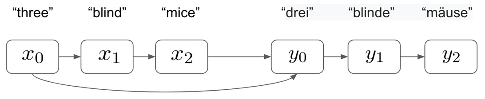
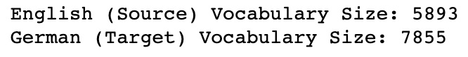

*Lab 7*: Text Translation Using Sequence-to-Sequence Neural Networks
=====================================================================


In this lab, we will cover the following topics:

-   Theory of sequence-to-sequence models
-   Building a sequence-to-sequence neural network for text translation
-   Next steps


Building a sequence-to-sequence model for text translation
==========================================================


In order to build our sequence-to-sequence model
for translation, we will implement the encoder/decoder framework we
outlined previously. This will show how the two halves of our model can
be utilized together in order to capture a representation of our data
using the encoder and then translate this representation into another
language using our decoder. In order to do this, we need to obtain our
data.


Preparing the data
------------------

The `Multi30k` dataset in `Torchtext` consists of
approximately 30,000 sentences with corresponding translations in
multiple languages. For this translation task, our input sentences will
be in English and our output sentences will be in German. Our fully
trained model will, therefore, allow us to **translate English sentences
into German**.

We will start by extracting our data and preprocessing it. We will once
again use `spacy`, which contains a built-in dictionary of
vocabulary that we can use to tokenize our data:

1.  We start by loading our `spacy` tokenizers into Python. We
    will need to do this once for each language we are using since we
    will be building two entirely separate vocabularies for this task:

    ```
    spacy_german = spacy.load(‘de’)
    spacy_english = spacy.load(‘en’)
    ```
    

    Important note

    You may have to install the German vocabulary from the command line
    by doing the following (we installed the English vocabulary in the
    previous chapter):**python3 -m spacy download de**

2.  Next, we create a function for each of our languages to tokenize our
    sentences. Note that our tokenizer for our input English sentence
    reverses the order of the tokens:

    ```
    def tokenize_german(text):
        return [token.text for token in spacy_german.            tokenizer(text)]
    def tokenize_english(text):
        return [token.text for token in spacy_english.            tokenizer(text)][::-1]
    ```
    

    While reversing the order of our input
    sentence is not compulsory, it has been shown to improve the model's
    ability to learn. If our model consists of two RNNs joined together,
    we can show that the information flow within our model is improved
    when reversing the input sentence. For example, let's take a basic
    input sentence in English but not reverse it, as follows:

    


    Here, we can see that in order to predict the first output word,
    *y0*, correctly, our first English word from *x0* must travel
    through three RNN layers before the prediction is made. In terms of
    learning, this means that our gradients must be backpropagated
    through three RNN layers, while maintaining the flow of information
    through the network. Now, let's compare this to a situation
    where we reverse our input sentence:

    

    

3.  With our tokenizers constructed, we now need
    to define the fields for our tokenization. Notice here how we append
    start and end tokens to our sequences so that our model knows when
    to begin and end the sequence's input and output. We also convert
    all our input sentences into lowercase for the sake of simplicity:
    ```
    SOURCE = Field(tokenize = tokenize_english, 
                init_token = ‘<sos>’, 
                eos_token = ‘<eos>’, 
                lower = True)
    TARGET = Field(tokenize = tokenize_german, 
                init_token = ‘<sos>’, 
                eos_token = ‘<eos>’, 
                lower = True)
    ```
    

4.  With our fields defined, our tokenization becomes a simple
    one-liner. The dataset containing 30,000 sentences has built-in
    training, validation, and test sets that we can use for our model:
    ```
    train_data, valid_data, test_data = Multi30k.splits(exts = (‘.en’, ‘.de’), fields = (SOURCE, TARGET))
    ```
    

5.  We can examine individual sentences using the `examples`
    property of our dataset objects. Here, we can see that the source
    (`src`) property contains our
    reversed input sentence in English and that
    our target (`trg`) contains our non-reversed output
    sentence in German:

    ```
    print(train_data.examples[0].src)
    print(train_data.examples[0].trg)
    ```
    

    This gives us the following output:

    

    


6.  Now, we can examine the size of each of our datasets. Here, we can
    see that our training dataset consists of 29,000 examples and that
    each of our validation and test sets consist of 1,014 and 1,000
    examples, respectively. In the past, we have used 80%/20% splits for
    the training and validation data. However, in instances like this,
    where our input and output fields are very sparse and our training
    set is of a limited size, it is often beneficial to train on as much
    data as there is available:

    ```
    print(“Training dataset size: “ + str(len(train_data.       examples)))
    print(“Validation dataset size: “ + str(len(valid_data.       examples)))
    print(“Test dataset size: “ + str(len(test_data.       examples)))
    ```
    

    This returns the following output:

    

    


7.  Now, we can build our vocabularies and check
    their size. Our vocabularies should consist of every unique word
    that was found within our dataset. We can see that our German
    vocabulary is considerably larger than our English vocabulary. Our
    vocabularies are significantly smaller than the true size of each
    vocabulary for each language (every word in the English dictionary).
    Therefore, since our model will only be able to accurately translate
    words it has seen before, it is unlikely that our model will be able
    to generalize well to all possible sentences in the English
    language. This is why training models like this accurately requires
    extremely large NLP datasets (such as those Google has access to):

    ```
    SOURCE.build_vocab(train_data, min_freq = 2)
    TARGET.build_vocab(train_data, min_freq = 2)
    print(“English (Source) Vocabulary Size: “ +        str(len(SOURCE.vocab)))
    print(“German (Target) Vocabulary Size: “ +        str(len(TARGET.vocab)))
    ```
    

    This gives the following output:

    

    


8.  Finally, we can create our data iterators from
    our datasets. As we did previously, we specify the usage of a
    CUDA-enabled GPU (if it is available on our system) and specify our
    batch size:
    ```
    device = torch.device(‘cuda’ if torch.cuda.is_available()                       else ‘cpu’)
    batch_size = 32
    train_iterator, valid_iterator, test_iterator = BucketIterator.splits(
        (train_data, valid_data, test_data), 
        batch_size = batch_size, 
        device = device)
    ```
    

Now that our data has been preprocessed, we can start building the model
itself.


Building the encoder
--------------------

Now, we are ready to start building our encoder:

1.  First, we begin by initializing our model by inheriting from our
    `nn.Module` class, as we've done with all our previous
    models. We initialize with a couple of parameters, which we will
    define later, as well as the number of dimensions in the hidden
    layers within our LSTM layers and the number of LSTM layers:
    ```
    class Encoder(nn.Module):
        def __init__(self, input_dims, emb_dims, hid_dims,     n_layers, dropout):
            super().__init__()   
            self.hid_dims = hid_dims
            self.n_layers = n_layers
    ```
    
2.  Next, we define our embedding layer within our encoder, which is the
    length of the number of input dimensions and the depth of the number
    of embedding dimensions:
    ```
    self.embedding = nn.Embedding(input_dims, emb_dims)
    ```
    
3.  Next, we define our actual LSTM layer. This takes our embedded
    sentences from the embedding layer, maintains
    a hidden state of a defined length, and consists of a number of
    layers (which we will define later as 2). We also implement
    `dropout` to apply regularization to our network:
    ```
    self.rnn = nn.LSTM(emb_dims, hid_dims, n_layers, dropout                    = dropout)
    self.dropout = nn.Dropout(dropout)
    ```
    
4.  Then, we define the forward pass within our encoder. We apply the
    embeddings to our input sentences and apply dropout. Then, we pass
    these embeddings through our LSTM layer, which outputs our final
    hidden state. This will be used by our decoder to form our
    translated sentence:
    ```
    def forward(self, src):
        embedded = self.dropout(self.embedding(src))
        outputs, (h, cell) = self.rnn(embedded)
        return h, cell
    ```
    

Our encoders will consist of two LSTM layers, which means that our
output will output two hidden states. This also means that our full LSTM
layer, along with our encoder, will look something
like this, with our model outputting two hidden states:


Now that we have built our encoder, let\'s start building our decoder.


Building the decoder
--------------------

Our decoder will take the final hidden states from
our encoder\'s LSTM layer and translate them into an output sentence in
another language. We start by initializing our decoder in almost exactly
the same way as we did for the encoder. The only difference here is that
we also add a fully connected linear layer. This layer will use the
final hidden states from our LSTM in order to make predictions regarding
the correct word in the sentence:

```
class Decoder(nn.Module):
    def __init__(self, output_dims, emb_dims, hid_dims,     n_layers, dropout):
        super().__init__()
        
        self.output_dims = output_dims
        self.hid_dims = hid_dims
        self.n_layers = n_layers
        
        self.embedding = nn.Embedding(output_dims, emb_dims)
        
        self.rnn = nn.LSTM(emb_dims, hid_dims, n_layers,                           dropout = dropout)
        
        self.fc_out = nn.Linear(hid_dims, output_dims)
        
        self.dropout = nn.Dropout(dropout)
```


Our forward pass is incredibly similar to that of our encoder, except
with the addition of two key steps. We first unsqueeze our input from
the previous layer so that it\'s the correct size
for entry into our embedding layer. We also add a fully connected layer,
which takes the output hidden layer of our RNN layers and uses it to
make a prediction regarding the next word in the sequence:

```
def forward(self, input, h, cell):
                
    input = input.unsqueeze(0)
                
    embedded = self.dropout(self.embedding(input))
                
    output, (h, cell) = self.rnn(embedded, (h, cell))
        
    pred = self.fc_out(output.squeeze(0))
        
    return pred, h, cell
```


Again, similar to our encoder, we use a two-layer LSTM layer within our
decoder. We take our final hidden state from our encoders and use these
to generate the first word in our sequence, Y[1]. We then
update our hidden state and use this and
Y[1] to generate our next word, Y[2], repeating
this process until our model generates an end token. Our decoder looks
something like this:


Constructing the full sequence-to-sequence model
------------------------------------------------

We must now stitch the two halves of our model
together to produce the full sequence-to-sequence model:

1.  We start by creating a new sequence-to-sequence class. This will
    allow us to pass our encoder and decoder to it as arguments:
    ```
    class Seq2Seq(nn.Module):
        def __init__(self, encoder, decoder, device):
            super().__init__()
            
            self.encoder = encoder
            self.decoder = decoder
            self.device = device
    ```
    

2.  Next, we create the `forward` method within our
    `Seq2Seq` class. This is arguably the most complicated
    part of the model. We combine our encoder with our decoder and use
    teacher forcing to help our model learn. We start by creating a
    tensor in which we still store our predictions. We initialize this
    as a tensor full of zeroes, but we still update this with our
    predictions as we make them. The shape of our tensor of zeroes will
    be the length of our target sentence, the width of our batch size,
    and the depth of our target (German) vocabulary size:
    ```
    def forward(self, src, trg, teacher_forcing_rate = 0.5):
        batch_size = trg.shape[1]
        target_length = trg.shape[0]
        target_vocab_size = self.decoder.output_dims
            
         outputs = torch.zeros(target_length, batch_size,                     target_vocab_size).to(self.device)
    ```
    

3.  Next, we feed our input sentence into our
    encoder to get the output hidden states:
    ```
    h, cell = self.encoder(src)
    ```
    

4.  Then, we must loop through our decoder model to generate an output
    prediction for each step in our output sequence. The first element
    of our output sequence will always be the `<start>` token.
    Our target sequences already contain this as the first element, so
    we just set our initial input equal to this by taking the first
    element of the list:
    ```
    input = trg[0,:]
    ```
    

5.  Next, we loop through and make our predictions. We pass our hidden
    states (from the output of our encoder) to our decoder, along with
    our initial input (which is just the `<start>` token).
    This returns a prediction for all the words in our sequence.
    However, we are only interested in the word within our current step;
    that is, the next word in the sequence. Note how we start our loop
    from 1 instead of 0, so our first prediction is the second word in
    the sequence (as the first word that's predicted will always be the
    start token).

6.  This output consists of a vector of the target vocabulary's length,
    with a prediction for each word within the vocabulary. We take the
    `argmax` function to identify the actual word that is
    predicted by the model.

    We then need to select our new input for the next step. We set our
    teacher forcing ratio to 50%, which means that 50% of the time, we
    will use the prediction we just made as our next input into our
    decoder and that the other 50% of the time, we will take the true
    target. As we discussed previously, this helps our model learn much
    more rapidly than relying on just the model's predictions.

    We then continue this loop until we have a
    full prediction for each word in the sequence:

    ```
    for t in range(1, target_length):
    output, h, cell = self.decoder(input, h, cell)
                
    outputs[t] = output
                
    top = output.argmax(1) 
            
    input = trg[t] if (random.random() < teacher_forcing_                   rate) else top
            
    return outputs
    ```
    

7.  Finally, we create an instance of our Seq2Seq model that's ready to
    be trained. We initialize an encoder and a decoder with a selection
    of hyperparameters, all of which can be changed to slightly alter
    the model:
    ```
    input_dimensions = len(SOURCE.vocab)
    output_dimensions = len(TARGET.vocab)
    encoder_embedding_dimensions = 256
    decoder_embedding_dimensions = 256
    hidden_layer_dimensions = 512
    number_of_layers = 2
    encoder_dropout = 0.5
    decoder_dropout = 0.5
    ```
    

8.  We then pass our encoder and decoder to our
    `Seq2Seq` model in order to create the complete model:
    ```
    encod = Encoder(input_dimensions,\
                    encoder_embedding_dimensions,\
                    hidden_layer_dimensions,\
                    number_of_layers, encoder_dropout)
    decod = Decoder(output_dimensions,\
                    decoder_embedding_dimensions,\
                    hidden_layer_dimensions,\
                    number_of_layers, decoder_dropout)
    model = Seq2Seq(encod, decod, device).to(device)
    ```
    

Try experimenting with different parameters here and see how it affects
the performance of the model. For instance, having a larger number of
dimensions in your hidden layers may cause the model to train slower,
although the overall final performance of the model may be better.
Alternatively, the model may overfit. Often, it is a matter of
experimenting to find the best-performing model.

After fully defining our Seq2Seq model, we are now ready to begin
training it.


Training the model
------------------

Our model will begin initialized with weights of 0
across all parts of the model. While the model should theoretically be
able to learn with no (zero) weights, it has been shown that
initializing with random weights can help the model learn faster. Let\'s
get started:

1.  Here, we will initialize our model with the weights of random
    samples from a normal distribution, with the values being between
    -0.1 and 0.1:
    ```
    def initialize_weights(m):
        for name, param in m.named_parameters():
            nn.init.uniform_(param.data, -0.1, 0.1)
            
    model.apply(initialize_weights)
    ```
    

2.  Next, as with all our other models, we define our optimizer and loss
    functions. We're using cross-entropy loss as we are performing
    multi-class classification (as opposed to binary cross-entropy loss
    for a binary classification):
    ```
    optimizer = optim.Adam(model.parameters())
    criterion = nn.CrossEntropyLoss(ignore_index = TARGET.               vocab.stoi[TARGET.pad_token])
    ```
    

3.  Next, we define the training process within a function called
    `train()`. First, we set our model to train mode and set
    the epoch loss to `0`:
    ```
    def train(model, iterator, optimizer, criterion, clip):
        model.train()
        epoch_loss = 0
    ```
    

4.  We then loop through each batch within our training iterator and
    extract the sentence to be translated (`src`) and the
    correct translation of this sentence (`trg`). We then zero
    our gradients (to prevent gradient accumulation) and calculate the
    output of our model by passing our model function our inputs and
    outputs:
    ```
    for i, batch in enumerate(iterator):
    src = batch.src
    trg = batch.trg
    optimizer.zero_grad()
    output = model(src, trg)
    ```
    

5.  Next, we need to calculate the loss of our
    model's prediction by comparing our predicted output to the true,
    correct translated sentence. We reshape our output data and our
    target data using the shape and view functions in order to create
    two tensors that can be compared to calculate the loss. We calculate
    the `loss` criterion between our output and
    `trg` tensors and then backpropagate this loss through the
    network:
    ```
    output_dims = output.shape[-1]
    output = output[1:].view(-1, output_dims)
    trg = trg[1:].view(-1)
            
    loss = criterion(output, trg)
            
    loss.backward()
    ```
    

6.  We then implement gradient clipping to prevent exploding gradients
    within our model, step our optimizer in order to perform the
    necessary parameter updates via gradient descent, and finally add
    the loss of the batch to the epoch loss. This
    whole process is repeated for all the batches
    within a single training epoch, whereby the final averaged loss per
    batch is returned:
    ```
    torch.nn.utils.clip_grad_norm_(model.parameters(), clip)
            
    optimizer.step()
            
    epoch_loss += loss.item()
            
    return epoch_loss / len(iterator)
    ```
    

7.  After, we create a similar function called `evaluate()`.
    This function will calculate the loss of our validation data across
    the network in order to evaluate how our model performs when
    translating data it hasn't seen before. This function is almost
    identical to our `train()` function, with the exception of
    the fact that we switch to evaluation mode:
    ```
    model.eval()
    ```
    

8.  Since we don't perform any updates for our weights, we need to make
    sure to implement `no_grad` mode:
    ```
    with torch.no_grad():
    ```
    

9.  The only other difference is that we need to make sure we turn off
    teacher forcing when in evaluation mode. We wish to assess our
    model's performance on unseen data, and enabling teacher forcing
    would use our correct (target) data to help our model make better
    predictions. We want our model to be able to
    make perfect, unaided predictions:
    ```
    output = model(src, trg, 0)
    ```
    

10. Finally, we need to create a training loop, within which our
    `train()` and `evaluate()` functions are called.
    We begin by defining how many epochs we wish to train for and our
    maximum gradient (for use with gradient clipping). We also set our
    lowest validation loss to infinity. This will be used later to
    select our best-performing model:
    ```
    epochs = 10
    grad_clip = 1
    lowest_validation_loss = float(‘inf’)
    ```
    

11. We then loop through each of our epochs and within each epoch,
    calculate our training and validation loss using our
    `train()` and `evaluate()` functions. We also
    time how long this takes by calling `time.time()` before
    and after the training process:
    ```
    for epoch in range(epochs):
        
        start_time = time.time()
        
        train_loss = train(model, train_iterator, optimizer,                       criterion, grad_clip)
        valid_loss = evaluate(model, valid_iterator,                          criterion)
        
        end_time = time.time()
    ```
    

12. Next, for each epoch, we determine whether the model we just trained
    is the best-performing model we have seen thus far. If our model
    performs the best on our validation data (if
    the validation loss is the lowest we have seen so far), we save our
    model:
    ```
    if valid_loss < lowest_validation_loss:
    lowest_validation_loss = valid_loss
    torch.save(model.state_dict(), ‘seq2seq.pt’) 
    ```
    

13. Finally, we simply print our output:

    ```
    print(f’Epoch: {epoch+1:02} | Time: {np.round(end_time-start_time,0)}s’)
    print(f’\tTrain Loss: {train_loss:.4f}’)
    print(f’\t Val. Loss: {valid_loss:.4f}’)
    ```
    

    If our training is working correctly, we should see the training
    loss decrease over time, like so:


Here, we can see that both our training and
validation loss appear to be falling over time. We can continue to train
our model for a number of epochs, ideally until the validation loss
reaches its lowest possible value. Now, we can evaluate our
best-performing model to see how well it performs when making actual
translations.


Evaluating the model
--------------------

In order to evaluate our model, we will take our
test set of data and run our English sentences through our model to
obtain a prediction of the translation in German. We will then be able
to compare this to the true prediction in order to see if our model is
making accurate predictions. Let\'s get started!

1.  We start by creating a `translate()` function. This is
    functionally identical to the `evaluate()` function we
    created to calculate the loss over our validation set. However, this
    time, we are not concerned with the loss of our model, but rather
    the predicted output. We pass the model our source and target
    sentences and also make sure we turn teacher forcing off so that our
    model does not use these to make predictions. We then take our
    model's predictions and use an
    `argmax` function to determine the index of the word that
    our model predicted for each word in our predicted output sentence:
    ```
    output = model(src, trg, 0)
    preds = torch.tensor([[torch.argmax(x).item()] for x         in output])
    ```
    

2.  Then, we can use this index to obtain the actual predicted word from
    our German vocabulary. Finally, we compare the English input to our
    model that contains the correct German sentence and the predicted
    German sentence. Note that here, we use `[1:-1]` to drop
    the start and end tokens from our predictions and we reverse the
    order of our English input (since the input sentences were reversed
    before they were fed into the model):

    ```
    print(‘English Input: ‘ + str([SOURCE.vocab.itos[x] for x        in src][1:-1][::-1]))
    print(‘Correct German Output: ‘ + str([TARGET.vocab.       itos[x] for x in trg][1:-1]))
    print(‘Predicted German Output: ‘ + str([TARGET.vocab.       itos[x] for x in preds][1:-1]))
    ```
    

    By doing this, we can compare our predicted output with the correct
    output to assess if our model is able to make accurate predictions.
    We can see from our model's predictions that our model is able to
    translate English sentences into German, albeit far from perfectly.
    Some of our model's predictions are exactly the same as the target
    data, showing that our model translated these sentences perfectly:


In other instances, our model is off by a single word. In this case, our
model predicts the word `hüten` instead of `mützen`;
however, `hüten` is actually an
acceptable translation of `mützen`,
though the words may not be semantically identical:


We can also see examples that seem to have been mistranslated. In the
following example, the English equivalent of the German sentence that we
predicted is "`A woman climbs through one`", which is not
equivalent to "`Young woman climbing rock face`". However, the
model has still managed to translate key elements of the English
sentence (woman and climbing):


#### Summary

In this lab, we covered how to build sequence-to-sequence models
from scratch. We learned how to code up our encoder and decoder
components individually and how to integrate them into a single model
that is able to translate sentences from one language into another.
